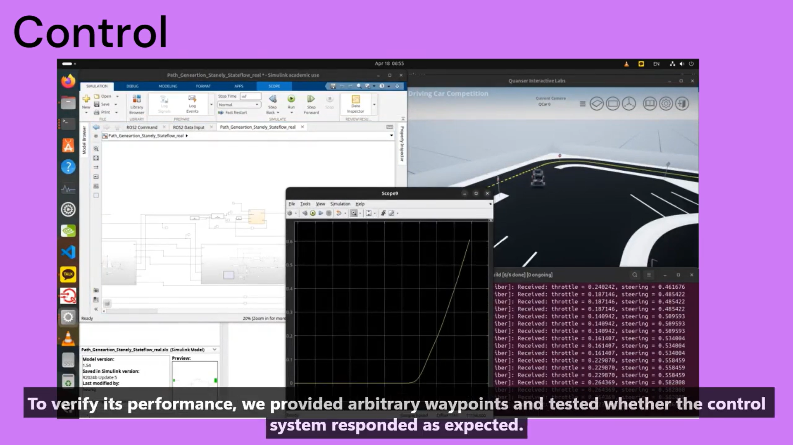
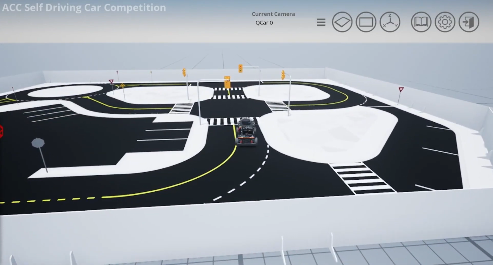
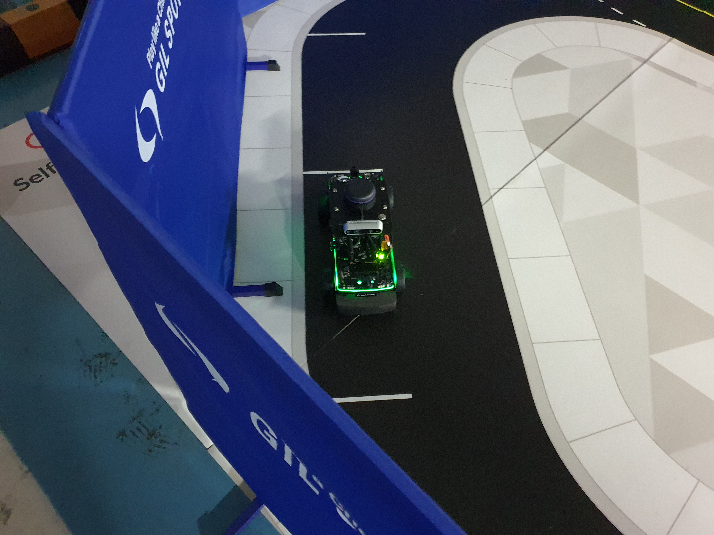
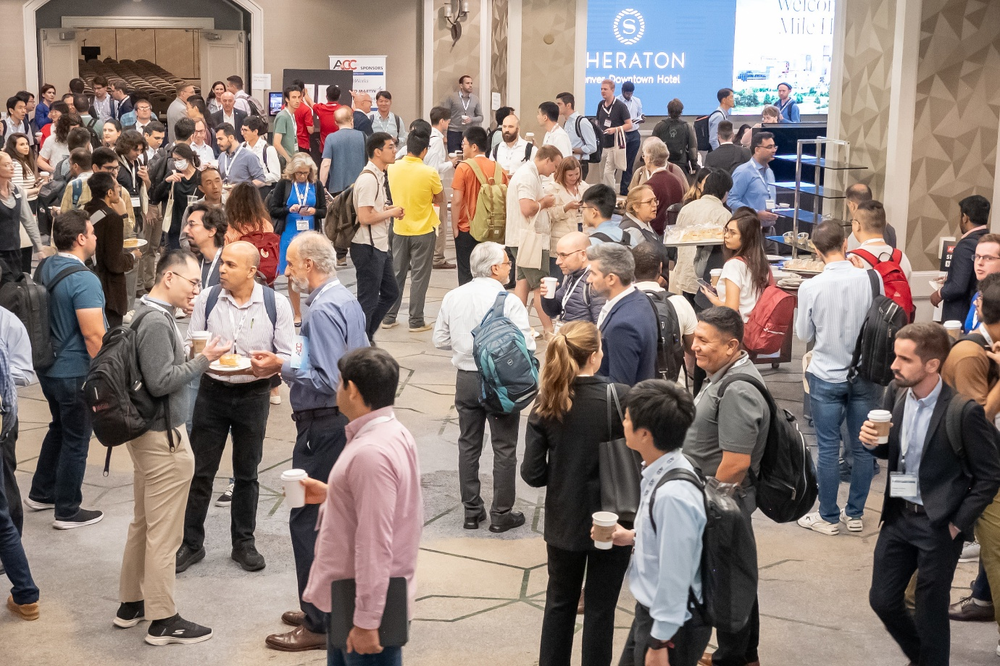
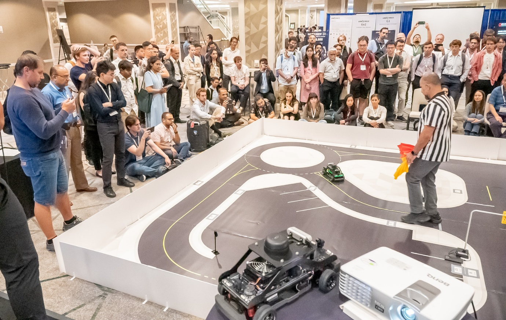
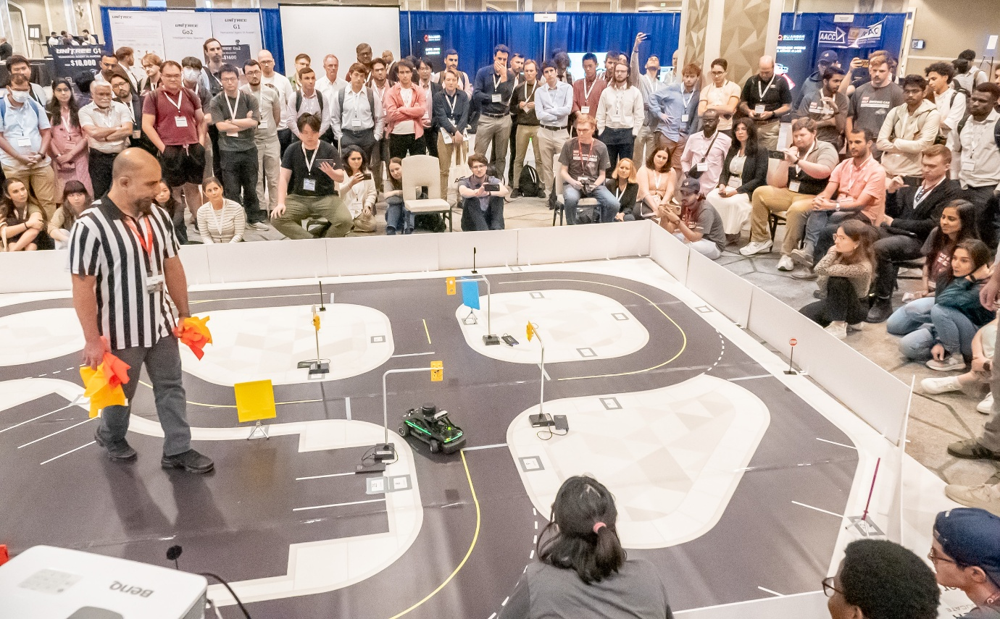

# International Competition — ACC 2025 Self-Driving Car Competition

---

## 1️⃣ Purpose & Significance

This competition aims to **maximize operating revenue** from an autonomous taxi service. Teams must navigate a track and visit designated **Pick-up** and **Drop-off** coordinates while handling diverse traffic scenarios (traffic lights, signs, intersections, etc.).  
All driving must comply with road rules, and a **passenger rating score** is assigned based on ride quality.  
This rating is multiplied by the operating revenue to determine the **total earnings**, so teams must design an optimal driving strategy to achieve the **maximum revenue within 5 minutes**.  
Through this structure, the competition evaluates the **integrated performance** of autonomous-driving algorithms and is designed for participants to experience the process of implementing a **realistic urban self-driving service**.

---

## 2️⃣ Competition Overview

- **Organizers:** Quanser Inc. & American Control Conference (**ACC 2025**, Denver, USA)  
- **Scale:** An international student competition with university teams (undergraduate & graduate) worldwide. According to Quanser, participants range from first-year undergraduates to master’s/PhD students.  
- **Objective:** Implement an **urban autonomous taxi scenario** on a **1/10-scale physical platform (QCar 2)** and develop a **revenue-optimization algorithm** that balances efficiency and safety.  
- **Participating Institutions:** Teams from **49 groups, 36 universities, 18 countries** (e.g., MIT, Purdue University, National University of Singapore, Waseda University, Tsinghua University).  
- **Stages:**
  1️⃣ **Stage 1 – Virtual Design & Submission**  
  2️⃣ **Stage 2 – Algorithm Implementation on Physical QCar 2**  
  3️⃣ **Stage 3 – On-site Competition at ACC (Denver, Colorado)**

---

## 3️⃣ Stage 1 – Virtual Design & Submission

- Stage 1 is executed in the **Quanser QLabs Virtual Environment**, where baseline driving scenarios are run to validate autonomous-driving algorithms in simulation.  
- Provided scenarios include **Stop Sign, Traffic Light, Yield, Roundabout, and Pedestrian Crossing**, emphasizing **driving stability, rule compliance, and path efficiency**.  
- Each team must submit a **≤3-minute demonstration video** and accompanying **GitHub source code**.

---

## 4️⃣ Our Approach

- We designed the system with **Decision (Perception & Planning)**, **Control**, and **ROS2 Integration**.
- **Decision**
  - **SCNN** for lane detection; **YOLOv8s** for detecting traffic signals/pedestrians.
  - **RRT** for path exploration; **DQN** to determine the priority/order of driving segments.
- **Control**
  - Combined **MPC** and **Pure Pursuit** to improve curve tracking and overall stability.
- **Integration**
  - Integrated **LiDAR, RealSense, and IMU** in **ROS2**, managing inter-node communication.

Detailed architecture and results are available here:  
Decision https://github.com/XXXXXXXXXXX, Control https://github.com/XXXXXXXXXXX, ROS https://github.com/XXXXXXXXXXX, Localization https://github.com/XXXXXXXXXXX

**🎥 Development Progress Video** (submitted for Quanser’s interim review) briefly explains our system architecture, algorithms, and improvement plan, visually conveying our technical approach.

- **YouTube:** https://youtu.be/nVfTEp7s9_k  
- 

---

## 5️⃣ Evaluation & Results

- Evaluation criteria: **Core Principles of Self-Driving**, **driving accuracy**, **traffic rule compliance**, and **system stability**.  
- Our team **fully satisfied** the requirements across all Stage 1 scenarios with stable driving performance and was selected among the **top 12 of 49 teams**, earning advancement to **Stage 2** and **Stage 3**.

Stage 1 submission video: https://youtu.be/6kEesr4rdyQ

---

## 6️⃣ Stage 2 – Implementation on Physical QCar 2

- After passing the preliminaries, we received **QCar 2** from Quanser and performed on-track tests during Stage 2.  
- Through repeated real-track tests, we improved **sensor synchronization**, **speed-control stability**, and **path-tracking correction**, optimizing the algorithms for the **physical vehicle**.

**📸 QCar 2 track calibration scene**

---

## 7️⃣ Stage 3 – On-site Competition at ACC 2025

- The Stage 3 finals were held **on-site** at **ACC 2025** (Denver, Colorado), a premier international conference in control and automation.  
- During each **5-minute autonomous session**, teams executed multiple **rides** (Pick-up/Drop-off routes), competing on the completeness of algorithms that simultaneously achieved **driving stability** and **revenue optimization**.  
- Key evaluation items included **LED signal handling**, **traffic-law compliance**, and **lane-keeping accuracy**, assessed in real time on a track emulating **urban traffic conditions**.  
- We performed **on-site parameter tuning** and **sensor-sync adjustments** to verify real-world robustness. Our team finished **7th overall (Top 7 out of 49)**, earning strong marks for **completion rate** and **driving stability**.  
- We also attended conference talks and presentations in **control, robotics, and autonomous driving**, gaining insights into the latest theory and industrial applications.

  

On-site video (includes venue operations and QCar 2 driving): https://youtu.be/BRnShDCEmBc

---

## 8️⃣ Distinctive Highlights

- **MATLAB–Simulink Control + ROS2 Integration:**  
  Without relying on Quanser’s default libraries, we implemented controllers **directly in MATLAB/Simulink** and built a **fully custom pipeline** by exchanging real-time messages with perception/decision nodes running in **ROS2**.

- **All-Undergraduate Team:**  
  While most finalist teams included graduate students, our team—**entirely undergraduates (2nd–4th year)**—advanced to Stage 3 and delivered a highly complete system.

---

## 9️⃣ Reflection & Significance

- We gained hands-on experience **implementing and optimizing an industrial-style autonomous stack** on a scaled platform.  
- The team significantly improved collaboration skills, including **project management**, **version control**, and **real-time ROS2 operations**.  
- By attending **ACC 2025** (Denver), we explored cutting-edge research trends in **control, robotics, and autonomous driving** through talks and paper sessions.  
- These experiences served as foundational material for core-module development in the **KMU-KDAS** project.

