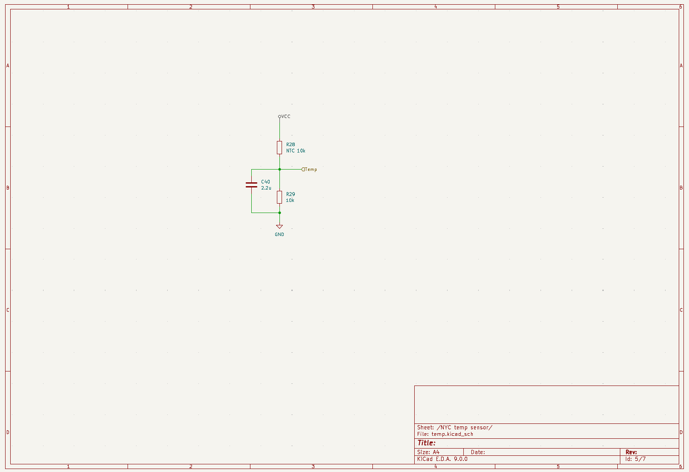
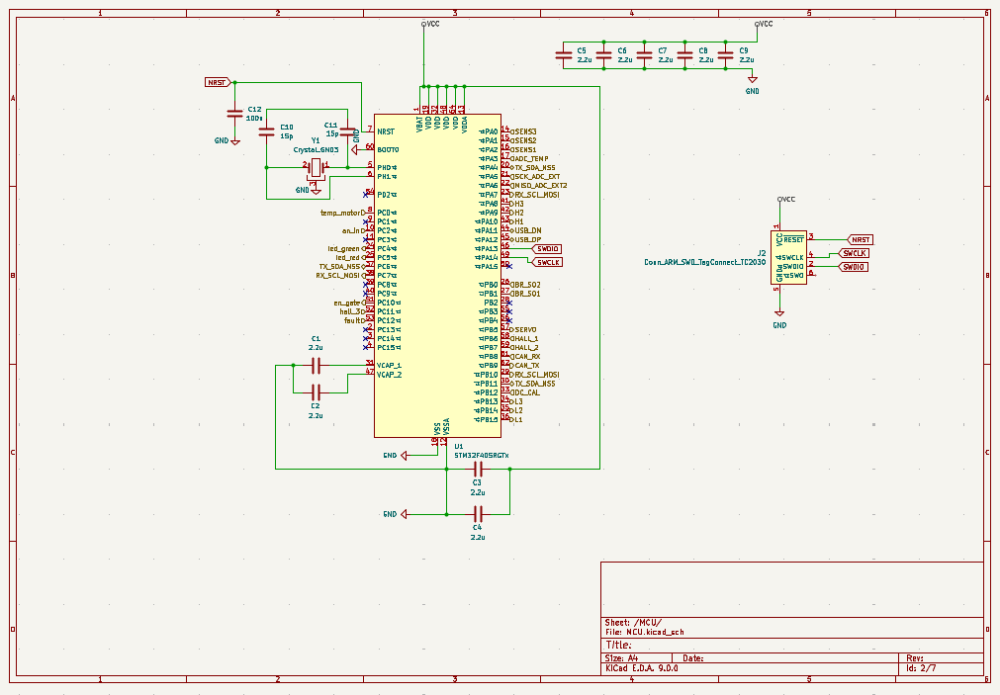
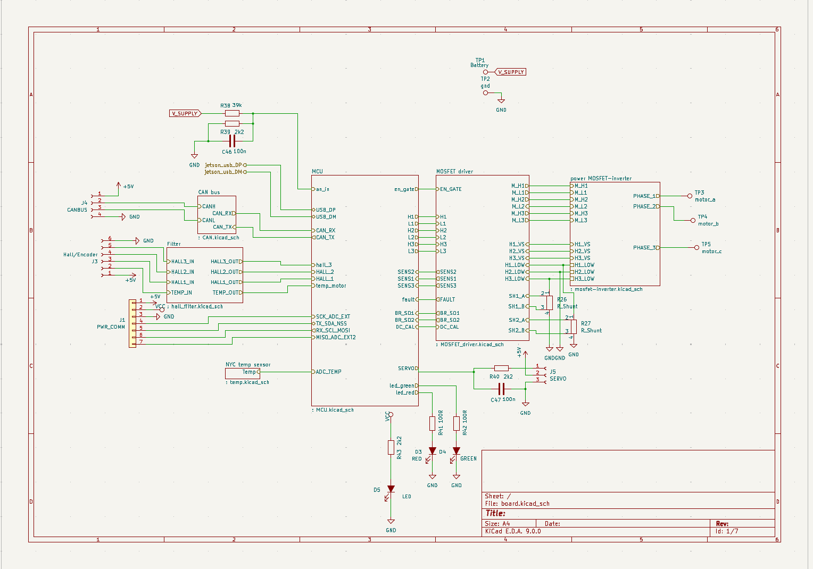
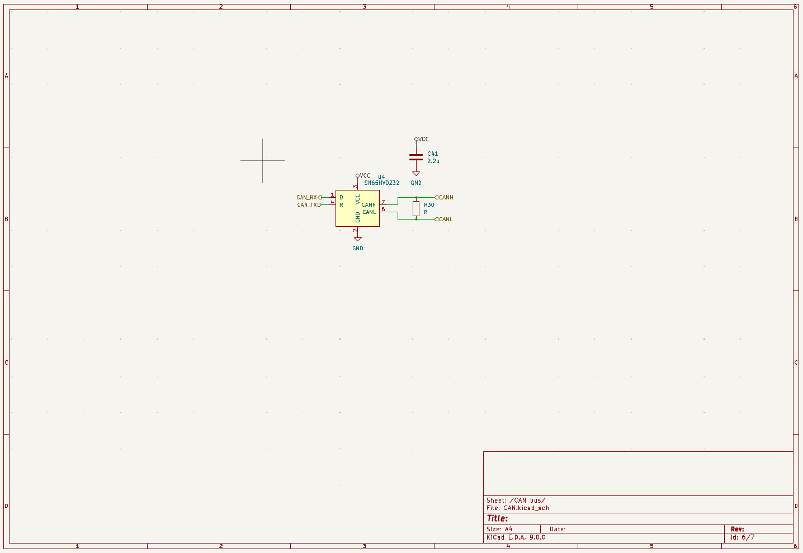
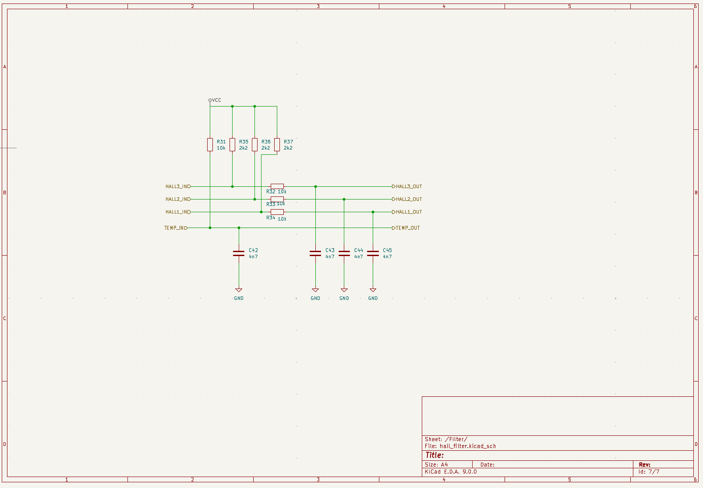
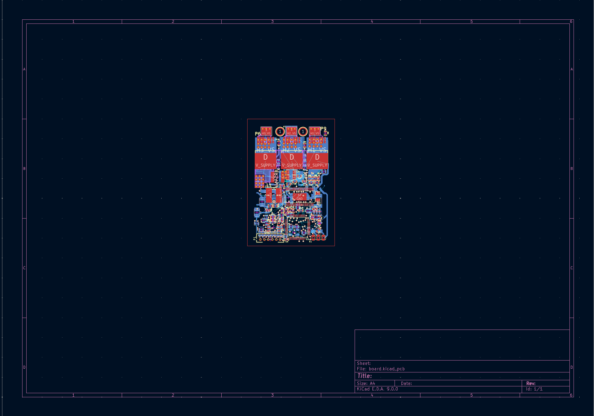
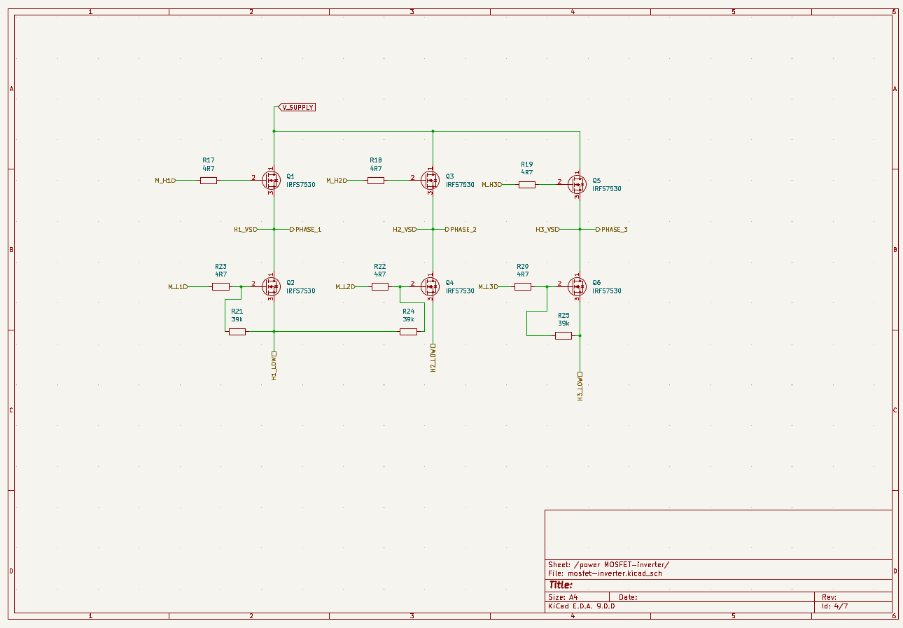
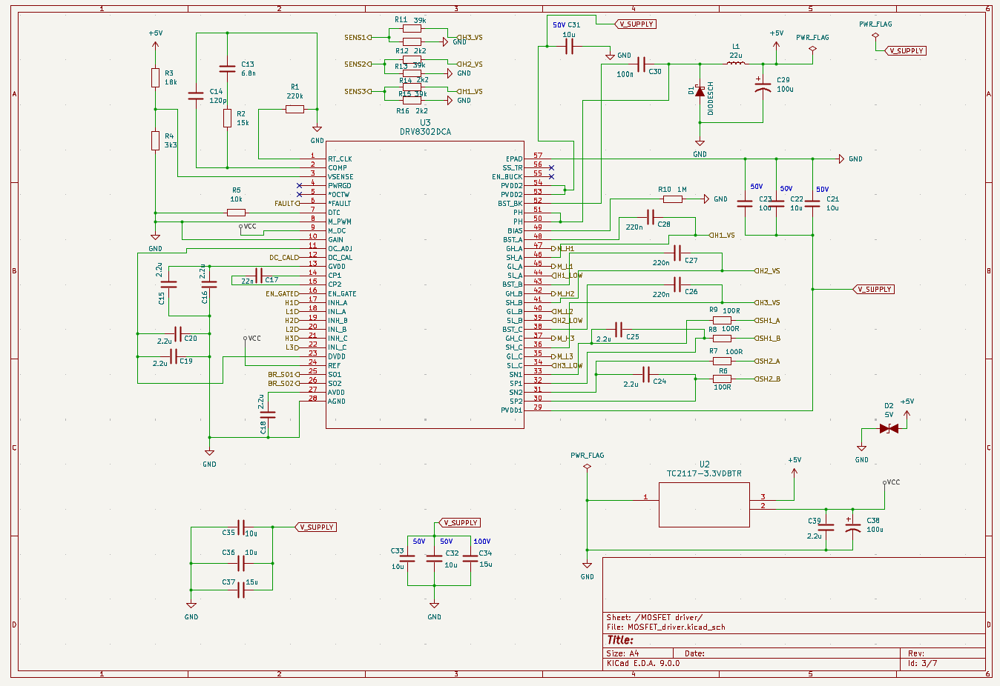

# VESC-Based Motor Driver Board Design

> **Goal:** Maintain VESC’s proven control stack (FOC, sensing, protection) while standardizing power, sensing, and communication interfaces for seamless integration into the autonomous vehicle system.  
> The board enables rapid connection between the **motor**, **battery**, **ECU**, and **PC**, allowing immediate tuning and operation.

---

## 1. System Overview

The developed system is based on the open-source **VESC** platform and targets the motor inverter (three-phase bridge) section of the autonomous RC vehicle.  
It is composed of the following core subsystems:

| Subsystem | Function |
|:-----------|:----------|
| **MCU (STM32F4 series)** | Generates PWM with dead-time, samples ADC, executes FOC and closed-loop control, handles faults, and manages CAN/USB communication. |
| **Gate Driver** | Drives high/low-side MOSFETs via bootstrap; manages enable (`EN_GATE`) and fault feedback (`FAULT`) for safe operation. |
| **Power Stage (3-Phase Bridge)** | Delivers current to the motor phases (A/B/C); includes bulk capacitors and snubbers for transient and EMI suppression. |
| **Sensing Front-End** | Amplifies and filters phase/bus current and voltage; provides `SENS1/2/3`, `BR_SO1/2` to ADC; `DC_CAL` stabilizes zero-current offset. |
| **Motor / Temperature / Encoder Inputs** | Shapes Hall/Encoder signals with RC-Schmitt filters for low-speed tracking; measures motor/board temperature via NTC divider for derate/shutdown logic. |
| **Communication Interfaces** | CAN bus ensures differential integrity and termination; USB handles PC tuning and firmware updates; SWD/UART simplify debugging and production testing. |

  

---

## 2. Power MOSFET Stage (mosfets.sch)

- Implements a **three-phase inverter** for motor drive (Phase A/B/C).  
- Each leg contains high-side and low-side MOSFETs.  
- Outputs (`Phase_1D/2D/3D`) provide phase currents that generate motor torque.

  

---

## 3. MOSFET Driver

- Provides gate drive for each phase pair (H1D/L1D, H2D/L2D, H3D/L3D).  
- `EN_GATE`: master enable for driver section (used during protection/startup).  
- `FAULT`: reports overcurrent/overtemperature to MCU.  
- `Hx_VS`, `Hx_LOW`: bootstrap and return references for high-side drivers.  
- `SENS1/2/3`: current/voltage feedback to MCU ADC channels.  
- `BR_SO1/2`: conditioned bus or phase current feedback signals.  
- `DC_CAL`: zero-current calibration for ADC offset removal.

  

---

## 4. MCU (STM32F4 Series)

- Generates **PWM** with interleaving and dead-time.  
- Samples ADC synchronized to PWM for precise current feedback.  
- Runs **FOC (Field-Oriented Control)** for torque/speed/position loops.  
- Handles **CAN** and **USB** communication and safety logic.  
- Controls status LEDs (`LED_GREEN`, `LED_RED`) to indicate state (boot, fault, communication).

  

---

## 5. Hall & Encoder Inputs (hall_filters.sch)

- Inputs: three-phase **Hall sensors (HALL_1/2/3)** and optional **incremental encoder**.  
- Signals are filtered and shaped by **Schmitt triggers** for clean digital edges, improving low-speed startup and position tracking.  
- Temperature input (`TEMP_IN`, `TEMP_OUT`) uses NTC sensors for both motor and board temperature monitoring.

  

---

## 6. Temperature Sensing (temp.sch)

- NTC-based voltage divider measures motor and PCB temperatures.  
- Protection logic triggers **derating** or **shutdown** during overheating events.  
- Temperature data is fed into ADC for firmware-level thermal control.

  

---

## 7. CAN Bus Transceiver

- Provides **physical layer** for CAN communication (`CANH`, `CANL`).  
- Connected to MCU (`CAN_RX`, `CAN_TX`) for networking with other controllers or higher-level ECU.  
- Ensures correct differential impedance and termination to prevent reflection.

  

---

## 8. Digital I/O and Programming Ports

- **SWD**: Firmware programming and debugging.  
- **UART**: Serial logging or console interface.  
- Supports low-latency communication with external extension boards.

---

## 9. Power Input Section

- Main supply (`V_SUPPLY`, connectors P4/P5) accepts **6–60 V battery input**.  
- Bulk capacitors and snubber networks suppress switching transients, critical for **EMI reduction** and **hardware reliability**.

---

## 10. PCB Implementation

- The PCB integrates all subsystems — power bridge, sensing front-end, MCU, and communication — with **short current paths**, **proper grounding**, and **thermal management zones**.  
- Design verified for both hardware protection and clean signal integrity during high-speed switching.

  

---

## 11. Summary

- Custom-designed **VESC-compatible motor driver** board optimized for small autonomous vehicles.  
- Preserves VESC’s robust firmware ecosystem while exposing standardized interfaces for **ROS2 / MATLAB / Simulink / Jetson** integration.  
- Modular architecture simplifies system bring-up, ensuring plug-and-play connection among motor, sensors, ECU, and host PC.

> The result is a compact yet fully capable **FOC-controlled inverter** module that bridges open-source firmware with real vehicle implementation.

---

