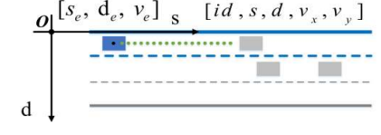
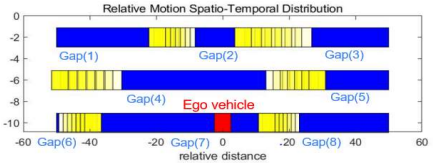
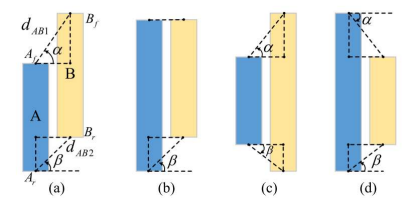
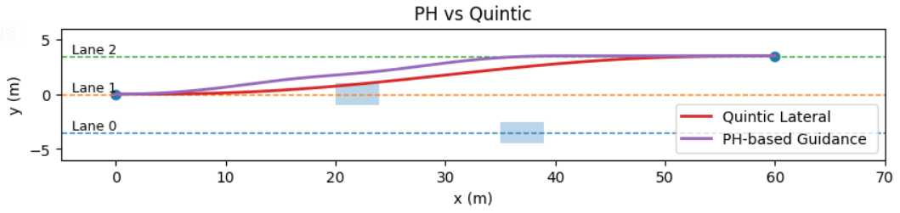
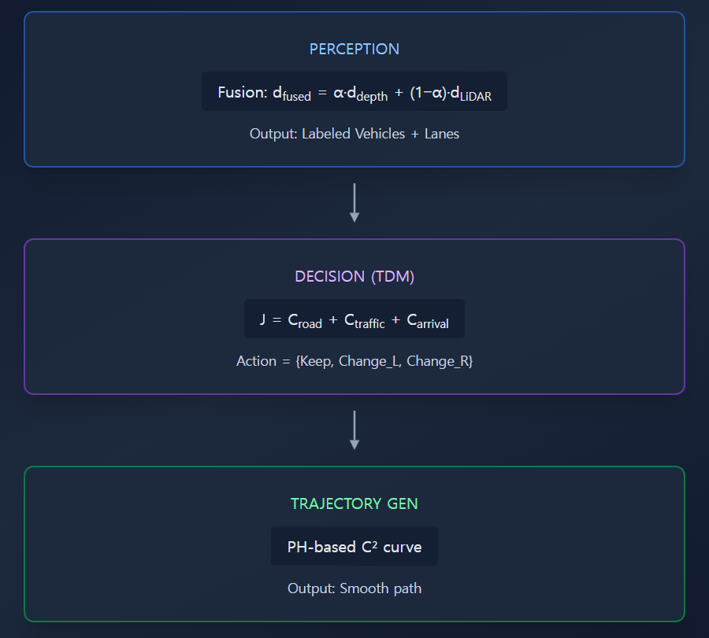

# Autonomous Evasive Maneuver (자율주행 회피기동)

Autonomous vehicles frequently encounter sudden obstacles in the front or on the sides while driving. In such cases, the vehicle must execute an **evasive maneuver** safely without collision and, to do so, it requires an algorithm that generates safe and efficient trajectories **in real time** as the environment changes.  
To simultaneously secure **efficiency** and **stability**, we design the evasive maneuver algorithm as a **hybrid architecture** split into two parts:

- **Tactical Decision Making (TDM):** high-level behavior decision (keep lane, change lane, decelerate, etc.)  
- **Trajectory Generator (TG):** dynamically feasible trajectory generation under vehicle constraints

Especially in TG, we introduce the **Pythagorean Hodograph (PH)** technique to overcome the limitations of conventional polynomial trajectory generation.  
A PH curve guarantees **$C^2$ continuity** (continuous curvature and curvature rate), which suppresses abrupt changes in steering angle and steering rate.  
Consequently, the proposed PH-augmented hybrid structure preserves computational efficiency while significantly improving steering stability and ride comfort.

---

## 1. Tactical Decision Making (TDM)

TDM is responsible for **high-level behavior decisions**.  
Among candidate behaviors such as lane keeping, lane change, and deceleration, TDM selects the safest and most efficient behavior for the current traffic context.

### (1) Decision Topology

**Reachability** between gaps is defined as:

$$
\mathrm{Reach}_{i,j}=
\begin{cases}
\mathrm{T}, & \left| \mathrm{Gap}_i.s-\mathrm{Gap}_j.s \right| < \dfrac{\mathrm{Gap}_i.l+\mathrm{Gap}_j.l}{2} \\
\mathrm{F}, & \text{otherwise}
\end{cases}
$$

This compares the center distance of two gaps with their lengths; if their spatio-temporal regions overlap or are adjacent, the transition is considered **reachable** (True).  
Starting from the root node that contains the ego vehicle, we explore only reachable gaps, maximizing cost-computation efficiency.  

Let $N_R$ be the number of reachable transitions.  
Then the search complexity reduces to $O(N_R^{2})$, making the decision process suitable for real-time operation.

 

### (2) Cost Function

 

The total cost for gap selection is:

$$
J = C_{\mathrm{road}} + C_{\mathrm{traffic}} + C_{\mathrm{arrival}}
$$

**① Road Cost**

$$
C_{\mathrm{road}}^{\,i}=1-\frac{\mathrm{Gap}_i.l}{100}
$$

A shorter gap length implies a smaller safety region; hence a higher cost.  
In effect, $C_{\mathrm{road}} \propto 1/L_{\mathrm{gap}}$.

**② Traffic Cost**

$$
C_{\mathrm{traffic}}^{\,i}=C_{\mathrm{traffic,1}}^{\,i}+C_{\mathrm{traffic,2}}^{\,i}
$$

$$
C_{\mathrm{traffic,1}}^{\,i}=
\begin{cases}
0, & n_{\mathrm{car}}=0 \\
-w_{\mathrm{car}}\dfrac{\mathrm{Gap}_{\mathrm{car}}}{n_{\mathrm{car}}}, & \text{otherwise}
\end{cases}
$$

$$
C_{\mathrm{traffic,2}}^{\,i}=
\begin{cases}
c_f\dfrac{v_{\mathrm{ego}}}{v_{\mathrm{target}}}, & s_{\mathrm{target}}>\mathrm{Gap}_i.l \\
-c_b\dfrac{v_{\mathrm{target}}}{v_{\mathrm{ego}}}, & s_{\mathrm{target}}<\mathrm{Gap}_i.l
\end{cases}
$$

- $C_{\mathrm{traffic,1}}$: risk increases with the number of vehicles.  
- $C_{\mathrm{traffic,2}}$: dynamic interaction via relative speed ratio.  
Together, $C_{\mathrm{traffic}}$ quantifies the **trade-off** between traffic flow and safety.

**③ Arrival Cost**

$$
C_{\mathrm{A\to B}}^{\,i}=C_{\mathrm{long}}^{\,i}+C_{\mathrm{lat}}^{\,i}
$$

$$
C_{\mathrm{long}}^{\,i}
=1-\frac{\min\left(A_f,B_f\right)-\max\left(A_r,B_r\right)}{\mathrm{Gap}_A.l}
$$

$$
C_{\mathrm{lat}}^{\,i}=
\begin{cases}
\dfrac{\mathrm{LaneWidth}}{10}, & \Delta \mathrm{Idx}_{\mathrm{lane}}\le 1 \\
2.5, & \Delta \mathrm{Idx}_{\mathrm{lane}}> 1
\end{cases}
$$

- $C_{\mathrm{long}}$: difficulty based on the **overlap ratio** between gaps  
- $C_{\mathrm{lat}}$: penalty on the **number of lane changes**

 

---

## 2. 2D LiDAR–Vision Fusion Pipeline for Vehicle Candidates

This pipeline is configured as a **YOLO + Depth + 2D LiDAR** fusion system to robustly detect surrounding vehicles and to provide TDM with accurate **distance, velocity,** and **TTC** in real time.

### 1) Candidate Generation (YOLO + Depth)

**(a) YOLO object detection**  
Using YOLOv8 on the RGB camera image, we detect 2D bounding boxes of vehicles, pedestrians, and obstacles. Each detection (with ID) is published on `/yolo_objects`.

**(b) Depth-based range estimation**  
From the lower ROI of each bounding box, we obtain depth samples and apply mean/median with IQR filtering to extract the object’s average depth $z$.  
Using camera intrinsics $(f_x,f_y,c_x,c_y)$, points are **back-projected** to 3D $(X,Y,Z)$.  
Results are published as `/objects_3d` (`vision_msgs/Detection3DArray`).

---

## 3. Gap Computation and MIO (Most Important Object) Selection

### (1) Lane-wise Gap Estimation

We compute longitudinal **gaps** between front/rear vehicles per lane so TDM can quantitatively evaluate safety and space availability for **lane change (LC)** or **keep**.

**Front gap (current lane)**

$$
\mathrm{Gap}_{\mathrm{front}}=\min_{\{d:\ \mathrm{lane}(d)=0,\ x_d>0\}} x_d
$$

**Lateral lane-change gap (adjacent lane)**

$$
\mathrm{Gap}_{l}=
\begin{cases}
\mathrm{Gap}_{l}^{\text{prev}}, & \text{$D_F$ or $D_B$ missing in the current frame} \\
0, & \text{missing persists for $N$ frames or more} \\
\max\bigl(0,\ D_F+D_B-L_{\mathrm{safe}}\bigr), & \text{both $D_F$ and $D_B$ observed}
\end{cases}
$$

**Publish**

$$
\bigl[\ \mathrm{Gap}_{\mathrm{front}},\ \mathrm{Gap}_{\mathrm{left}},\ \mathrm{Gap}_{\mathrm{right}}\ \bigr]^{\top}
$$

### (2) MIO Selection

Within ±30° in front of ego’s heading, select the **closest** object as **MIO**.  
We publish its relative speed and TTC on `/tdm/mio_vrel` and `/tdm/mio_ttc`.

---

## 5. PH-Augmented Lateral Trajectory

While the polynomial TG is efficient, curvature and curvature rate can be discontinuous, which may induce steering oscillation and overshoot.  
We therefore extend the **lateral** trajectory with a **Pythagorean Hodograph (PH)** curve.

### (1) Definition and Properties

A PH curve is defined by

$$
\mathbf{r}(t)=\int_{0}^{t}\left(u(\tau)^2-v(\tau)^2, 2u(\tau)v(\tau)\right)\,d\tau
$$

where $u(t)$ and $v(t)$ are polynomials.  
The speed magnitude is a perfect square:

$$
\|\dot{\mathbf{r}}(t)\|=u(t)^2+v(t)^2
$$

Thus, the **arc length** admits a closed form:

$$
L(t)=\int_{0}^{t}\left(u(\tau)^2+v(\tau)^2\right)\,d\tau
$$

and the curvature is:

$$
\kappa(t)=\frac{2\left(\dot u\,v-u\,\dot v\right)}{\left(u^2+v^2\right)^2}
$$

It follows that both $\kappa$ and $\dot\kappa$ are **continuous ($C^2$)**, ensuring smooth steering behavior.

---

### (2) Application Procedure and Cost Coupling

**Target from lateral error**

Using ego–obstacle lateral error, set an evasive target that maintains at least a minimum clearance.

$$
d^\* = d_{\mathrm{ego}} \pm \Delta d_{\mathrm{safe}}
$$

**PH guide and TG integration**

Construct  

$$
\mathbf{r}(t) = \int_{0}^{t} \bigl(u(\tau)^2 - v(\tau)^2, 2u(\tau)v(\tau)\bigr)\,d\tau
$$  

to satisfy boundary conditions  

$$
(x_0,\, y_0,\, \psi_0)\ \rightarrow\ (x^\*,\, y^\*,\, \psi^\*)
$$  

then plug it into the TG cost.  
PH trajectories naturally yield lower $C_j$ and $C_k$, suppressing jerk and curvature without extra constraints.

**Benefits**

Guarantees continuity of steering angle and curvature-rate, improving **steering stability**.

 

We verified the algorithm using arbitrary parameter values as a functional test.

---

## 6. Implementation

We implement the TDM–TG architecture in a two-lane environment.  
The full system consists of **Perception → TDM → TG**, operating in real time to decide and generate evasive trajectories.

 

## (1) Perception and Data Fusion

To robustly output distances in real time from YOLOv8 detections,  
we design a **confidence-based fusion** of Camera, Depth, and LiDAR.  
A single sensor (Depth or LiDAR) alone often suffers from noise or missed detections.  
Thus, we combine them with distance-dependent weighting.

---

**Step 1. YOLOv8 Object Detection**

YOLOv8 provides real-time object class and position.  
Depth samples from the center and lower parts of each bounding box are filtered by mean/median (IQR)  
to obtain an initial distance.

$$
d_{\mathrm{depth}}
$$

---

**Step 2. LiDAR Distance Extraction**

LiDAR ranges are computed using rays near the object’s bearing angle.

$$
d_{\mathrm{LiDAR}}
$$

---

**Step 3. Distance-based Fusion Weight**

The distance-based weight blends the two measurements:  
it emphasizes the camera within approximately 3 m,  
and LiDAR for longer distances.  
The fused distance is defined as:

$$
d_{\mathrm{fused}} = \alpha(d)d_{\mathrm{depth}} + \bigl(1-\alpha(d)\bigr)d_{\mathrm{LiDAR}} \qquad \alpha(d)\in[0,1]
$$

---

**Step 4. Frame Smoothing**

Apply **EMA** (Exponential Moving Average)  
to stabilize frame-to-frame variation.  
In the case of outliers or missed detections,  
the previous frame’s value is held constant.

---

**Step 5. Lane-based Classification**

Using the lane mask,  
each detected object is classified as belonging to the **current lane** or an **adjacent lane**.  
Only valid objects are passed to the **TDM module**.

---

### (2) TDM Implementation

We design a **cost-based decision** that considers **road situation, vehicle density,**  
and **arrival stability**, rather than just distance thresholds.

**Implementation ideas**

- Behavior set: **Keep Lane** vs **Change Lane**  
- For each lane, compute three partial costs:
  - $C_{\mathrm{road}}$: increases when gap length $L_{\mathrm{gap}}$ is small  
  - $C_{\mathrm{traffic}}$: proportional to number of vehicles $N_{\mathrm{veh}}$ and relative speed $v_{\mathrm{rel}}$  
  - $C_{\mathrm{arrival}}$: reflects path length and number of lane changes required to the goal

The total decision cost is:

$$
J=C_{\mathrm{road}}+C_{\mathrm{traffic}}+C_{\mathrm{arrival}}
$$

To decide between behaviors, compare current vs. adjacent lanes.  
If the difference exceeds a threshold $\Delta J_{\mathrm{th}}$, perform a lane change:

$$
\mathrm{Action}=
\begin{cases}
\text{Change Lane}, & J_{\mathrm{adjacent}} < J_{\mathrm{current}}-\Delta J_{\mathrm{th}} \\
\text{Keep Lane}, & \text{otherwise}
\end{cases}
$$

---

## (3) TG Implementation

Using the TDM decision, TG generates the drivable trajectory in real time.  
In a two-lane scenario, the behavior is either **Keep** or **Change**,  
and the lateral terminal condition is defined as:

$$
y(T) =
\begin{cases}
y_{\mathrm{center,current}}, & \text{Keep} \\
y_{\mathrm{center,current}} \pm W_{\mathrm{lane}}, & \text{Change}
\end{cases}
$$

---

**PH curve definition**

$$
\mathbf{r}(t) = \int_{0}^{t} \bigl(u(\tau)^{2}-v(\tau)^{2},\; 2\,u(\tau)v(\tau)\bigr)\,d\tau
$$

---

**Closed-form arc length (distance-based control without numerical integration)**

$$
L(t) = \int_{0}^{t} \bigl(u(\tau)^{2}+v(\tau)^{2}\bigr)\,d\tau
$$

---

**Curvature**

$$
\kappa(t) = \frac{2\bigl(\dot{u}\,v - u\,\dot{v}\bigr)}{\bigl(u^{2}+v^{2}\bigr)^{2}}
$$

These ensure continuity of $\kappa$ and $\dot{\kappa}$,  
suppressing abrupt changes of steering angle $\delta$ and steering rate $\dot{\delta}$.

---

## 7. Experiments

### PH Segment Parameters

**Base form**

$$
u(t)=U,\qquad v(t)=c\,t(1-t)
$$

The derivative becomes:

$$
\dot{\mathbf r}(t)=(x'(t),y'(t))=\bigl(u^2-v^2,\; 2uv \bigr)
$$

**End constraints**

$$
v(0)=v(1)=0 \quad \Rightarrow \quad y'(0)=y'(1)=0
$$

Thus, the start and end headings align with the $x$-axis (steering angle $0^\circ$).

**Closed-form solution** for target arc length $L_{\mathrm{target}}$ and lateral offset $D$:

$$
s=\frac{1}{2}\left(L_{\mathrm{target}}+\sqrt{L_{\mathrm{target}}^{\,2}+\frac{12}{10}D^{2}}\right)
$$

$$
U=\sqrt{s},\qquad c=\frac{3D}{U}
$$

---

**Parameter Table**

| Variable | Value | Unit | Description |
|:---:|---:|:---:|---|
| $D$ | $\pm 0.8$ | m | Lateral shift (left $+$ / right $-$) |
| $U$ | by formula | – | Constant term of $u(t)$; determines longitudinal vs. lateral ratio |
| $c$ | $3D/U$ | – | Scale of $v(t)$; controls curvature magnitude |

Using the TDM–TG structure in various two-lane scenarios with different gap sizes and obstacle configurations,  
we tested whether TDM correctly decides lane changes and whether TG generates **smoothly connected waypoints** using PH curves.  
The following figures show trajectory visualizations for representative cases.

 

| Case A | Case B |
|:---:|:---:|
|  |  |
|  |  |

---

## 8. Summary

By feeding **YOLO+LiDAR** perception outputs into TDM and passing the **cost-based decision**  
to a **PH-augmented TG**, we confirmed that the system generates **stable and smooth** evasive trajectories.  

The proposed architecture demonstrates strong **real-time performance**, **computational efficiency**, and **steering stability**,  
making it a practical evasive maneuver algorithm for real-world autonomous vehicles.
