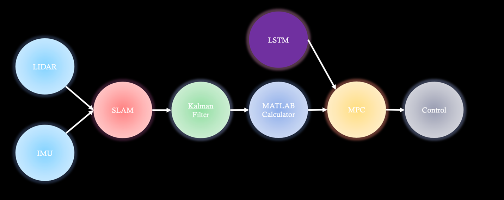

# **Model Predictive Control (MPC) for Autonomous Vehicle**

---

## 📘 1. Paper Review and Conceptual Foundation

The motivation for exploring and applying **Model Predictive Control (MPC)** in this project can be outlined as follows:

- During the *Vehicle Signal Processing* course, I reviewed and presented papers on autonomous driving control, identifying the limitations of conventional **PID-based** approaches in handling sensor noise and complex trajectory tracking.
- Later, in *Autonomous Driving Control System Design*, I encountered **MPC** within MATLAB examples. Further study allowed me to understand its theoretical advantages — including **constraint handling** and **prediction-horizon–based optimization**.

As a pre-validation step, MPC was tuned using both an **Unreal Engine–MATLAB AEB** (Automatic Emergency Braking) simulation and MATLAB control examples.  
This confirmed the effectiveness of **constraint-based control (acceleration, speed limits)** and clarified how **prediction horizon** and **weight matrices (Q, R)** affect performance and real-time feasibility.

However, early implementations relied on **Simulink’s built-in MPC block**, making it difficult to trace internal optimization processes.  
This experience underscored the importance of moving toward **mathematical modeling and code-level implementation**, reducing dependency on graphical blocks.

In the actual project, MPC was integrated with:
- **Sensor fusion (LiDAR, IMU)**
- **Kalman Filter–based localization**
- **Test-driven constraints for steering and acceleration**

Unlike most reference studies limited to simulation, this project extended the **prediction-based MPC** framework to a **real-world track environment**, combining perception and control under realistic timing and sensor noise.

---

## ⚙️ 2. System Implementation

### **Sensor Fusion and State Estimation**

Data collected from **LiDAR** and **IMU** were fused via **Kalman Filter + SLAM** to obtain accurate vehicle states.  
Using these states, the MATLAB computation module calculated steering and acceleration inputs based on the **vehicle dynamic model** and **road curvature**.

In addition, speed and other dynamic variables were predicted using a **pre-trained LSTM model**, enhancing prediction accuracy in nonlinear and rapidly changing driving conditions.

---

*(Place here the overall data-processing pipeline diagram, e.g. LiDAR → SLAM → KF → MATLAB → LSTM → MPC → Control)*

---

### **Data-Processing Pipeline**
| **Stage** | **Topic/Variable** | **Data Description** | **Data Type** | **Message Type** |
|------------|--------------------|----------------------|----------------|------------------|
| **Sensor → SLAM** | `/scan` | LiDAR scan range values | `float32 list` | `sensor_msgs/LaserScan` |
| | `/qcar2_imu` | Quaternion, angular velocity, linear acceleration | `float64` | `sensor_msgs/Imu` |
| **SLAM → MATLAB** | `/location` | Vehicle position `(x, y, heading)` | `float64` | `geometry_msgs/Point` |
| **MATLAB → Actuators** | `/simulinkout` | `(velocity, steering, 0)` | `float64` | `geometry_msgs/Point` |

---

### **Constraint Settings**

Test-driven constraint ranges were applied for each control variable:

| **Variable** | **Curved Segment** | **Straight Segment** | **Description** |
|---------------|--------------------|----------------------|-----------------|
| Steering Angle | ±0.35 rad | ±0.13 rad | Based on stability and actuator limits |
| Velocity | 0.3 m/s | 0.1 m/s | Tuned for smooth motion and safety |

These values were repeatedly validated through **simulation and on-track testing**, ensuring both **trajectory tracking** and **real-time stability**.

However, in some cases, **LSTM predictions diverged** from actual vehicle behavior — indicating **limited generalization** of the model.  
This is addressed as a key point for **future improvement** (see Section 4).

---

## 🧮 3. Cost Function and Weight Matrices (Q, R)

🖼️ **Insert Image Placeholder:** `MPC_Cost_Function.png`  
*(Insert your attached figure showing the cost function and Q/R matrix explanation.)*

The MPC objective function is defined as:

$$
J = \sum_{k=1}^{N_p} (x_k - x_k^{ref})^T Q (x_k - x_k^{ref}) + \sum_{k=0}^{N_c-1} u_k^T R u_k
$$

### **Q (State Weight Matrix)**
Determines how much to penalize **state errors** such as position, heading, and velocity deviations.  
- Emphasis: trajectory tracking accuracy  
- Example: penalizing position/angle deviation → higher \( Q \)

### **R (Input Weight Matrix)**
Determines how much to penalize **control effort** (steering, throttle).  
- Emphasis: smoothness of control inputs  
- Example: penalizing large steering changes → higher \( R \)

### **Interpretation**
- **Prediction Horizon:** "How far into the future should we predict?"
- **Q:** "How closely should we track the reference trajectory?"
- **R:** "How softly should control inputs vary to maintain stability?"

---

## 📊 4. Results and Analysis

The experimental track was narrow and contained several high-curvature segments.  
Despite these challenges, the designed control framework achieved **smooth, stable driving** without lane departure.

### **Key Findings**
- The baseline controller and **Kalman Filter–based state estimation** performed so accurately that MPC’s correction effect was relatively minor.  
- The theoretical **error reduction** benefit of MPC was not strongly observed in real experiments.
- Under certain scenarios, **LSTM predictions** deviated from actual vehicle dynamics, limiting control precision.
- When disturbances caused path deviations, **MPC’s corrective capability** was insufficient — mainly due to temporary computational latency and sensor timestamp misalignment.

### **Interpretation**
These results demonstrate that MPC performance is not determined solely by algorithmic superiority,  
but heavily depends on:
- Sensor fusion accuracy  
- Synchronization stability  
- Predictive model reliability

Ultimately, the MPC module was **excluded from the final competition deployment**, as the baseline controller already achieved sufficient accuracy.  
This decision reflects a **pragmatic balance between reliability and complexity** under real-world constraints.

