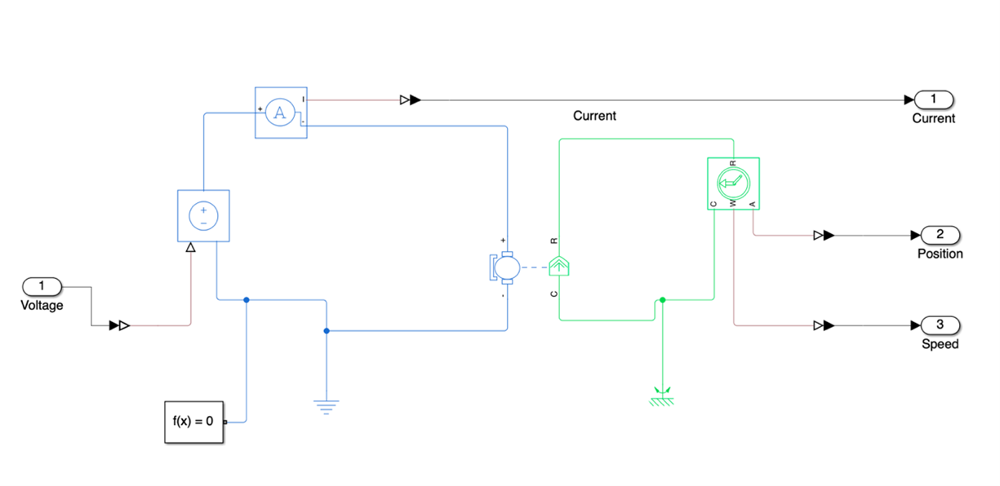

# **Actuator PID Auto-Tuner**

---

## 1. Motor Simscape

The DC motor was modeled in **Simscape Electrical**, incorporating both **electrical** and **mechanical** dynamics.  
The simulation model parameters were configured based on motor specifications from the datasheet, ensuring realistic system response.  

The input to the motor was applied as **PWM voltage**, and the resulting **current, speed, and position** were measured for feedback analysis.

---

## 2. Simulink Implementation

This simulation implements a **signal-based motor control** mechanism.  
An external input signal containing multiple frequency components is converted into a **PWM voltage signal**, which drives the motor model in Simscape Electrical.  
The resulting **motor speed** and **position** are measured and used for control feedback.

The control structure is designed around the **Simulink PID Autotuner**:
- During simulation, the **Autotuner** calculates optimal PID gains based on the motor’s dynamic response.  
- The derived gains are stored in a **Gain Storage block**.  
- During operation, stored parameters are recalled and applied dynamically for different conditions (e.g., straight driving, stop, or constant speed).

A key strength of this model lies in its **realistic frequency-to-voltage conversion**, reflecting actual hardware characteristics.  
The complete control loop — *Autotuner → PID Gain Storage → Motor Control* — demonstrates **dynamic gain scheduling** and allows validation of stable performance through closed-loop simulation.

---

## 3. Results and Application

### 3.1 Voltage and Speed Response

<table>
  <tr>
    <td align="center">
       
      <b>Voltage Graph</b>
    </td>
    <td align="center">
       
      <b>Motor Speed</b>
    </td>
  </tr>
</table>

---

### 3.2 Analysis

The simulation results confirm the **effectiveness of the closed-loop control**.  
As shown in the plots, the motor rapidly accelerates to the target speed with minimal overshoot,  
then maintains a stable steady-state velocity.  

The system exhibits both **accurate tracking** and **robust stability**,  
which are crucial for **waypoint-based trajectory execution**.

In operation:
- Each waypoint is mapped to a **stored PID profile**.  
- When activated, the controller retrieves corresponding PID gains and applies them to the motor.  
- The resulting commands are **published via ROS topics**, seamlessly integrating with higher-level planning and decision modules.

This mechanism enables the motor to **accelerate, stop, or maintain constant speed** depending on the driving condition,  
ensuring **smooth transitions and overall system stability**.

---

## 4. Summary

This study implemented a **PID autotuning framework** for DC motor control using MATLAB Simulink and Simscape Electrical.  
The system combines **automatic gain scheduling**, **PWM-based actuation**, and **closed-loop verification**,  
serving as a reliable foundation for actuator-level control in autonomous driving applications.
