# **Pure Pursuit & Stanley Controllers for Autonomous Driving**

---

## 1. Introduction and Background

In the early development stages (AEB System simulation, Xytron simulation),  
autonomous driving was implemented using a **PID controller**.  
However, both the **Xytron competition** and **QLabs environment** required high-speed driving, tight curves, and obstacle sections simultaneously.  
Under such conditions, the PID controller could not ensure stable performance through gain tuning alone,  
and unstable output spikes frequently occurred at high speeds.

---

## 2. PID Control Analysis

To analyze control stability, performance comparisons were made across **PID** at both **high** and **low speeds**.

### PID stability table

<table>
  <tr>
    <td align="center">
      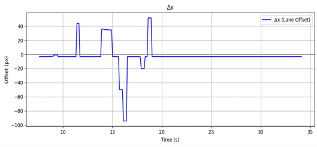 
      <b>High-speed PID Δx</b>
    </td>
    <td align="center">
      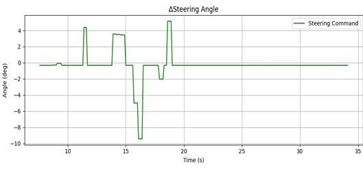 
      <b>High-speed PID ΔSteering Angle</b>
    </td>
  </tr>
  <tr>
    <td align="center">
      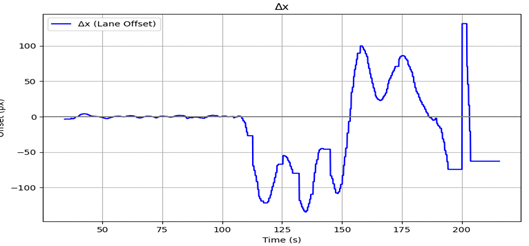 
      <b>Low-speed PID Δx</b>
    </td>
    <td align="center">
      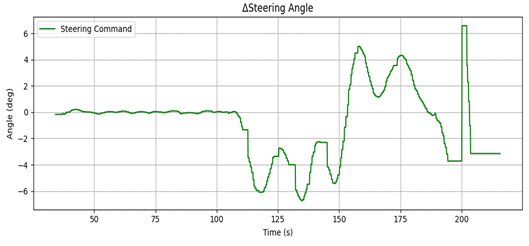 
      <b>Low-speed PID ΔSteering Angle</b>
    </td>
  </tr>
</table>

In low-speed environments (see [Xytron Simulator](#)),  
the PID controller showed relatively stable behavior.  
However, in the **high-speed** conditions required for the competition, the output fluctuated sharply,  
and overall driving stability degraded significantly.  
This demonstrated that manual gain tuning was **inefficient and unreliable**, motivating the adoption of new controllers.  
We therefore investigated the **Stanley** and **Pure Pursuit** controllers—both known for their stability, efficiency, and low computational cost.

---

## 3. Stanley Controller

### 3.1 Control Law
The Stanley controller computes steering angle δ as:

$$
\delta = \phi(t) + \tan^{-1}\left(\frac{k e(t)}{v_f(t)}\right)
$$

(Reference: [Robotics StackExchange](https://robotics.stackexchange.com/questions/22989/what-is-wrong-with-my-stanley-controller-for-car-steering-control))

The Stanley method uses vehicle kinematics, geometric path information, and heading angle to follow the target trajectory.  
It maintains lane centering effectively even on curved sections by compensating both **heading error** and **lateral error** simultaneously.  
However, at very low speeds, steering may become overly sensitive, and parameter **k** tuning can be challenging.

---

### 3.2 Integration with SCNN and Depth-based Coordinates

The Stanley controller used the **SCNN-based lane centerline** and **depth-estimated coordinates** as input.  
It calculates:
- **Heading error:** between the vehicle’s forward direction and the tangent of the path.  
- **Cross-track error:** lateral offset from the centerline.

By combining both errors, the controller generates the steering command δ, enabling stable trajectory tracking.

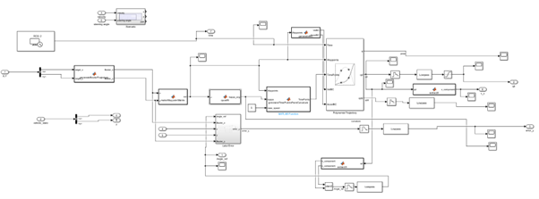

---

### 3.3 Stateflow-based Stop Modeling (Quanser Specification)

To comply with competition specifications, **Stateflow** was used to model stop events.  
Two conditions trigger the stop logic:

1. **Signal/Sign-based Stop (YOLO integrated)**  
   - YOLO detects a traffic light or stop sign → sends a ROS flag (`stopsign == 1`).  
   - Stateflow transitions to **Stopping**, sets `output_speed = 0`, waits `after(t_sec)`, then resumes normal driving.

2. **Coordinate-based Stop (CoorStop)**  
   - MATLAB function `GetStopTarget()` calculates Euclidean distance between current and target positions.  
   - If `(stopIndex <= numStops)` and `(distance_to_target < threshold)`, transition to **CoorStop** → stop vehicle → resume after delay and increment `stopIndex`.

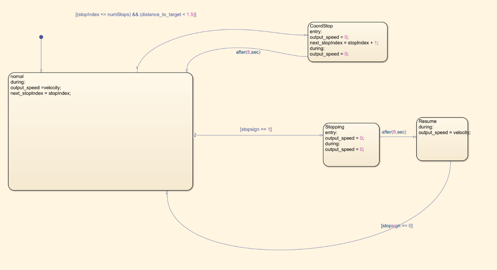

---

## 4. Simulation and Verification (MATLAB/Simulink)

A sine-wave path was generated in MATLAB to verify Stanley control performance —  
to confirm correct waypoint tracking, and the proper handling of stop/resume transitions.

### 4.1 Path Generation

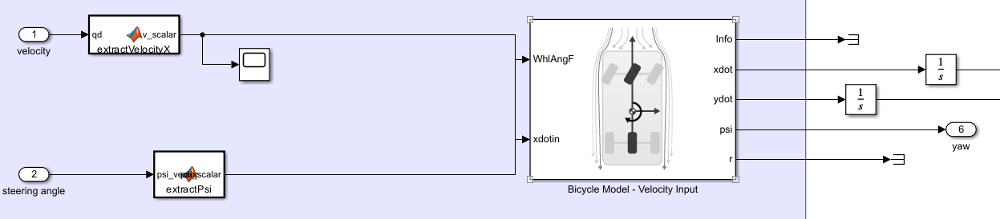 
<b>Sine Path Generation</b>
      
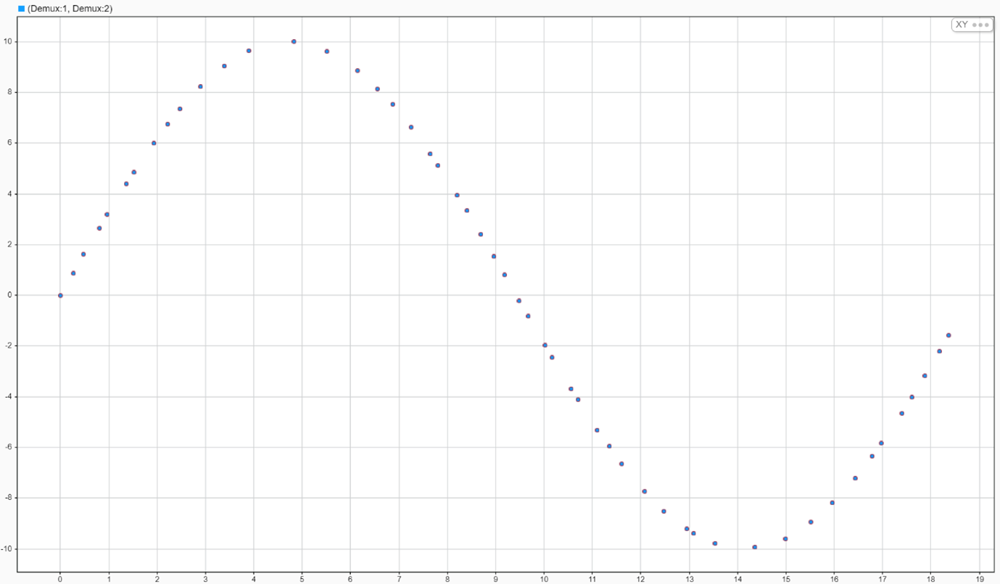 
<b>Path Generation model</b>

---

### 4.2 Lateral Error
The controller outputs lateral error as a **vector**,  
since multiple predicted coordinates and error terms are computed across time.  
Thus, several error curves appear in the scope window.  
Overall, errors remained within acceptable bounds,  
with slightly lower accuracy observed near the end of the trajectory.

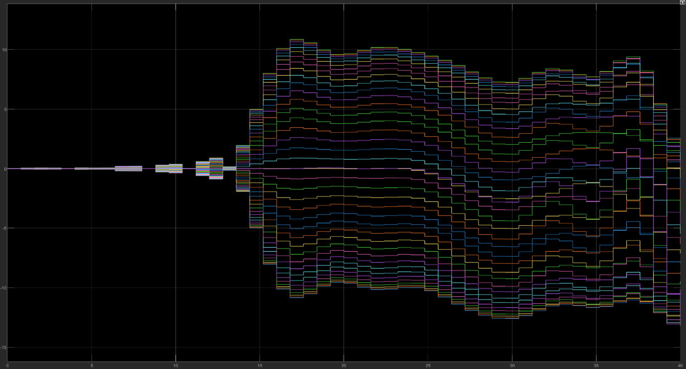

<b>Lateral Error Trace</b>

---

### 4.3 Steering Angle
The steering signal was discretized using a **zero-order hold** block, producing stepwise commands.  
This prevents overly sharp changes that could stress the servo motor and destabilize control.  
The discrete output thus reflects **hardware-aware design**.

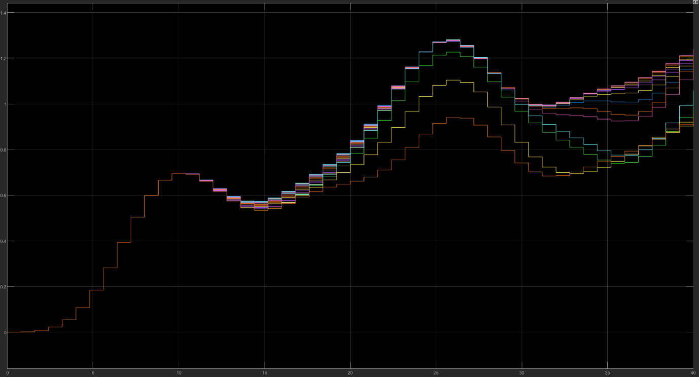

<b>Discrete Steering Angle Output</b>

---

### 4.4 Vehicle Speed
Vehicle speed adjusted naturally according to path curvature —  
slower in sharp curves, faster in straight segments — confirming that control output properly reflects curvature sensitivity.

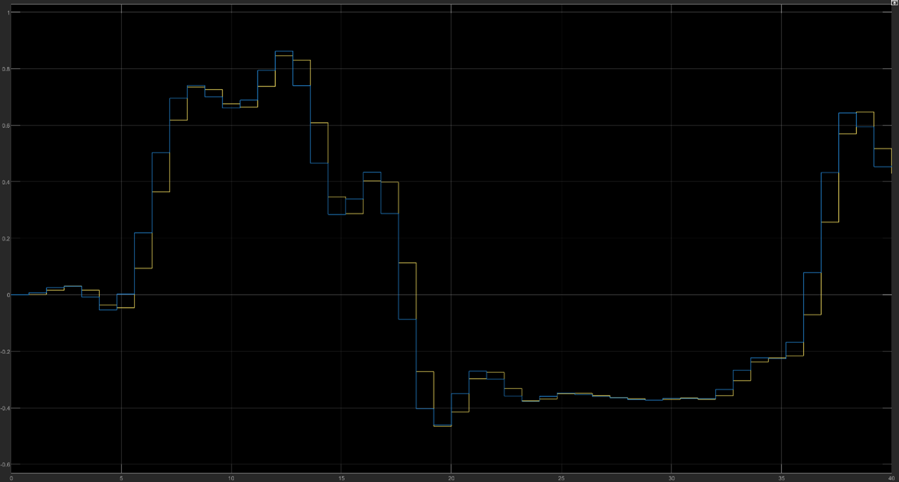

<b>Vehicle Speed Profile</b>

---

### 4.5 Stateflow Speed Output
At **t = 20s**, a pulse stop signal was injected.  
The controller correctly stopped and resumed tracking afterward,  
demonstrating that it handled **YOLO-based** and **coordinate-based** stop logic properly.

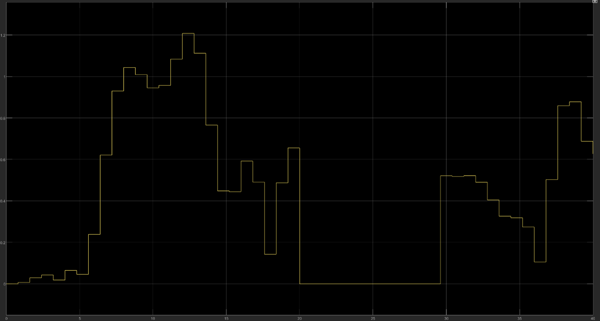

<b>Stop and Resume Event</b>

---

### 4.6 Zero-Order Hold and Discretization Verification
All control signals were processed via **zero-order hold** to output discrete command values.  
This design minimizes excessive motor stress and ensures safe actuator operation.  
Through Simulink scopes, all control variables were verified to behave normally.

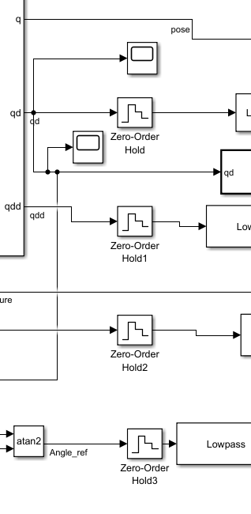

---

## 5. From Simulation to Real System

In the **Xytron simulator**, stable driving performance was achieved overall.  
However, in **QLabs**, the organizers reported a **Depth Camera malfunction**,  
preventing the intended **SCNN+Depth** coordinate system from being deployed.  
As a result, the final system used the **Pure Pursuit** controller for the competition.

---

## 6. Pure Pursuit Controller

### 6.1 Control Law
The Pure Pursuit steering angle is given by:

$$
\delta = \tan^{-1}\left(\frac{2L \sin(\alpha)}{l_d}\right)
$$

(Reference: [ShuffleAI Blog](https://www.shuffleai.blog/blog/Three_Methods_of_Vehicle_Lateral_Control.html))

The controller computes the curvature toward the **look-ahead point**,  
producing smooth trajectories and robust high-speed tracking.  
It is simple and computationally efficient, though **look-ahead distance** tuning strongly affects performance.

---

### 6.2 Simulink Implementation
The Pure Pursuit block received:
- **Pose (x, y, θ)** from Cartographer SLAM  
- **Waypoints** from the global planner  

and output **linear velocity** and **steering angle** commands.

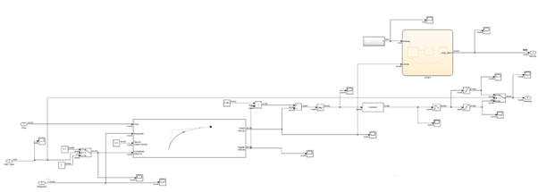

---

## 7. Performance Improvement and Results

To enhance performance, two main strategies were applied:

### 7.1 Adaptive Look-Ahead Distance
- Straight segments: **0.1 m** → minimizes unnecessary steering, maintains stability at high speed.  
- Curved segments: **3 m** → improves curve tracking.

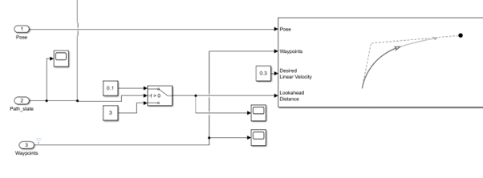

---

### 7.2 Steering Saturation
- Straight segments: **±0.13 rad**  
- Curved segments: **±0.35 rad**  
→ prevents over-aggressive steering and ensures actuator stability.

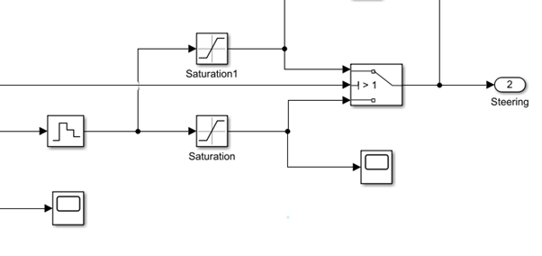

---

### 7.3 Results
After implementing these improvements,  
the system exhibited reduced output spikes and maintained smooth motion.

<table>
  <tr>
    <td align="center" valign="top">
       
      <b>Improved Tracking Results</b>
    </td>
    <td align="center" valign="top">
       
      <b>Final Simulation Results</b>
    </td>
  </tr>
</table>

Both **simulation and real-world experiments** confirmed that Pure Pursuit achieved stable performance across low- and high-speed, curved, and straight sections.  
Adaptive look-ahead tuning and saturation settings significantly reduced steering jitter and improved driving stability.

---

## 8. Conclusion

This study compared and implemented **PID**, **Stanley**, and **Pure Pursuit** controllers.  
While PID was sufficient for basic low-speed tasks,  
Stanley and Pure Pursuit provided superior performance in **high-speed** and **tight-curve** scenarios.  

Stanley’s geometric correction and Stateflow-based event logic offered strong path adherence,  
whereas Pure Pursuit achieved smooth, continuous steering with lower computational cost.  

Ultimately, due to hardware constraints in QLabs, **Pure Pursuit** was selected for final deployment,  
demonstrating stable performance and precise tracking in both simulation and real driving tests.

Future work will involve reintegrating **SCNN+Depth-based** lane input,  
and exploring **MPC** for adaptive, constraint-aware trajectory control once full sensor synchronization is available.
