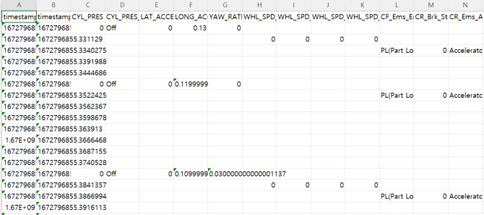
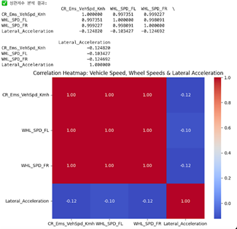
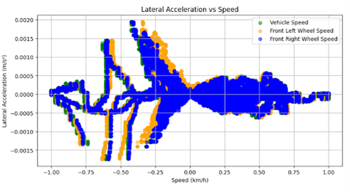
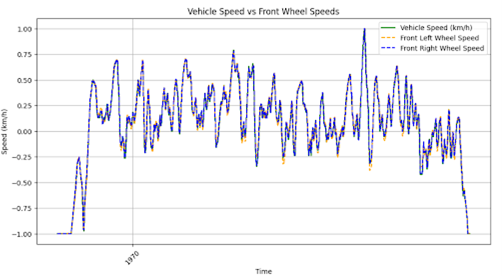
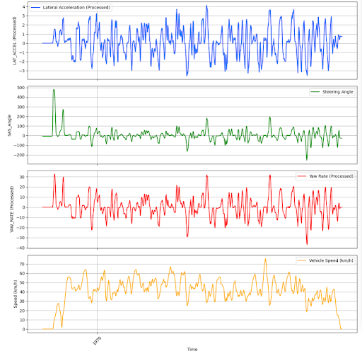
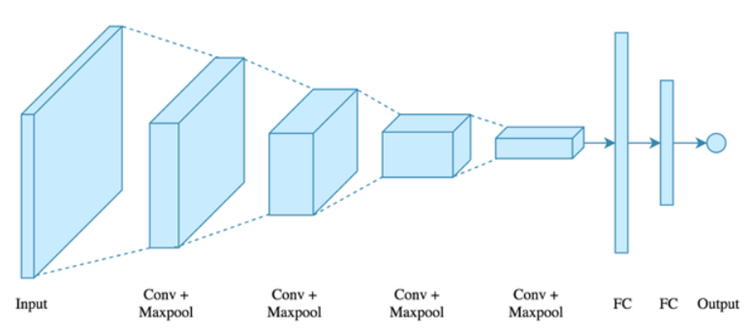
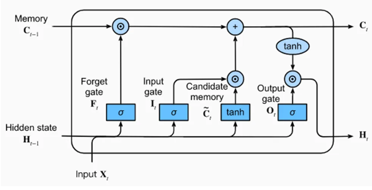
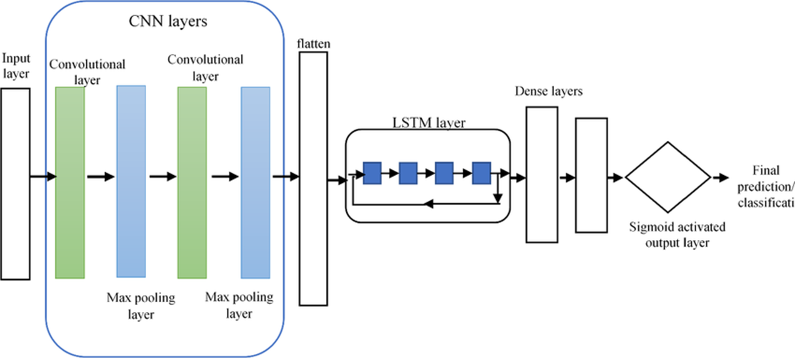
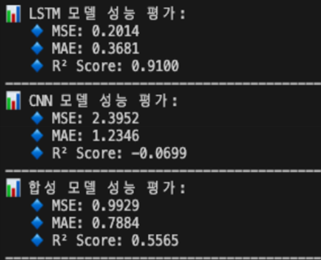
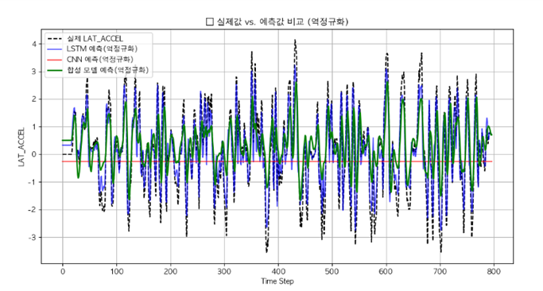

# LSTM-Based Lateral Acceleration Prediction

> Predicting vehicle **lateral acceleration ($a_y$)** 2 seconds ahead from real driving **CAN** data (and exploratory image streams).  
> We benchmark three approaches — **CNN**, **LSTM**, and **Fusion (CNN+LSTM)** — and confirm that **LSTM** provides the most stable and reliable performance for this task.

---

## 1) Motivation & Modeling Perspective

Most control stacks consider two complementary modeling paths:

- **Physics-driven (Vehicle Dynamics Modeling):** derive motion from governing equations.  
- **Data-driven (AI-based Modeling):** learn system behavior statistically from sensor data.

This project selects the **data-driven** path, building a **deep learning predictor** from **real CAN logs** gathered during on-road driving.  
CAN serves as the system’s low-latency backbone for sharing states and commands and is therefore a strong substrate for real-time prediction tasks feeding higher-level planning/control.

> Why this matters for control: MPC and similar controllers cannot consume every raw signal directly.  
> A **compact, predictive state** selected from the **most relevant variables** improves tractability and robustness.

---

## 2) Dataset & Problem Setup

- **Source vehicle:** Hyundai Ioniq Hybrid (real driving).  
- **Signals:** CAN time series (primary) and time-synchronized image frames (exploratory).  
- **Target:** Lateral acceleration **2.0 s** in the future.

### 2.1 Workflow at a Glance

---

### 2.2 Variable Selection (Correlation-Driven)
We select variables with **direct physical relevance** to lateral acceleration:

- **Yaw Rate ($r$):** relates via  
  $$
  a_y \approx v \cdot r
  $$
  during cornering.

- **SAS Angle (Steering Angle):** driver steering input directly changes $a_y$.

- **Vehicle Speed ($v$):** scales the magnitude of $a_y$ for the same steering input.

- **Brake Signal:** couples with longitudinal acceleration and influences transient $a_y$.

---

### Relationship Between Vehicle Speed and Front Wheel Speeds

The relationship between **vehicle speed** and **front wheel speeds** was visually analyzed, and no significant difference was observed between the two.  
Therefore, treating them as separate independent variables was unnecessary, and excluding front-wheel speed did not negatively impact the prediction of lateral acceleration.

| **Lateral Acceleration vs Speed** | **Vehicle Speed vs Front Wheel Speeds** |
|:---------------------------------:|:--------------------------------------:|
|  |  |
| *Comparison of lateral acceleration and speed relationships* | *Time-series comparison between vehicle and front wheel speeds* |

---

### 2.3 Time Alignment, Cleaning, and Scaling

- **Resampling:** All channels re-timestamped to a **common time grid**.  
- **Interpolation:** Missing entries **linearly** interpolated.  
- **Outliers:** Extreme values removed (**Z-score > 5**).  
- **Normalization:** Inputs mapped to a **[-2, 2]** range to balance positive/negative spans.

---

## 3) Model Candidates

We compare three alternatives using the same target ($a_y$ @ +2s) and consistent train/val/test splits.

### 3.1 CNN 
**Intuition:** learn visual dynamics from frame-to-frame changes.  
**Reality:** with **small pixel deltas** per frame, CNN features were **weak** for direct $a_y$ regression.

---

### 3.2 LSTM
Best aligned with **sequential dynamics**.  
LSTM captures long-term dependencies among **Speed, Yaw Rate, Steering**, and **Brake** to regress the future $a_y$.

---

### 3.3 Fusion (CNN + LSTM)
CNN extracts image features; LSTM processes CAN; features are concatenated and regressed to $a_y$.  
In practice, **weak/ noisy visual features** diluted the CAN signal, **hurting** performance.

---

## 4) Training & Evaluation

### 4.1 Inputs & Shapes
- **LSTM branch (CAN):** `(batch, time_steps, features)` built from **[LAT_ACCEL, YawRate, SAS_Angle, VehicleSpeed]**.  
- **CNN branch (Images):** preprocessed tensors (e.g., `processed_images.npy`).  
- **Loss:** Mean Squared Error (**MSE**) for all models.

### 4.2 Metrics
We report:
- **MAE** — Mean Absolute Error  
- **MSE** — Mean Squared Error  
- **$R^2$** — Coefficient of Determination

---

## 5) Results

### 5.1 Quantitative Comparison
**LSTM** achieved the most stable results; notably,  
$$R^2 \approx 0.91$$
indicating strong explanatory power for true $a_y$ variations.

---

### 5.2 Qualitative Comparison (Denormalized)
LSTM tracks both **trend** and **amplitude** most faithfully; CNN and Fusion exhibit noisier, phase-shifted responses.

**Interpretation**
- **CNN:** Frame-level changes are too subtle → low signal-to-noise for $a_y$.  
- **LSTM:** Learns temporal coupling among CAN variables → **best** alignment with ground truth.  
- **Fusion:** Adds non-informative visual features → **degrades** the LSTM stream.

---

## 6) Why LSTM Wins (for This Task)

- **Right bias for sequences:** Gate mechanisms (Forget/Input/Output) and cell state model **long-term temporal dependencies** directly.  
- **Physically consistent inputs:** CAN channels reflect the vehicle’s dynamic state (speed, yaw, steering, braking), which drive $a_y$.  
- **Robustness:** Less sensitive to image artifacts and scene-dependent variance than CNN-only pipelines.

---

## 7) Takeaways & Extensions

- **Control Integration:** The predicted $a_y$ and related short-horizon states can feed **MPC** or serve as priors in **(E)KF/UKF** measurement updates to reduce noise and drift.  
- **Generalization:** The LSTM pipeline provides a strong baseline for data-driven vehicle state prediction; fusion should be **revisited** once image streams carry stronger semantics (e.g., object-centric dynamics, optical flow, or events).  
- **Future Work:**  
  - Enrich the CAN feature set (e.g., longitudinal accel, steering rate).  
  - Sequence-to-sequence heads for **multi-step horizons**.  
  - Hybrid physics–ML models (grey-box) for better extrapolation.

---
