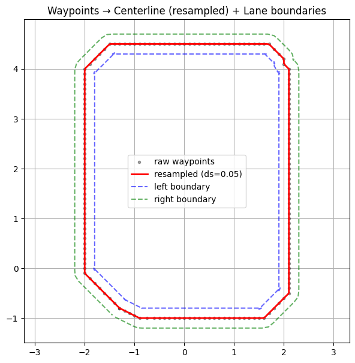
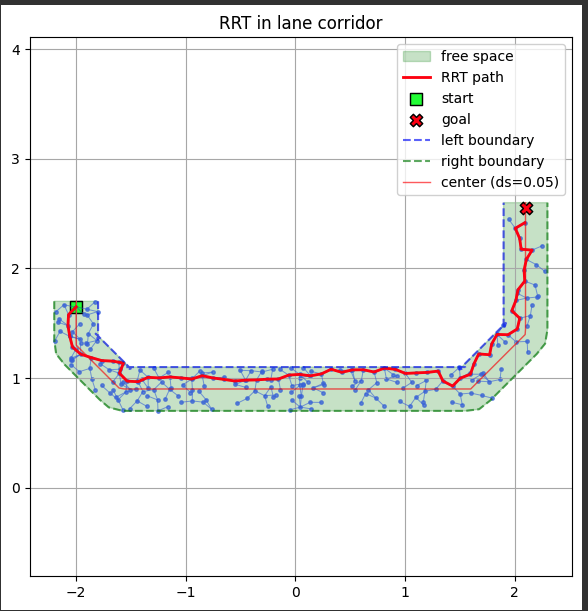
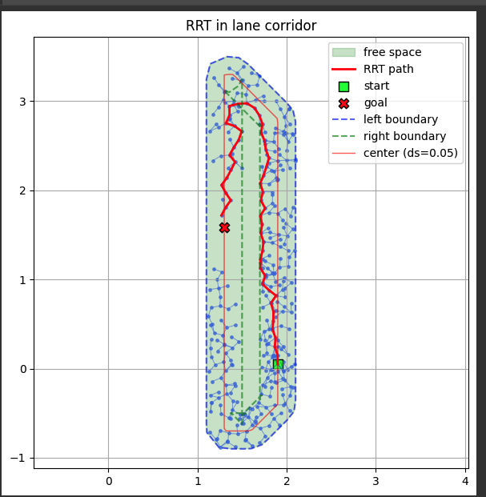
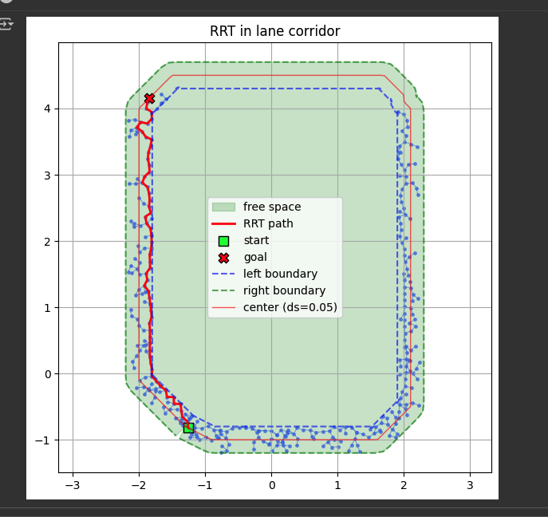

# RRT-Based Global Path Generation  
*(Rapidly-exploring Random Tree for Global Path Generation)*

---

## 1. Overview

This project pre-generates a **global driving path** for an autonomous vehicle operating in a **closed-track environment** using the **RRT (Rapidly-exploring Random Tree)** algorithm.

Because the taxi scenario was conducted on a competition-grade closed track, pre-generation of the entire path was practically feasible.  
Although the conventional RRT algorithm is effective for path exploration, its **random sampling** nature introduces the following limitations:

- The result differs each time the algorithm is executed, and the generated path often lacks **continuity**.  
- Since no cost function is considered, RRT does not guarantee an **optimal (shortest or smoothest)** path.

To overcome these issues, the study defines **Free Space** for each track segment, repeatedly executes RRT in every segment, and then performs **post-processing (smoothing)** to construct a continuous and drivable global path.

In other words, while embracing the stochastic exploration characteristic of RRT, we exploit the repeatability of a closed-track environment to evaluate path quality quantitatively and **pre-construct the most stable and consistent trajectory** before real driving.

---

## 2. Theoretical Background of RRT

The core idea of RRT is to randomly sample a point in the search space, find the nearest node in the existing tree, and extend (steer) the tree from that node toward the sample by a small step Δq.  
Repeating this process rapidly expands the tree throughout the space until it reaches the goal region.

---

### (1) Random Sampling

$$
q_{\text{rand}} \sim U(Q)
$$

A random point \( q_{\text{rand}} \) is sampled within the search space \( Q \).

---

### (2) Nearest-Node Search

$$
q_{\text{near}} = \underset{q_i \in T}{\arg\min}\, \text{dist}(q_i, q_{\text{rand}})
$$

Among all nodes currently in the tree, the one with the smallest distance to \( q_{\text{rand}} \) is selected.  
The distance metric can be Euclidean or any metric suitable for the configuration space.

---

### (3) Tree Extension (Steer Function)

$$
q_{\text{new}} = q_{\text{near}} + 
\frac{(q_{\text{rand}} - q_{\text{near}})}{\|q_{\text{rand}} - q_{\text{near}}\|} \cdot \varepsilon
$$

From \( q_{\text{near}} \), a new point \( q_{\text{new}} \) is created by moving a step \( \varepsilon \) toward \( q_{\text{rand}} \).  
(In other words, one incremental step in the direction of \( q_{\text{rand}} \).)

---

### (4) Collision Check

$$
q_{\text{new}} \in C_{\text{free}}
$$

Verify that \( q_{\text{new}} \) lies within the free configuration space \( C_{\text{free}} \).  
If it collides with any obstacle, discard \( q_{\text{new}} \).

**Segment-based collision test**

$$
\text{CollisionFree}(q_{\text{near}}, q_{\text{new}}) =
\begin{cases}
\text{True}, & \text{if } (1-s)q_{\text{near}} + s q_{\text{new}} \notin O,\; \forall s \in [0,1] \\
\text{False}, & \text{otherwise}
\end{cases}
$$

- \( O \): obstacle region  
- If no point on the segment between \( q_{\text{near}} \) and \( q_{\text{new}} \) lies inside \( O \) for all \( s \in [0,1] \), the motion is collision-free.

---

### (5) Tree Expansion and Node Addition

$$
T = T \cup \{ (q_{\text{near}}, q_{\text{new}}) \}
$$

If collision-free, add the new node and edge to the tree.

---

## 3. Definition of Free Space and Problem Recognition

### 3.1 Structural Characteristics of the Track

The track has only an **outer boundary**, with no internal physical obstacles.  
While traffic lights and signs exist visually, the interior is essentially an **open empty space**, meaning that an **occupancy-grid representation** cannot accurately describe drivable regions.  
Therefore, a conventional occupancy-based environment model has fundamental limitations for applying RRT.

---

### 3.2 Centerline Extraction via Cartographer SLAM

To overcome this issue, the **centerline coordinates** obtained from **Cartographer-based SLAM** during vehicle driving were used.  
The centerline was laterally expanded by the lane width to generate left and right boundaries, modeling each track segment’s **Free Space** as a **polygonal corridor**.

---

### 3.3 Problems of Whole-Track Free-Space Generation

Initially, RRT was executed by forming a single free-space polygon using the entire track centerline.  
However, the presence of **intersections**, **roundabouts**, and **bi-directional lanes** caused **overlaps and tangling** among free-space polygons.

<p align="center"></p>

As a result:
- The free-space definition became incomplete.  
- RRT expansion behaved abnormally or extended beyond the valid track boundary.  
- Numerous off-track trajectories were generated.

---

## 4. Segment-wise Free-Space Division and RRT Execution

To resolve these issues, the track was divided into multiple **segments**.  
Each segment consists of a continuous portion of the centerline with a fixed arc length,  
and an **independent free-space corridor** was modeled for each one.

---

### 4.1 Free-Space Modeling Procedure (Pseudo Code)

The following pseudo code summarizes how each segment’s Free Space was modeled using the waypoint data.  
The actual implementation loads waypoint JSON files and processes them sequentially.

Each segment includes the following steps:
1. Load and merge waypoints.  
2. Re-sample by arc length.  
3. Generate left/right lane boundaries using the lane width.  
4. Define the polygonal Free Space.

```python
INPUT: files = sorted(glob("waypoints_*.json"), by natural order)
PARAM: ds=0.05, lane_width=0.4
OUTPUT: segments_free_space = [FreeSpace_i], centerline, left/right boundaries

# 1) Load & stitch
segments = [ load_json_xy(f) for f in files ]
center_raw = stitch(segments)  # remove duplicated endpoints at joins

# 2) Resample (arc-length uniform)
centerline = resample_uniform(center_raw, step=ds)

# 3) Lane boundaries via normal offsets
tangent = normalize(gradient(centerline))
normal  = rotate90(tangent)  # [-t_y, t_x]
left_boundary  = centerline + 0.5 * lane_width * normal
right_boundary = centerline - 0.5 * lane_width * normal

# 4) Segmenting rules
breaks = []
for i from 1 to len(centerline)-2:
    kappa = curvature(centerline, i)
    dpsi  = heading(centerline, i) - heading(centerline, i-1)
    if kappa > κ_thresh OR abs(dpsi) > ψ_thresh OR arc(i) - arc(last_break) > L_max:
        breaks.append(i)

segments_idx = pairwise([0] + breaks + [len(centerline)-1])

# 5) Free space polygons
segments_free_space = []
for (s, e) in segments_idx:
    L = left_boundary[s:e+1]
    R = right_boundary[s:e+1]
    corridor = polygon( concatenate(L, reverse(R)) )
    segments_free_space.append(corridor)
```

---

### 4.2 Example of Segment Modeling Results

<table><tr>
<td></td>
<td></td>
<td></td>
</tr></table>

The above figures show **Free-Space modeling results** for selected portions of the track.  
The centerline (black), and the blue/green dashed lines represent the **left and right lane boundaries**, respectively.

It can be confirmed that each segment’s Free Space is defined as a **polyline-shaped band**.  
This modeling was performed for every specific segment of the track; the above figures show a few representative examples.  
In subsequent stages, the **RRT algorithm** was applied inside each Free Space segment to generate local optimal paths,  
and those were then connected sequentially to produce a **global path** covering the entire track.

---

## 5. RRT Execution Results and Analysis

### 5.1 Algorithmic Procedure (Pseudo Code)

```text
Algorithm: Rapidly-exploring Random Tree (RRT)
1.  Initialize tree T with start node q_start
2.  for i = 1..N_max:
      q_rand  ← SampleFree(C)                     # random in corridor C
      q_near  ← Nearest(T, q_rand)
      q_new   ← Steer(q_near, q_rand, η)
      if EdgeInCorridor(q_near, q_new, C):
          AddNode(T, q_new); AddEdge(T, q_near → q_new)
          if ||q_new - q_goal|| ≤ r_goal: return Backtrack(T, q_new)
3.  return Failure (if goal not reached)
```

---

### 5.2 RRT Execution Results

<table><tr>
<td></td>
<td></td>
<td></td>
</tr></table>

The figures above visualize **RRT-based path generation** for several different segments.  
The green area represents the **drivable corridor**,  
the blue dots and lines denote the **RRT exploration tree**,  
and the red line indicates the **final connected path**.  
(Target points within each segment were selected manually.)

---

### 5.3 Result Analysis and Limitations

<table><tr>
<td></td>
<td></td>
</tr></table>

Through segment-wise RRT generation, the algorithm successfully produced **feasible paths** that reached the goal quickly.  
However, because RRT relies on **random sampling**, multiple runs over the same segment yield slightly different trajectories.  
The following limitations were observed:

- The paths were **discontinuous** and included **sharp turns**.  
- The method does **not guarantee the shortest or optimal path**.

Therefore, raw RRT results were unsuitable for direct vehicle driving.  
A **post-processing smoothing** stage was required to improve continuity and optimality.

---

## 6. Post-Processing (Smoothing) and Final Path Generation

### 6.1 Elastic-Band-Based Path Smoothing

Elastic-band smoothing treats the path as a physical spring model.  
By combining the effects of **length (tension)**, **curvature**, **clearance**, and **centerline attraction**,  
each waypoint is iteratively adjusted to minimize energy and ensure smoothness and clearance.

```text
Pseudo code: Elastic-band based Path Smoothing

Algorithm: Path Smoothing
# Input : initial path P (e.g., RRT output)
# Output: smoothed path P_smooth
```

---

### 6.2 Comparison Before and After Smoothing

<table><tr>
<td></td>
<td></td>
</tr></table>

Left: Raw RRT result (discontinuous path)  
Right: **Clearance-aware Elastic-band smoothing result (smooth and drivable path)**

After smoothing, the **curvature variation decreased significantly**,  
and previously disconnected segments were smoothly connected, ensuring **continuity**.  
In curved regions, rather than strictly following the centerline,  
the algorithm generated a more **natural curvature** that reflected vehicle dynamics and lane width,  
resulting in a path more suitable for actual driving.

Moreover, the smoothing process maintained a **minimum clearance** from the corridor boundaries  
while slightly shortening the total path length, thereby improving overall **efficiency** compared to the raw RRT output.

---

### 6.3 Global Path Visualization

<p align="center"></p>

The figure above shows the **global path visualization** based on the entire track.  
To make the path clearer, center coordinates of all RRT-based segment results were used.  
During visualization, **GeoGebra** was employed to connect **splines and straight segments**,  
allowing intuitive observation of curvature variation and trajectory continuity.

This clearly illustrates the structural shape and drivable regions of the final global path.

The resulting path combines the **exploratory robustness** of RRT  
with the **smooth optimality** of the Elastic-band method,  
forming a **global path** that is both feasible and realistic for real-world vehicle driving.

---

## 7. Conclusion and Significance

This research considered both the structural constraints of the track and the exploratory nature of RRT.  
By combining **segment-wise Free-Space division**, **repetitive RRT exploration**, and **post-processing correction**,  
a complete global driving path was pre-constructed.

The proposed method is meaningful in that it **pre-generates a drivable path for the entire track in data form**,  
which can then be used directly by higher-level modules.  
The resulting **Global Path** served as the input to a subsequent **DQN (Deep Q-Network)-based path ordering and optimization module**.

Ultimately, this approach demonstrates the potential for organically linking **sampling-based global planning**  
with **learning-based decision modules**, improving both the **efficiency** and **practicality** of autonomous path planning.

<p align="center"></p>
