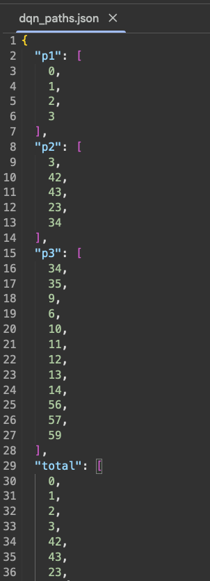

# Planning and Decision (DQN Path Optimization)

> This repository covers the process of deriving the **optimal route sequence (node visit order)** inside a closed-loop track using a **Deep Q-Network (DQN)** approach.  
> The algorithm was developed for an autonomous taxi scenario, where the vehicle must sequentially visit predefined **Pickup** and **Drop-off** points.

---

## 1. Theoretical Background

### 1.1 Q-Function Definition

The **Q-function** defines the expected cumulative reward obtainable from a given state–action pair \((s, a)\):

$$
Q^*(s, a) = \max_\pi \, \mathbb{E} \left[ \sum_{t=0}^{\infty} \gamma^t r_t \; \middle| \; s_0 = s, \, a_0 = a, \, \pi \right]
$$

---

### 1.2 Q-Learning Update Rule

The **Q-learning** algorithm iteratively updates the state–action value to approximate the optimal policy:

$$
Q(s, a) \leftarrow Q(s, a) + \alpha \left[ r + \gamma \max_{a'} Q(s', a') - Q(s, a) \right]
$$

---

### 1.3 Deep Q-Network (DQN) Approximation

To handle high-dimensional state spaces, Q-functions are approximated using neural networks:

$$
Q(s, a; \theta) \approx Q^*(s, a)
$$

Key components:
- **Experience Replay:** Randomized sampling from memory buffer to stabilize learning  
- **Target Network:** Periodic parameter synchronization to prevent divergence  
- **Epsilon-Greedy Policy:** Balances exploration (\(\varepsilon\)) and exploitation (\(1-\varepsilon\))

---

### 1.4 Target Q-Value

The target value incorporates the reward and discounted future reward estimate:

$$
\text{target}[a] = r + \gamma \max_{a'} Q(s', a'; \theta^-)
$$

---

### 1.5 Loss Function

The DQN minimizes the mean-squared error between the target network and the current Q-value network:

$$
L(\theta) = \mathbb{E}_{(s, a, r, s') \sim D} 
\left[ \big( r + \gamma \max_{a'} Q(s', a'; \theta^-) - Q(s, a; \theta) \big)^2 \right]
$$

---

## 2. Algorithm Design

### 2.1 Track Environment Modeling

The track is modeled as a **directed graph** with **60 nodes (0–59)**.  
The vehicle starts at node 0, visits several intermediate **Pick-up / Drop-off** nodes sequentially, and returns to the **final hub (node 59)**.  
Each sub-goal is treated as a local objective, and the network learns to complete these goals in order.

---

### 2.2 Reward Function Design

| Condition | Reward/Penalty | Purpose |
|:-----------|:---------------:|:--------|
| Reach sub-goal node | +100 | Encourage fast arrival at waypoints |
| Enter loop node (SCC > 1) | −1000 | Suppress cyclic route exploration |
| General movement | −1 | Penalize unnecessary movement |
| Revisit same node | −10 × (visit count) | Prevent redundant routes |
| Branch node (out-degree > 1) | +5 | Encourage route diversity |

At the end of each segment, the agent receives a +100 reward for successfully reaching the next **Pick-up/Drop-off** node, driving the policy to learn sequential goal achievement.

---

### 2.3 ε-Greedy Policy

The ε-Greedy exploration rate starts from **ε = 0.5** and decreases linearly toward 0 during training.  
This allows broad exploration in early episodes and convergence to stable exploitation in later stages.

---

### 2.4 Network Architecture and Hyperparameters

| Parameter | Description | Value |
|:-----------|:-------------|:------:|
| Structure | 2-layer MLP (Input–Hidden–Output) | — |
| Activation | ReLU | — |
| Loss Function | MSE (Mean Squared Error) | — |
| Optimizer | Gradient Descent | — |
| Learning Rate (α) | — | 0.01 |
| Discount Factor (γ) | — | 0.9 |
| Hidden Units | — | 64 |
| Episodes | — | 5000 |
| Max Steps per Episode | — | 100 |

Fallback mechanism: If no valid goal is reached, **BFS-based shortest path** is applied to guarantee a valid path is always generated.

---

## 3. Implementation and Results

### 3.1 SimpleDQN Class

The DQN agent was implemented as `SimpleDQN`.  
Each episode consists of iterative learning between the agent and environment.  
The agent selects actions using ε-Greedy policy, updates parameters via backpropagation, and applies learned weights for greedy inference after training.

---

### 3.2 Scenario 1 — Single Pick/Drop Case

**Scenario:**  
Start → Pick-up (Node 3) → Drop-off (Node 34) → Return to Hub (Node 59)

  

**Result:**  
The DQN accurately visited all assigned nodes sequentially, avoiding reverse driving or redundant paths.  
It demonstrated robust route planning within the complex directed graph structure.

  

---

### 3.3 Scenario 2 — Multiple Intermediate Stops

**Scenario:**  
Start → 3 → 43 → 49 → 10 → 14 → Return to Start

  

**Result:**  
Even with an increased number of waypoints, DQN maintained consistent and stable route generation.  
It sequentially achieved all sub-goals, validating scalability for more complex multi-stop taxi missions.

  

---

### 3.4 JSON Storage and Integration

The generated paths were saved as segmented files (`p1`, `p2`, `p3`, …) and also merged into a total integrated path.

  

This **segment-based structure** allows independent learning and validation of each route segment while maintaining full-path integration.  
The resulting JSON files can be directly loaded into **Simulink control modules** or **ROS2 Helper Nodes** for real-time trajectory tracking.

---

## 4. Conclusion

By applying a **Deep Q-Network (DQN)** for route sequence optimization,  
the model successfully computed the **optimal Pick-up and Drop-off sequence** in a closed track environment.

- The system achieved **stable convergence** without loops or reverse motion.  
- Performance remained consistent even as the number of waypoints increased.  
- The DQN-generated paths were directly usable in **MATLAB Simulink** and **ROS2 nodes**.  
- Pre-calculated routes enabled **real-time mission switching** during competition scenarios.

> These results confirm that DQN-based path planning can go beyond simulation and serve as a **real-time decision engine** for autonomous vehicle control.

---
