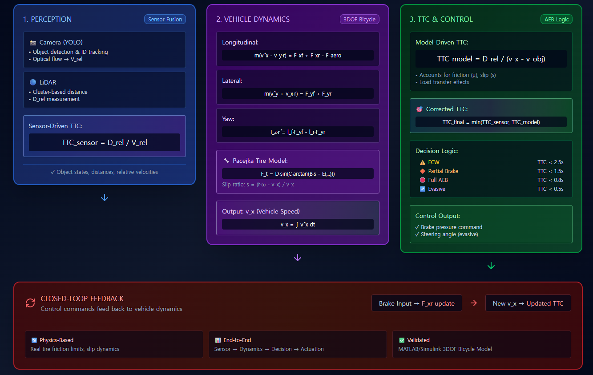
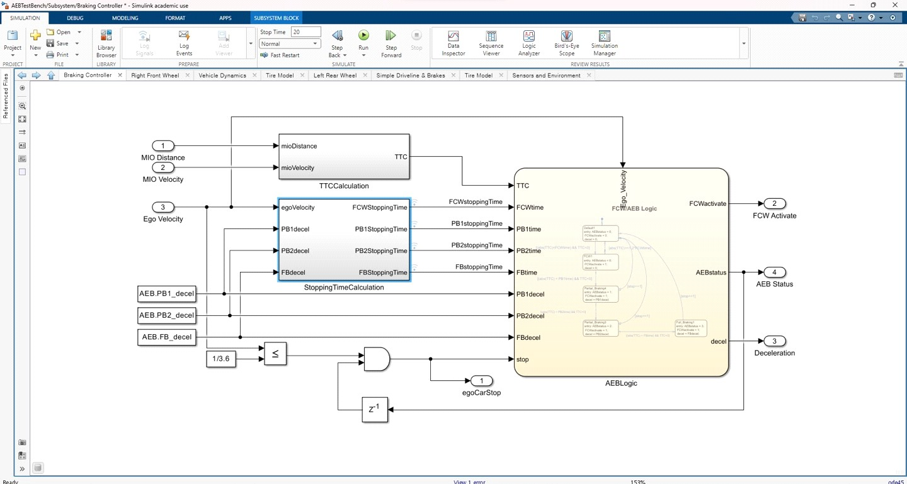

# Gasoline Vehicle Model (AEB Dynamics)

> A MATLAB/Simulink **Bicycle Vehicle Model** implementing the **Autonomous Emergency Braking (AEB)** system with physics-based vehicle dynamics, tire modeling, and sensor-fused TTC (Time-To-Collision) estimation.

---

## 1. Overview

The **AEB (Autonomous Emergency Braking)** system predicts potential frontal collisions and automatically applies braking without driver input.  
A key metric is the **Time-To-Collision (TTC)**, which depends directly on accurate vehicle speed estimation.

This project models physically consistent vehicle motion and braking behavior using MATLAB’s **3DOF Bicycle Model** block.  
Sensor-fused TTC combines:

- **Relative distance ($D_{rel}$)** from LiDAR/Camera  
- **Relative velocity ($V_{rel}$)** from optical flow + LiDAR depth  
- **Vehicle speed ($v_x$)** from the dynamics block  

to compute a corrected TTC for **AEB logic** and **Evasive Maneuver** decision layers.

  

---

## 2. 3DOF Bicycle Model Equations

The **Vehicle Dynamics Block** implements a force-based **3 Degree-of-Freedom (3DOF)** model governed by:

$$
\begin{cases}
m(\dot v_x - v_y r) = F_{xf} + F_{xr} - F_{aero} \\
m(\dot v_y + v_x r) = F_{yf} + F_{yr} \\
I_z \dot r = l_f F_{yf} - l_r F_{yr}
\end{cases}
$$

  

---

### (1) Longitudinal Motion

$$
m(\dot v_x - v_y r) = F_{xf} + F_{xr} - F_{aero}
$$

Longitudinal acceleration is computed from front/rear forces and aerodynamic drag.  
Throttle input is mapped to **engine torque**, contributing to $F_{xr}$.

---

### (2) Lateral Motion

$$
m(\dot v_y + v_x r) = F_{yf} + F_{yr}
$$

Steering angle induces tire lateral forces ($F_y$), governing **cornering** and **evasive response**.

---

### (3) Yaw Motion

$$
I_z \dot r = l_f F_{yf} - l_r F_{yr}
$$

Yaw rate is determined by the difference in lateral tire forces, including **load transfer** effects during acceleration and braking.

---

## 3. Tire and Slip Modeling

### 3.1 Longitudinal Slip

$$
s = \frac{r_{wheel} \omega_{wheel} - v_x}{\max(v_x, \varepsilon)}
$$

**Inputs:** wheel angular speed ($\omega_{wheel}$), vehicle speed ($v_x$), wheel radius ($r_{wheel}$)  
**Output:** slip ratio ($s$)  

Slip represents tire–road micro-slip; higher $s$ increases friction saturation under braking.

---

### 3.2 Vehicle Speed Estimation

Vehicle speed is obtained by integrating acceleration:

$$
\dot v_x = \frac{1}{m} (F_{tractive} - F_{roll} - F_{aero}), 
\quad 
v_x = \int \dot v_x \, dt
$$

To improve low-speed stability, wheel-speed-based estimation may be fused:

$$
v_x^{wheel} = r_{wheel}\, \omega_{wheel}\, (1 - s_{est})
$$

The final $v_x$ feeds directly into the **TTC calculation** in the AEB logic.

---

### 3.3 Tire Force (Pacejka Magic Formula)

$$
F_t = D \sin \!\Big( C \arctan \!\big( B s - E (B s - \arctan(B s)) \big) \Big)
$$

This nonlinear curve captures friction saturation near the slip region $s \approx 0.15 \sim 0.2$, reproducing the tire traction limit during braking.

---

## 4. TTC Calculation and Correction

  

### (1) Sensor-Driven TTC

During **Avoidance Preprocessing**, the perception pipeline estimates object states:

- **YOLO:** object detection and ID tracking  
- **LiDAR:** cluster-based distance → $D_{rel}$  
- **Camera:** ROI motion / optical flow + depth → $V_{rel}$

Then:

$$
TTC_{sensor} = \frac{D_{rel}}{V_{rel}}
$$

Used as the **primary early-stage metric** for Forward Collision Warning (FCW) and Avoidance.

---

### (2) Model-Driven TTC

Sensor TTC does not account for **friction ($\mu$)**, **slip ($s$)**, or **load transfer**, which limit braking capability.  
To compensate, a **model-based TTC** is calculated in parallel:

$$
TTC_{model} = \frac{D_{rel}}{v_x - v_{obj}}
$$

where $v_x$ comes from the Vehicle Dynamics block, and $v_{obj}$ (if available) from sensors or simulation.  
This ensures physically consistent AEB logic decisions.

---

## 5. Control Feedback Structure

When $TTC_{model}$ falls below a threshold, the **AEB controller** automatically increases brake pressure.  
This input is fed back into the **Vehicle Dynamics block**, closing the loop:

> Perception → Dynamics Correction → Control Decision → Braking Response

A fully closed-loop system ensuring end-to-end physical consistency.

---

## 6. Summary and Significance

This gasoline-based AEB simulator:

- Uses **validated 3DOF Bicycle Model equations**
- Integrates **sensor-fusion TTC correction** and dynamic feedback  
- Serves as a **reference baseline** for verifying AEB and **Evasive Maneuver** logic  

Its RC counterpart (**QCar model**) extends the same physical framework to real hardware for **Kalman Filter** and **Model Predictive Control (MPC)** studies.

---

