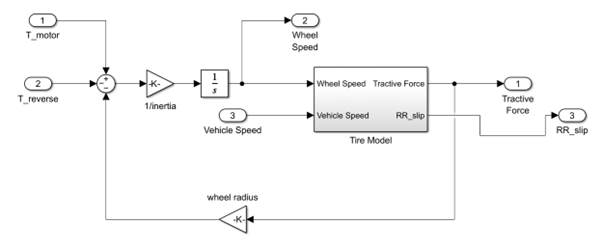
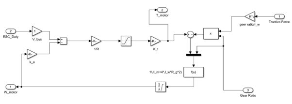
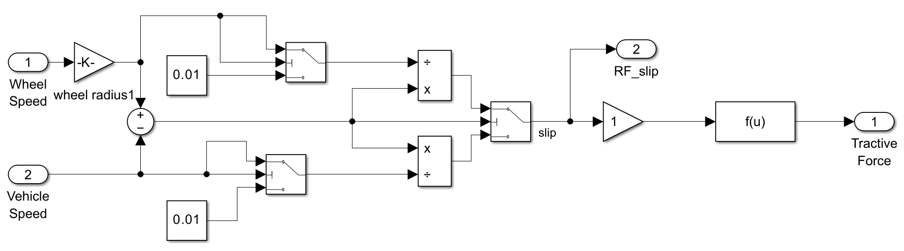
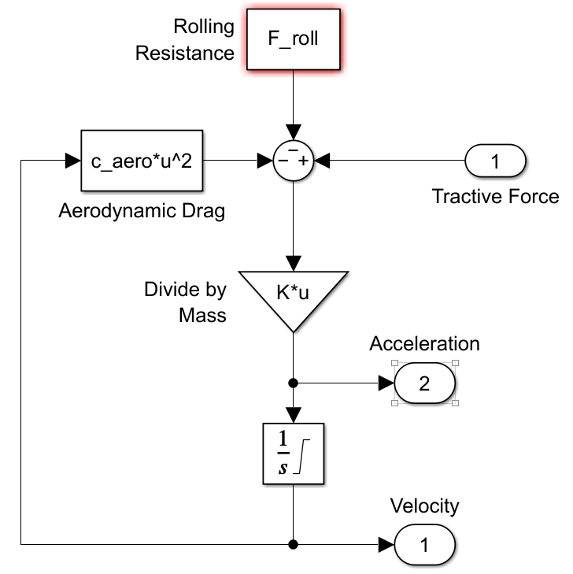
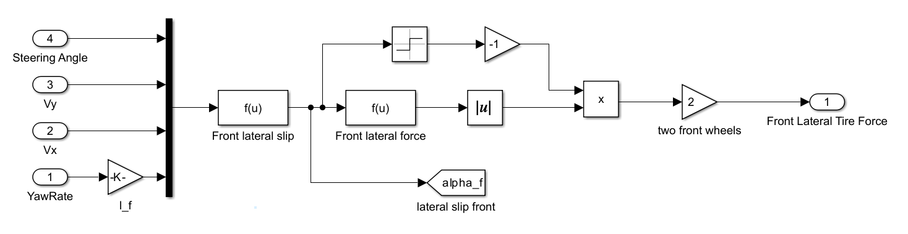
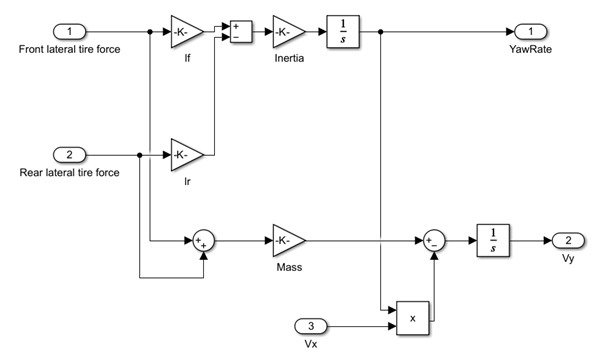
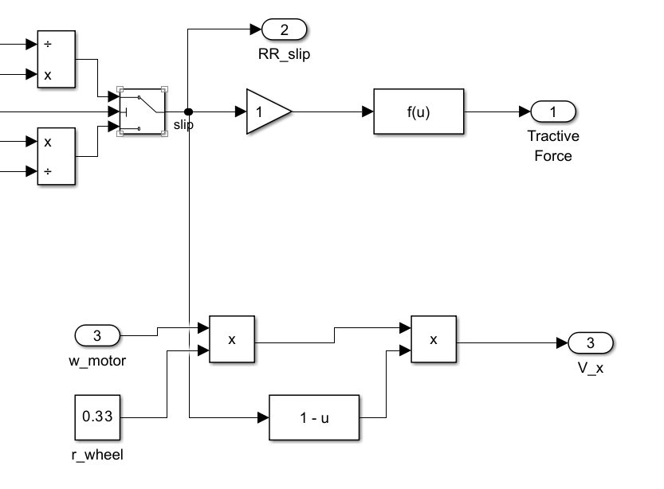

# QCar Vehicle Dynamics Model (RC Implementation)

> Motor-driven, **brake-less** 1/10-scale RC vehicle dynamics modeled from first principles to match **QCar** hardware (BLDC + ESC).  
> All equations are implemented explicitly (no “Vehicle Dynamics Bicycle Model” block) and are compatible with **QLabs** and **ROS2** I/O rates/types.

---

## 1. Overview

Unlike a gasoline car, **QCar** uses a BLDC motor and an **ESC** without a hydraulic brake. The model therefore:
- computes **longitudinal** and **lateral** dynamics directly from torque, slip, and simple tire laws,
- maps **ESC duty** to motor torque,
- omits explicit brake torque and uses **reverse/coast torque** from the ESC for deceleration,
- remains lightweight for **real-time control** (MPC, AEB, path tracking) and simulation parity.

---

## 2. Architecture Differences (Why a custom model?)

| Item | Gasoline Car | QCar (RC) |
|---|---|---|
| Powertrain | Engine → Gearbox → Wheel | ESC → **BLDC Motor** → Wheel |
| Braking | Hydraulic brake torque | **No physical brake** (ESC reverse/coast) |
| Control Inputs | Throttle, Brake pressure | **ESC duty** (and decel command `Pmc`) |
| Key Outputs | Engine RPM, Vehicle speed | **Motor speed**, Vehicle speed |
| Brake Torque | Explicit term in equations | **Absent** (replaced by friction/ESC decel) |

> We reconstruct a compact **3-DOF** structure (longitudinal + planar lateral/ yaw) instead of shrinking a passenger-car bicycle block.

---

## 3. Symbols

| Symbol | Name | Unit | Note |
|---|---:|---:|---|
| \(J_w\) | Wheel equivalent inertia | kg·m² | Wheel+motor reflected inertia |
| \(\omega_w\) | Wheel angular speed | rad/s | From encoder |
| \(\dot\omega_w\) | Wheel angular accel. | rad/s² |  |
| \(T_m\) | Motor torque | N·m | From ESC duty via \(k_t\) |
| \(T_{\text{reverse}}\) | Reverse/Coast torque | N·m | ESC-induced decel when commanded |
| \(F_t\) | Tire tractive force | N | Nonlinear vs slip \(s\) |
| \(r_w\) | Wheel radius | m | Measured on RC tire |
| \(v_x\) | Longitudinal vehicle speed | m/s | \(v_x = r_w\,\omega_w(1-s)\) |
| \(s\) | Longitudinal slip ratio | – | \(s=\dfrac{r_w\omega_w - v_x}{\max(v_x,\varepsilon)}\) |
| \(\mu\) | Friction coefficient | – | Slip-dependent |
| \(F_z\) | Normal load | N | From mass distribution |

---

## 4. Longitudinal Dynamics

### 4.1 Wheel–Motor Dynamics
\[
J_w\,\dot\omega_w \;=\; T_m \;-\; T_{\text{reverse}} \;-\; F_t\,r_w
\]

Slip, tire force, friction:
\[
s \;=\; \frac{r_w\,\omega_w - v_x}{\max(v_x,\varepsilon)}, \qquad
F_t \;=\; \mu(s)\,F_z
\]

  

### 4.2 Motor Torque (ESC Duty → Torque)
\[
\boxed{ \;
T_m \;=\; k_t\,I_m \;=\; k_t\,\frac{V_{\text{duty}} - k_e\,\omega_m}{R}
\;}
\]
where \(k_t\) = torque constant, \(k_e\) = back-EMF constant, \(R\) = internal resistance.  
Deceleration is realized by duty reduction or reverse command (no brake torque term).

  

---

## 5. Tire Model (Longitudinal)

We use a low-cost **Pacejka-style** (Magic Formula) curve to connect linear to saturation regions:

\[
\boxed{ \;
F_t(s) \;=\; D \,\sin\!\Big( C \arctan\!\big( B s - E (B s - \arctan(B s)) \big) \Big)
\;}
\]

This is implemented as:
\[
\mu(s) = \mu_D \,\sin\!\big(\mu_C \arctan(\mu_B s - \mu_E(\mu_B s-\arctan(\mu_B s)))\big),
\quad F_t=\mu(s)F_z.
\]

  

> Aerodynamic drag is negligible at RC speeds; we keep a small residual drag for MPC stability.

---

## 6. Vehicle Longitudinal Equation
\[
m\,\dot v_x \;=\; \sum F_t \;-\; F_{\text{roll}} \;-\; F_{\text{aero}} \;-\; m g \sin\theta
\]

  

---

## 7. Lateral Dynamics

### 7.1 Inputs / Outputs / States
- **Inputs:** steering angle \(\delta\), longitudinal speed \(v_x\)  
- **States:** \(v_y\) (lateral speed), \(r\) (yaw rate)  
- **Kinematics:** global pose \((x,y,\psi)\)

> For real-time control, we keep a compact state set \((v_x, v_y, r)\).  
> A learned **LSTM** side-model (see LSTM section) provides auxiliary predictions for steering/lateral error if desired.

### 7.2 Tire Slip Angles (Front/Rear)
\[
\alpha_f \;=\; \delta - \frac{v_y + l_f r}{v_x}, \qquad
\alpha_r \;=\; -\frac{v_y - l_r r}{v_x}
\]

Lateral forces with smooth saturation:
\[
F_{yf} \;=\; -C_f \tan^{-1}(\alpha_f), \qquad
F_{yr} \;=\; -C_r \tan^{-1}(\alpha_r)
\]

  

### 7.3 Planar Lateral/Yaw Equations
\[
m(\dot v_y + v_x r) \;=\; F_{yf} + F_{yr}, 
\qquad
I_z \dot r \;=\; l_f F_{yf} - l_r F_{yr}
\]

Integrate to get \(v_y(t)\) and \(r(t)\) and update global pose.  
A 2-track model is unnecessary at QCar speeds but can be added if required.

  

---

## 8. Motor–Wheel–Vehicle Speed Mapping

With no gearbox, motor speed maps almost directly to vehicle speed:
\[
\boxed{ \; v_x \;=\; r_w\,\omega_{\text{motor}}\,(1-s) \;}
\]

  

This mapping feeds **TTC**, **MPC**, and simulator I/O; on-vehicle we compute \(v_x\) from measured \(\omega_{\text{motor}}\), while in simulation \( \omega_{\text{motor}} \) can be commanded and mirrored.

---

## 9. TTC-Based Deceleration Logic (AEB/Avoidance)

Relative-distance/velocity TTC:
\[
\boxed{ \; \text{TTC} \;=\; \frac{D_{\text{rel}}}{\,v_x - v_{\text{obj}}\,} \;}
\]

If an **Avoidance cost** based on TTC falls below a threshold, a **deceleration command** \(Pmc\) is issued and the ESC applies reverse/coast torque (indirect braking).  
This reproduces AEB without a physical brake.

---

## 10. Vision-Triggered Stop Logic (Parallel to TTC)

In parallel with TTC, **YOLO** detections (traffic light, stop sign, crosswalk) are fed to **Stateflow**:
- Stateflow combines **State** (current mode) and **Event** (vision) → issues a **stop** by setting motor speed to zero.
- This runs **in parallel** to AEB: either path can stop the vehicle; both share the same control framework.

---

## 11. Validation & Conclusion

Track tests confirmed that the **simulated responses** match **measured** QCar behavior in both longitudinal and lateral axes.  
The model runs stably with **MPC/AEB/path-tracking**.

  
  

*(Optional) Xytron avoidance photos can be inserted here.*

---

