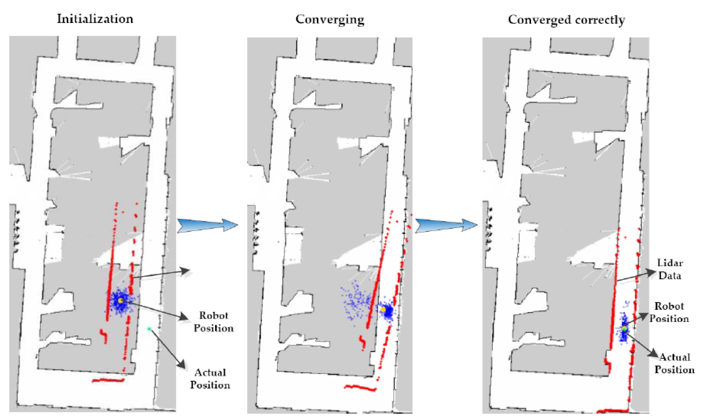
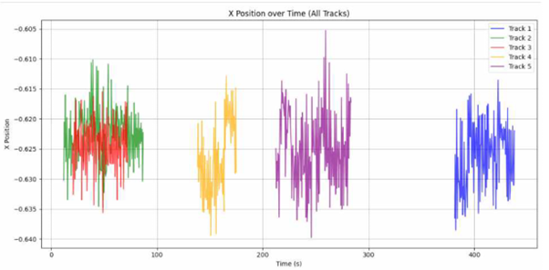
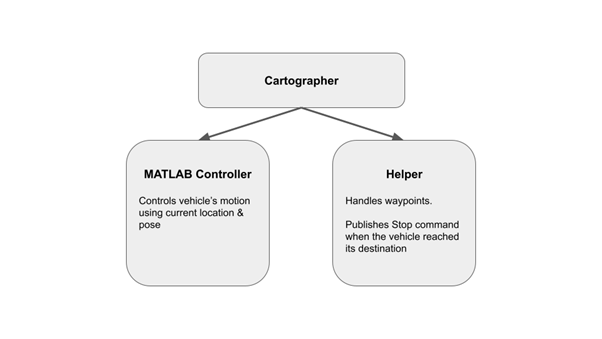

# Localization (Cartographer SLAM Integration)

> Accurate **self-localization** is the foundation of all vehicle control systems.  
> This section describes the transition from conventional GPS and AMCL to a **LiDAR-based Cartographer SLAM** approach optimized for small-scale RC environments.

---

## 1. Motivation

Accurate self-localization is the foundation of any vehicle control system.  
Conventional GPS-based localization, though common, produces errors of several meters — unacceptable for small-scale track environments.  
To overcome this limitation, we implemented a **LiDAR-based SLAM (Simultaneous Localization and Mapping)** approach.

  

---

## 2. AMCL vs Cartographer

Among classical SLAM methods, **AMCL (Adaptive Monte Carlo Localization)** is lightweight and widely used.  
However, it relies on odometry prediction with LiDAR correction, which becomes unreliable when:
- Odometry data is noisy (wheel slip, vibration),
- Sensor readings are unstable,
- Or the environment lacks distinct features.

AMCL also lacks **loop closure**, causing cumulative drift, and assumes a **static** world model, degrading performance in dynamic environments.  
Therefore, AMCL was not suitable for the RC-car setup, where odometry uncertainty is high.

  

In contrast, **Google Cartographer** performs **direct scan matching**, reducing odometry dependence and achieving high mapping accuracy on small-scale tracks.  
It also treats temporary dynamic objects as outliers, improving robustness.  
Moreover, Cartographer supports **both online mapping and real-time localization**, enabling adaptive behavior in changing environments.

> For these reasons, **Cartographer** was selected to ensure stable, drift-free, and high-accuracy localization.

---

## 3. Cartographer Tuning Process

Because the test track has limited geometric diversity, early experiments showed **pose jumps** during scan matching.  
To stabilize performance, the following tuning steps were applied:

### ● LiDAR Scan Range Extension
The scan range was increased to **12 meters**, allowing the system to capture the full track structure and maintain continuous scan overlap for robust matching.

### ● IMU Data Fusion
IMU orientation data were fused with LiDAR scans to reduce ambiguity in rotational estimation.  
This stabilized localization performance even under **dynamic obstacles** or **temporary occlusions**.

### ● TF Frame Definition & Transformation
All sensor positions were explicitly defined in the **TF tree**.  
The `map → base_link` transform was published in \((x, y, \text{yaw})\) format, enabling direct use by MATLAB and Simulink control modules.

### ● Coordinate Smoothing
Minor oscillations in estimated positions were filtered using a low-pass smoothing method.  
This prevented the control layer (MPC, Pure Pursuit) from overreacting to small localization noise.

> After applying these adjustments, localization became smoother and more responsive, eliminating most of the previous “position jumping” issues.

   
  <i>Example: x-coordinate vibration reduction while stationary</i>

---

## 4. Integration with Control System

The **ROS2-based localization data** from Cartographer were fully integrated into the **MATLAB control framework** for real-time operation.  
A dedicated **Helper Node** subscribed to localization outputs and distributed:
- Position and heading to the **waypoint tracker**,
- Stop signals and position tolerance checks to the **control logic**.

This configuration enabled **precise path following** and **consistent waypoint tracking**, validating the effectiveness of Cartographer-based localization for small autonomous vehicles.

  

---

## 5. Summary

- **Cartographer SLAM** provided superior performance over AMCL, minimizing drift and improving robustness against dynamic obstacles.  
- Tuning (LiDAR range, IMU fusion, TF calibration, smoothing) was essential to stabilize mapping on small-scale tracks.  
- Integration with **ROS2 + MATLAB/Simulink** achieved real-time, high-accuracy localization directly supporting control tasks (MPC, Pure Pursuit, AEB).

> This approach ensured reliable localization across both simulation and real QCar deployments.

---
