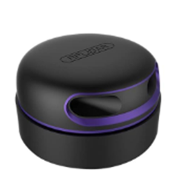
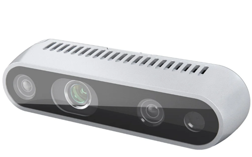
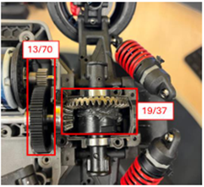

# **Sensor Suite & Integration (Perception)**

> An autonomous vehicle requires **complementary multi-sensor fusion** to achieve reliable perception and localization across lighting, occlusion, reflectivity, and speed variations.

---

## 1) LiDAR — Slamtec **RPLIDAR A2M12**

- Local/global mapping & localization, robust near/mid-range geometry via 360° 2D scan, simple USB/UART (5 V) integration



**Key Specs**

| **Field** | **Spec** |
|---|---|
| Modality | 2D rotating LiDAR (planar), 360° sweep |
| Range | 0.2–12 m |
| Scan Rate | 5–15 Hz (typ. 10 Hz) |
| Sampling | 16,000 samples/s |
| Points / Revolution | ≈ 1,600 pts/rev @ 10 Hz |
| Angular Resolution | ≈ 0.225° |
| Laser Class | Class 1 |
| Supply | 5 V, 450–600 mA |
| Interface | UART (USB bridge) |
| Primary Use on QCar2 | Cartography & localization; near-field obstacle geometry |

---

## 2) RGB-D Camera — Intel **RealSense D435i**

- YOLOv8s for real-time object/traffic-light/sign detection; SCNN for robust lane estimation → lane keeping / lane-change support



**Key Specs**

| **Field** | **Spec** |
|---|---|
| Modality | RGB + Depth (Active Stereo), built-in IMU (accel/gyro) |
| Depth FOV (H×V) | ≈ 87° × 58° |
| Operating Range (Depth) | ≈ 0.3–3 m (scene-dependent; up to ~10 m per datasheet) |
| Max Depth Mode | 1280×720 @ 30 fps |
| RGB Example Mode | 1920×1080 @ 30 fps |
| Max Frame Rate (Depth) | Up to 90 fps (lower resolutions) |
| Interface / Power | USB 3.x (single-cable data + power), 5 V via USB |
| Physical | ~90×25×25 mm; ~200 g |
| Primary Use | Object/sign/light detection (YOLOv8s), lane cue support; depth ROI for distance |

---

## 3) Motor Encoder — **US Digital E8T-720-125** (pre-gearing) + **HW Digital Tachometer**

- FOC / closed-loop speed feedback (electrical angle, speed, position); wheel odometry & safety (overspeed/slip) inputs



**Constants**

| **Name** | **Value** | **Unit** | **Notes** |
|---|---:|---|---|
| `meters_per_count` | 6.865916e-06 | m/count | ×4 quadrature, r=0.033 m, gear (13/70)*(19/37) |
| `counts_per_wheel_rev` | 30199.19 | counts/rev | `= 2880 / ((13/70)*(19/37))` |
| `wheel_circumference` | 0.207345 | m | `= 2π×0.033` |

**Formulas (plain text)**

```text
# Distance [m]
distance_m = encoder_counts * meters_per_count

# Speed from counts per second [m/s]
speed_mps = counts_per_sec * meters_per_count

# Derivations
counts_per_wheel_rev = 2880 / ((13.0/70.0) * (19.0/37.0))
meters_per_count = ((13.0/70.0) * (19.0/37.0)) * (2π * 0.033) / 2880.0
```

---

## 4) Fusion Rationale

- **Complementarity**: LiDAR gives geometry & map consistency; RGB-D adds semantics (objects/signals/lanes) and short-range depth; encoders provide precise wheel-based motion.  
- **Robustness**: Each sensor covers others’ failure modes (lighting, texture, occlusion, specular surfaces).  
- **Localization**: LiDAR-SLAM → global pose; encoders → wheel odometry (short-term drift suppression); camera cues → lane anchoring.  
- **Control Interface**: All processed outputs are published via ROS2 topics with QoS tuned for **low-latency pose** and **loss-free waypoints**.

---

