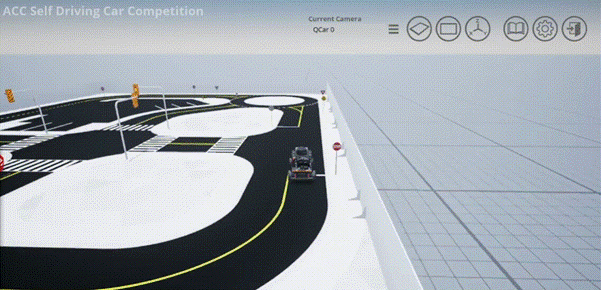

# KDAS2025

# Kookmin Autonomous Driving Project (KMU-KDAS)

This repository serves as the central archive of the **Kookmin Autonomous Driving System (KMU-KDAS)**.  
All modules are stored under `Product/` and correspond to specific functionalities such as perception, localization, planning, control, and ROS2 integration.  
Each folder contains detailed implementations, experiment results, and figures.

---

## Whole Project (GIF Previews)

Click each caption to jump to the corresponding module folder under `Product/`.

<table>
  <tr>
    <td align="center">
       
      <b><a href="Product/Decision/SCNN/">SCNN – Lane</a></b>
    </td>
    <td align="center">
       
      <b><a href="Product/Decision/SCNN/">SCNN – Lane (Alt)</a></b>
    </td>
  </tr>
  <tr>
    <td align="center">
       
      <b><a href="Product/Decision/YOLO/">YOLO – Detection #1</a></b>
    </td>
    <td align="center">
       
      <b><a href="Product/Decision/YOLO/">YOLO – Detection #2</a></b>
    </td>
  </tr>
  <tr>
    <td align="center">
       
      <b><a href="Product/Decision/YOLO/">YOLO – Detection #3</a></b>
    </td>
    <td align="center">
       
      <b><a href="Product/Control/">Control – Pure Pursuit #1</a></b>
    </td>
  </tr>
  <tr>
    <td align="center">
       
      <b><a href="Product/Control/">Control – Pure Pursuit #2</a></b>
    </td>
    <td align="center">
       
      <b><a href="Product/Decision/path%20planning/">RRT/DQN – Planning #1</a></b>
    </td>
  </tr>
  <tr>
    <td align="center">
       
      <b><a href="Product/Decision/path%20planning/">RRT/DQN – Planning #2</a></b>
    </td>
    <td align="center">
       
      <b><a href="Product/ROS/">ROS2 – System Integration #1</a></b>
    </td>
  </tr>
  <tr>
    <td align="center">
       
      <b><a href="Product/ROS/">ROS2 – System Integration #2</a></b>
    </td>
    <td align="center">
       
      <b style="visibility:hidden">placeholder</b>
    </td>
  </tr>
</table>

---

## Project Modules Overview

All modules are located inside `Product/`.  
Each component below includes a short explanation and direct link to its folder.

---

### **Perception (Sensor Suite)**
- **LiDAR (RPLIDAR A2M12)** — Provides 360° 2D scan data for geometry-based mapping and near-field obstacle detection.  
  [→ Product/Sensors/](Product/Sensors/)
- **RGB-D (Intel RealSense D435i)** — Captures RGB and depth images for lane estimation and YOLO-based object detection.  
  [→ Product/Sensors/](Product/Sensors/)
- **Encoder & Tachometer** — Supplies precise wheel odometry and feedback for speed/position estimation.  
  [→ Product/Sensors/](Product/Sensors/)
- **Fusion Rationale** — Explains sensor fusion logic and ROS2 topic QoS configuration.  
  [→ Product/Sensors/](Product/Sensors/)

---

### **Localization**
- **Cartographer SLAM** — Performs scan matching–based SLAM for drift-free, high-accuracy localization on small tracks.  
  [→ Product/Localization/](Product/Localization/)
- **AMCL Comparison** — Describes AMCL limitations (no loop closure, odometry drift) and rationale for selecting Cartographer.  
  [→ Product/Localization/](Product/Localization/)

---

### **Planning & Decision**
- **SCNN (Lane Detection)** — Extracts lane boundaries and centerlines using a Spatial CNN model optimized for 640×480 RGB inputs.  
  [→ Product/Decision/SCNN/](Product/Decision/SCNN/)
- **YOLO (Object Detection)** — Detects traffic lights, pedestrians, and signs in real time using YOLOv8s on Jetson Orin.  
  [→ Product/Decision/YOLO/](Product/Decision/YOLO/)
- **LSTM (Prediction)** — Predicts 2-second future lateral deviation, curvature, and acceleration from CAN data sequences.  
  [→ Product/Decision/Deep%20Learning/CAN_DATA(LSTM)/](Product/Decision/Deep%20Learning/CAN_DATA(LSTM)/)
- **RRT (Path Generation)** — Generates free-space paths and connects predefined waypoints within the static mapped track.  
  [→ Product/Decision/path%20planning/RRT/](Product/Decision/path%20planning/RRT/)
- **DQN (Waypoint Ordering)** — Determines optimal waypoint traversal order for multi-target navigation tasks.  
  [→ Product/Decision/Reinforcement%20Learning/DQN/](Product/Decision/Reinforcement%20Learning/DQN/)
- **PH Curve / TG (Avoidance Trajectory)** — Smooths obstacle-avoidance paths using Tangent Guidance + PH curve blending.  
  [→ Product/Decision/path%20planning/](Product/Decision/path%20planning/)

---

### **Control (Independent of ROS2)**
- **Pure Pursuit Controller** — Implements the final steering control law for lane-following and waypoint tracking.  
  [→ Product/Control/Steering%20Control%20&%20Breaking/](Product/Control/Steering%20Control%20&%20Breaking/)
- **MPC** — Uses model-predictive control for speed regulation and dynamic obstacle handling in simulation.  
  [→ Product/Control/MPC/](Product/Control/MPC/)
- **Kalman Filter** — Applies EKF for state estimation, combining IMU, encoder, and visual cues.  
  [→ Product/Control/Kalman_Filter/](Product/Control/Kalman_Filter/)
- **Avoidance Control** — Implements time-to-collision-based AEB and lateral avoidance strategies.  
  [→ Product/Control/Avoidance%20Control/](Product/Control/Avoidance%20Control/)
- **Motor/ESC Control** — Provides PWM-based actuation and VESC speed feedback handling.  
  [→ Product/Control/Motor%20Control/](Product/Control/Motor%20Control/)

---

### **Dynamics**
- **AEB Dynamics** — MATLAB/Simulink models for longitudinal braking dynamics under TTC and MPC control.  
  [→ Product/Dynamics/AEB_Dynamics/](Product/Dynamics/AEB_Dynamics/)
- **QCar Dynamics** — Simscape-based full vehicle model used for Pure Pursuit simulation validation.  
  [→ Product/Dynamics/QCAR_Dynamics/](Product/Dynamics/QCAR_Dynamics/)
- **Documentation** — Supplemental modeling references for both AEB and QCar setups.  
  [AEB doc](Product/Dynamics/github_AEBdynamics.docx) / [QCar doc](Product/Dynamics/github_QCarDynamics.docx)

---

### **ROS2 (System Integration)**
- **Launch Files & Nodes** — Integrates all modules (SLAM, SCNN, YOLO, Control) into a unified runtime pipeline.  
  [→ Product/ROS/](Product/ROS/)
- **Topic Graph & Synchronization** — Describes node connections, TF tree, and data-flow latency calibration.  
  [→ Product/ROS/](Product/ROS/)

---

### **Product (Hardware & Circuits)**
- **Circuit / DC-DC** — Contains schematics, wiring diagrams, and power regulation circuits for QCar.  
  [→ Product/Circuit/](Product/Circuit/)
- **VESC / ESC Integration** — Configuration and test logs for BLDC motor control and telemetry feedback.  
  [→ Product/VESC/](Product/VESC/)
- **Complete Deliverables** — Aggregates all above components under one physical RC-car system.  
  [→ Product/](Product/)

---

## Notes

- There is **no unified `Simulation` folder**; simulation files are embedded in each relevant module.  
- **Control** and **ROS2** remain **independent**, ensuring modular testing and flexible deployment.

---

## Directory Glimpse

