# KDAS2025: Kookmin Autonomous Driving System

*Kookmin University Autonomous Driving Research Team – Alpha Project 2024–2025*

The **Kookmin Autonomous Driving System (KMU-KDAS)** is a full-stack autonomous RC-car platform developed for the **Quanser Autonomous Car Competition (ACC)**. This repository documents our journey from basic vehicle dynamics simulation to a fully integrated ROS2-based AI driving system running on the QCar2 hardware.

---

## 0. Overall Results 

Below are the final results showing each module operating in real time. Click on each caption to open the corresponding folder under `Product/`.

<table>
  <tr>
    <td align="center">
       
      <b><a href="Product/Decision/SCNN/">Lane Detection (SCNN)</a></b>
    </td>
    <td align="center">
       
      <b><a href="Product/Decision/YOLO/">Object Detection (YOLO)</a></b>
    </td>
  </tr>
  <tr>
    <td align="center">
       
      <b><a href="Product/Decision/path%20planning/">Path Planning (RRT + DQN)</a></b>
    </td>
    <td align="center">
      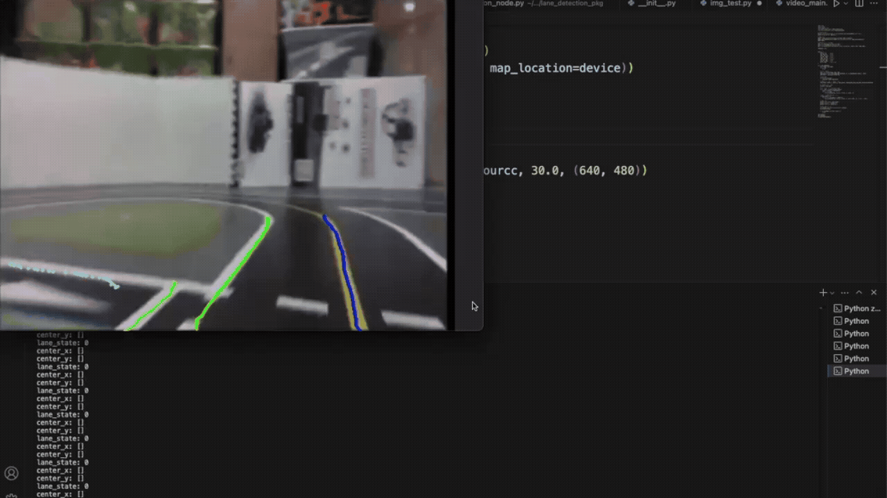 
      <b><a href="Product/Decision/SCNN/">Lane Tracking Visualization</a></b>
    </td>
  </tr>
  <tr>
    <td align="center">
      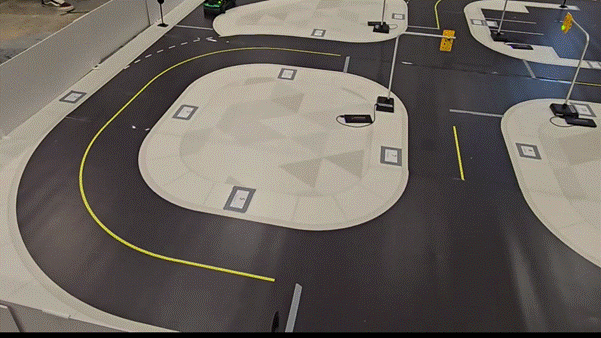 
      <b><a href="Product/Control/Steering Control & Breaking Control/">Control QCar</a></b>
    </td>
    <td align="center">
      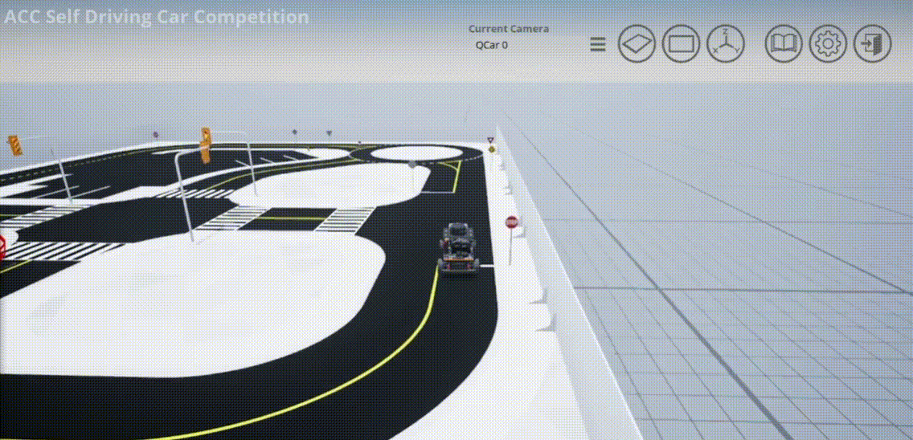 
      <b><a href="Product/Decision/SCNN/">Control simulation</a></b>
    </td>
  </tr>
</table>

---

## 1. Development Story and Repository Overview

This section summarizes the final system modules, representative figures, and links them to the directory structure under `Product/`. It complements the detailed narrative in the later sections.

### 1.1 Overall Results 

**Repository:** `Product/`

The final system integrates perception, planning, control, and ROS2 infrastructure. Each main module runs in real time on QCar2.

**Module entries:**

- Lane Detection (SCNN): `Product/Decision/SCNN/`  
- Object Detection (YOLO): `Product/Decision/YOLO/`  
- Path Planning (RRT + DQN): `Product/Decision/path_planning/`  
- Control (Pure Pursuit): `Product/Control/`  
- ROS2 System Integration: `Product/ROS/`  

---

### 1.2 Step 1 – Modeling and Simulation

**Repository:**  
- `Product/Dynamics/`  
- `Product/Control/MPC/`

We began by modeling vehicle dynamics in MATLAB/Simulink:

- **AEB Dynamics:** `Product/Dynamics/AEB_Dynamics/`  
- **QCar Dynamics:** `Product/Dynamics/QCAR_Dynamics/`

These models allowed us to replicate longitudinal and lateral vehicle motion, design braking strategies, and explore control methods.

Manual PID tuning proved unstable under varying loads. This led to the development of:

- an automatic tuning pipeline, and  
- an MPC controller at `Product/Control/MPC/` for TTC-based braking.

**Result:** stable braking under dynamic conditions using MPC.

---

### 1.3 Step 2 – Real-Vehicle Implementation

**Repository:**  
- `Product/Control/Steering_Control_&_Braking/`

We transitioned from simulation to real hardware control using **STM32** and **VESC**.

The **Pure Pursuit controller** in `Product/Control/Steering_Control_&_Braking/` was validated as our final steering algorithm due to its robust low-speed performance and smooth path tracking.

Initial tests with Stanley revealed oscillations and understeering issues at higher speeds, whereas Pure Pursuit aligned steering with lookahead geometry and provided stable behavior.

**Result:** smooth and stable real-vehicle steering control.

---

### 1.4 Step 3 – Perception (Sensor Integration)

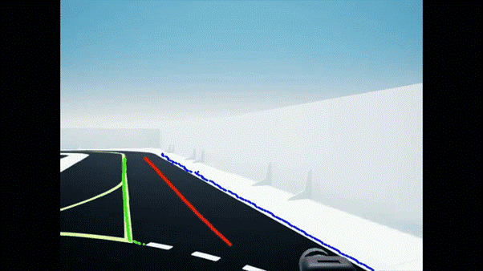

**Repository:**  
- `Product/Sensors/`

To perceive the environment, we integrated:

- **RPLiDAR A2M12** for 360° mapping,  
- **RealSense D435i** for RGB-D semantics, and  
- **encoders** for odometry.

The sensor setup is described in `Product/Sensors/`, where we detail ROS2 topics and fusion rationale.

- **Problem:** reliability of single sensors degraded under reflections and shadows.  
- **Solution:** multi-sensor fusion improved robustness across varying conditions.

---

### 1.5 Step 4 – Localization

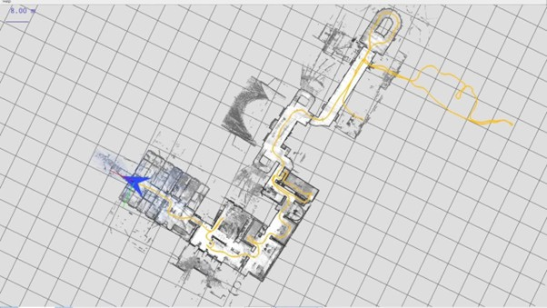

**Repository:**  
- `Product/Localization/`

Accurate localization was essential for stable planning. We evaluated:

- **AMCL**, and  
- **Cartographer**

under `Product/Localization/`.

AMCL suffered from drift and map dependency, while Cartographer offered:

- real-time loop closure,  
- map correction, and  
- robust LiDAR-based scan matching.

**Result:** Cartographer was selected as the default SLAM backend, achieving pose errors on the order of centimeters.

---

### 1.6 Step 5 – Deep Learning-Based Perception (SCNN / YOLO / LSTM)

<table>
  <tr>
    <td align="center">
       
      <b><a href="Product/Decision/SCNN/">SCNN – Lane Detection</a></b>
    </td>
    <td align="center">
       
      <b><a href="Product/Decision/SCNN/">SCNN – Lane Tracking</a></b>
    </td>
  </tr>
  <tr>
    <td align="center">
       
      <b><a href="Product/Decision/YOLO/">YOLOv8s – Object Detection</a></b>
    </td>
    <td align="center">
      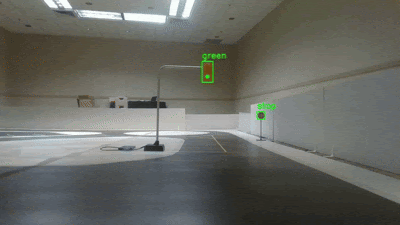 
      <b><a href="Product/Decision/YOLO/">YOLOv8s – Traffic Light & Sign</a></b>
    </td>
  </tr>
</table>

**Repository:**

- SCNN: `Product/Decision/SCNN/`  
- YOLOv8s: `Product/Decision/YOLO/`  
- LSTM: `Product/Decision/Deep_Learning/CAN_DATA(LSTM)/`

We integrated three deep models:

- **SCNN** for lane detection and centerline generation,  
- **YOLOv8s** for real-time traffic light, sign, and obstacle detection, and  
- **LSTM** for future-state prediction (e.g., lateral deviation and curvature).

This pipeline enabled proactive control decisions and operated at real-time frame rates.

---

### 1.7 Step 6 – Path Planning and Decision Making

<table>
  <tr>
    <td align="center">
       
      <b><a href="Product/Decision/path%20planning/RRT/">RRT </a></b>
    </td>
    <td align="center">
       
      <b><a href="Product/Decision/path%20planning/">RRT </a></b>
    </td>
  </tr>
</table>

**Repository:**  
- `Product/Decision/path_planning/`

Our decision layer combined:

- **RRT:** `Product/Decision/path_planning/RRT/` for safe corridor generation between waypoints,  
- **DQN:** `Product/Decision/Reinforcement_Learning/DQN/` for learning waypoint ordering to minimize travel cost, and  
- **PH Curve / Trajectory Generation:** `Product/Decision/path_planning/` for smoothing jagged RRT paths into continuous curves.

**Result:** PH-based smoothing reduced lateral jerk and produced collision-free avoidance paths suitable for real-time control.

---

### 1.8 Step 7 – ROS2 Integration

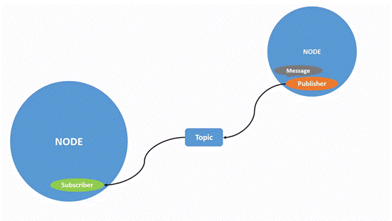

**Repository:**  
- `Product/ROS/`

All components—SLAM, perception, planning, and control—were unified via ROS2. Nodes communicate through a structured topic tree with carefully tuned QoS settings.

The launch configuration in `Product/ROS/` orchestrates the full system, enabling end-to-end autonomous driving on QCar2 in real time.

**Outcome:** robust, real-time autonomous driving achieved on QCar2 with the full stack under ROS2.

---

## 2. Project Overview and Motivation

> “Can we implement the things we learned in class as industry-level technology?”

This question was the starting point of the Alpha Project.

As students majoring in automotive engineering, we felt that we should at least be able to build a small platform and implement autonomous driving on it. Simply taking courses and receiving grades was not enough; we wanted to see control, circuits, artificial intelligence, and modeling—concepts learned in lectures—embedded in a real, working vehicle.

This project was an experiment to answer the question:

> “Is it possible to build an industry-level system using only what we have learned?”

We decided to turn the limitations of an undergraduate “student project” into the very conditions of our challenge. Instead of staying inside the safe frame of a domestic student competition, we held ourselves to the same standards as research-level autonomous driving projects carried out by university teams worldwide. A key principle of the team was to evaluate our results from a **global perspective**.

Our final goal was to implement an autonomous vehicle and achieve measurable results in actual competitions.

At first, the task seemed overwhelming. We knew abstract concepts like **Perception**, **Path Planning**, and **Control**, but had no clear idea how these subsystems interact and cooperate inside a real vehicle. Moreover, even after deciding to implement them, we were unsure which technology stack and algorithms to choose among so many possibilities.

To resolve this uncertainty, we decided to **continuously test theory in real environments**, observing its limitations and potential firsthand. We did not merely apply the concepts learned in class; we supplemented our theoretical foundation by analyzing research papers and technical documents, and then chose methods that fit our constraints and resources.

Some technologies we encountered were difficult to handle directly at the undergraduate level. However, we did not simply abandon them. Instead, we simplified their structure within an accessible range or looked for functionally equivalent alternatives. At the same time, we made a constant effort to understand **why** such approaches were necessary and **what principles** they relied on, organizing that theoretical rationale and reflecting it in practical implementation.

Whenever issues emerged during implementation, we analyzed the cause and iterated through a cycle of testing and modification to find solutions. Through this process, we gradually evolved from “people who understand theory” into “engineers who can implement it.”

The core of this project was the belief that we could build real technology with what we had learned—and the determination to prove that belief through a complete autonomous driving system.

---
## [3. Hardware System – “How do we bring an autonomous driving stack into the real world?”](Product/Circuit/)

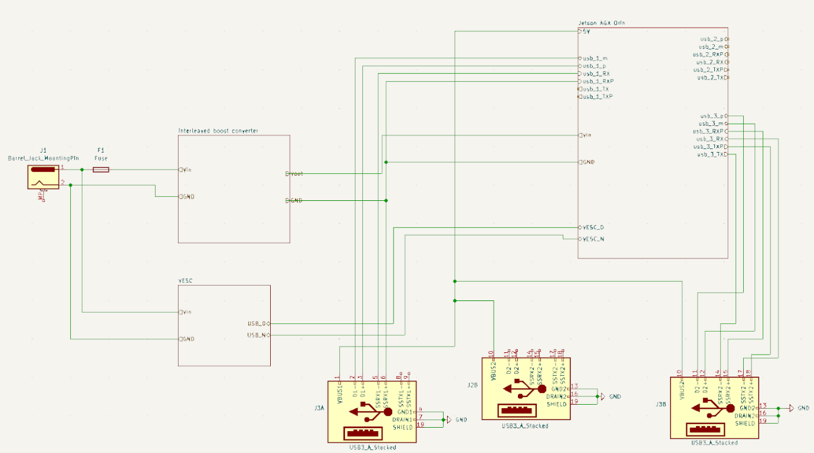

In simulation, perception and control algorithms alone are enough to define “autonomous driving.”  
But the moment we tried to run our stack on a real vehicle, a completely different question appeared:

> “What kind of **vehicle hardware** do we need to trust this autonomous driving software in the real world?”

It was no longer about “one board that moves the car.”

We needed:

- a boost converter,
- Jetson power and I/O circuitry,
- a VESC-based drive stage,
- sensor interfaces,
- and PCB layouts that tie everything together,

so that the physical system can **reliably sustain what the algorithms expect it to do**.

---

### 3.1 Power Stage – “Is it enough to just boost 7.4 V to 19 V?”

The initial question was deceptively simple:

> “We just need to boost 2S Li-ion (7.4 V) to 19 V. Can’t we just copy a reference boost design from the market?”

Once we actually analyzed the boost behavior, that question changed immediately.

- In **voltage-mode control**, the **RHP zero** fundamentally limits how wide we can set the bandwidth.
- Increasing L and C reduces ripple but also worsens size, cost, and transient response.
- In other words, simply “using bigger parts” is not enough to meet the **power quality and response** required by an autonomous system.

So we had to ask a different question:

> “Instead of oversizing components, what if we change the **control structure and topology**?”

The first answer was to move to **current-mode control (PCMC, Peak Current Mode Control)**:

- We include the inductor current in the feedback loop, making the effective plant closer to a first-order system.
- We add slope compensation to suppress subharmonic oscillation.

This allowed us to reframe the boost converter: not as a “fundamentally hard-to-control topology,” but as a **well-behaved target under current-mode control**.

Then the next question followed:

> “Even with current-mode control, do we really have to dump all ripple and device stress into a single phase?”

Our solution was a **2-phase, 180° interleaved boost**:

- The inductor ripple currents of the two phases partially cancel, reducing **input and output ripple current**.
- Inductors and capacitors share current, **distributing thermal and electrical stress**.
- The effective switching frequency doubles, allowing us to hit the same ripple targets with **smaller L and C**.

After this design process, our view of the power stage changed completely:

> “This booster is not just a ‘7.4 V → 19 V converter.’  
> It is a **power architecture** that addresses RHP zeros, ripple, and device stress using  
> current-mode control (PCMC) and a 2-phase interleaved topology.”

---

### 3.2 Jetson and Sensors – “How far should we trust the reference design?”

When we first planned to mount a Jetson, our instinct was:

> “Wouldn’t it be safest to copy the NVIDIA reference board 1:1?”

The reference design already includes power sequencing, USB, and CSI port configurations.  
At first glance, copying it exactly seemed like the **lowest-risk option**.

But once we laid out the BOM, the issues became clear:

- Some power ICs and hub chips were **very expensive**.
- Several components had **EOL or unstable supply**, making long-term procurement unreliable.
- For a research/education platform that might go through multiple revisions and re-spins, this was not sustainable.

So we had to reformulate the question:

> “If we want to match the reference design’s performance,  
> how do we do it with **components that we can continuously source**?”

Our conclusion was:

1. Keep the **electrical specifications** (voltage, current, ripple, transient behavior) aligned with the reference.  
2. Rebuild the circuit using **components that are realistically available and stable in the local supply chain**.

In practice:

- Power ICs were replaced with **equivalent-grade devices** that matched the required specs.
- The USB hub was switched to a chip with solid documentation and **stable distribution**, and we redesigned the Jetson–hub–sensor chain around it.

In short:

> “The Jetson power/I-O board preserves the reference design’s electrical requirements,  
> but is rebuilt with components that we can **actually buy, repair, and recreate** over time.”

---

### 3.3 Motor Drive – “How do we create an output we can trust?”

On the motor side, the starting question was:

> “How can we make motor control for an autonomous vehicle **stable and trustworthy**?”

In this system, the motor is not just a part that spins the wheels.  
It is the **final actuator** that turns perception and control outputs into real-world motion.  
If motor control is unstable, safety logic is weak, or Jetson–VESC communication breaks, the entire stack collapses.

We therefore made an early design choice:

> “Rather than building our own motor control core,  
> let’s **build our hardware around a proven core**.”

The answer was:

- the open-source **VESC reference**, and  
- the **F1TENTH VESC ROS nodes** (such as `vesc_driver`).

That is:

- Low-level FOC control, current/voltage/temperature sensing, and protection logic are delegated to **VESC**, which is already well tested.
- High-level commands between Jetson and VESC flow through **ROS nodes**, using topics and services.

The next question was about **physical connectivity**:

> “The software stack is robust, but how do we connect things physically  
> so that we have a **control path that does not randomly break**?”

Our first thought was to simply wire Jetson and VESC using external cables and exposed connectors.  
However, in a real vehicle:

- vibration and shock,
- repeated plugging/unplugging,
- and constrained cable routing

mean that even a slightly loose connector can **break communication**—which directly turns into unpredictable motor behavior and safety risk.

So we changed our answer:

> “Pull the VESC–Jetson link **as far inside the PCB as possible**.”

In the final design:

- Critical interfaces between Jetson and VESC are connected via **internal PCB traces**, not long external cables.
- Exposed, frequently-handled cable segments are **minimized**.

The result is a VESC–Jetson pair that:

- is integrated logically through the **VESC–ROS stack**, and  
- is connected physically through a **robust internal PCB path**,

forming a **single, hard-to-break control pathway**.

Summarizing:

> “Our VESC-based drive stage places a proven motor-control core underneath  
> a custom power, sensing, communication, and wiring design that is tailored to our vehicle,  
> raising the stability and trustworthiness of motor control.”

---

### 3.4 PCB Layout – “How much attention does a single trace deserve?”

Near the end of the schematic design, another question arose:

> “How can we ensure that this circuit, once laid out on a PCB,  
> will behave **stably in the real world**?”

At higher switching frequencies, **traces and vias are no longer just ‘wires’.**  
They carry resistance as well as **parasitic inductance (L)** and **parasitic capacitance (C)**.

So layout design inevitably led to the question:

> “How do we close loops and route traces so that we can **trust this board** later?”

We based our layout on two core principles:

1. **“Minimize loop area, but don’t create excessive parasitic capacitance.”**  
2. **“Always route signals together with their return paths.”**

More concretely:

- The boost switching loop, gate driver–MOSFET loop, and current sensing loop were  
  routed to close within **tight, compact areas** to reduce parasitic L.
- At the same time, we avoided over-compressing them to the point that parasitic C to adjacent traces/planes would explode;  
  we tuned spacing and loop size to find a **balanced middle ground**.
- Trace corners were routed at **45° instead of 90°**, reducing local impedance jumps, heating, and waveform distortion in high-frequency paths.

Additionally:

- High-speed and sensitive signals were placed with their **GND return paths directly under/next to them**,  
  minimizing the signal–return loop area and reducing both radiated EMI and susceptibility to external noise.
- USB and CSI lines were routed so that they would **not run long, parallel segments with power lines**, mitigating unwanted coupling.
- TVS/ESD arrays were placed **as close as possible** to each external connector,  
  clamping ESD and surge events at the port itself.
- Power GND and signal GND were not mixed arbitrarily across the board;  
  they were **joined at carefully chosen single-point connections**.

In summary:

> “This is not just a board with a clean schematic.  
> It is a PCB whose traces and loops are laid out with **parasitic L/C and long-term reliability in mind**.”

---

### 3.5 Summary – Not just “combined references”, but “hardware shaped by questions”

At a glance, the hardware in this project might look like:

- a 2-phase interleaved boost converter,
- a Jetson power/I-O board,
- and a VESC-based drive unit.

Just three PCBs.

But beneath that, there is a long chain of questions and answers:

- “Can we really power this system stably with a boost converter?”
- “How far should we copy the Jetson reference, and where must we diverge?”
- “How do we make motor control that is both safe and robust against disconnection?”
- “How should we draw even a single trace so that we can trust it years later?”

Because of that, we think this work is best described as:

> “A hardware stack that evolved in response to our own questions —  
> built on proven references like VESC and Jetson,  
> but re-engineered in circuitry and layout to become a  
> **‘question-driven autonomous driving hardware stack.’**”

---

## [4. First Challenge – Motor Control (PID Autotuning)](Product/Control/Motor%20Control/)

> “What does it actually mean to ‘move’ a vehicle?”

Our first concern was how to make the vehicle move. For the wheels to rotate, the motor must be controlled; therefore, the starting point of driving was **precise motor control**. We realized that the first step toward implementing autonomous driving had to begin with **motor control**.

The most realistic control strategy available to us at that time was **PID control**, which we had learned in the “Automotive Integration Experiment” course. PID has a simple structure yet offers fast response, making it suitable for stable control in limited computational environments.

However, even though the theory appears simple, in a real system small changes in the PID gains can drastically alter the response characteristics. Fine-tuning was essential.

To apply PID to a realistic motor model, we referred to the **Control Tutorials for MATLAB and Simulink** provided by the University of Michigan. Based on the Motor Control section, we used **Simscape Electrical** to build a virtual model of our DC motor.

Modeling alone did not allow us to directly apply PID, because:

- **Simulink** uses a *signal-flow* computational model, while  
- **Simscape** uses a *physical energy-flow* model.

Their computational structures and time scales are fundamentally different.

After recognizing that the two environments operate on different computation paradigms, we explored ways to connect them. Through MathWorks interface documentation, we identified the **PS Converter** block as the critical bridge between signal-based and physical domains. By integrating this block, we established a unified framework in which both environments could exchange data on a shared time base.

Only after this integration was complete could we apply our designed PID controller to the virtual motor model.

However, the tuning process revealed new issues. Because PID responses change significantly with even small gain adjustments, we had to repeat the cycle of “adjust gain → observe response” many times. Even then, it was difficult to be confident that the chosen gains were truly optimal.
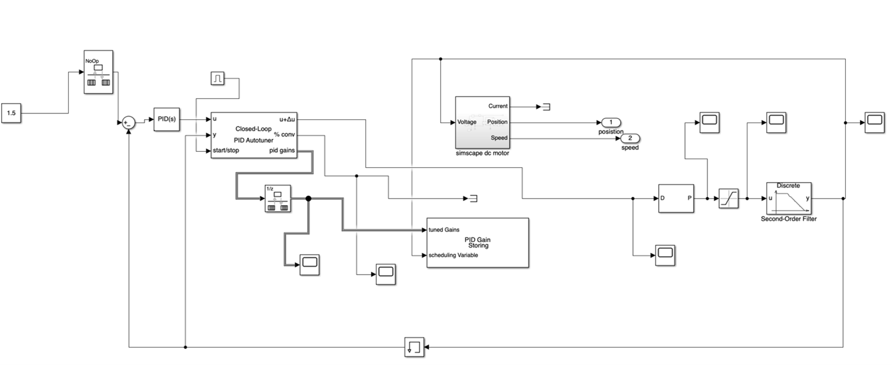
To overcome this inefficiency and uncertainty, we searched for a more systematic method to derive gains and adopted **PID Autotuner**. PID Autotuner computes gains based on the actual system response, providing more stable and consistent control performance compared to manual tuning.

---

## [5. AEB System Design and Simulation – Matlab_AEB_Unreal](Simulations/Matlab%20-%20Unreal%20Simulation/)

> “If we can move the vehicle, how do we make it stop safely?”

Once we had implemented forward motion via motor control, the next task was **stopping in dangerous situations**. This is where **AEB (Autonomous Emergency Braking)** comes in—a system that allows the vehicle to detect hazards and perform deceleration or full braking at the right moment.

However, testing a control algorithm that assumes potential collisions in a real vehicle poses obvious risks: vehicle damage, sensor failure, and high cost. We therefore needed a **virtual environment** capable of replacing real-world crash scenarios.

To this end, we integrated **MATLAB/Simulink** with **Unreal Engine 3**, building a 3D simulation environment where the AEB controller could be tested and validated. In this environment, heterogeneous elements such as:

- discrete-time sensors,
- fixed-step controllers, and
- continuous-time vehicle dynamics

could be aligned on a single time axis, closely approximating real driving conditions.

The essence of AEB design lies not in “braking itself,” but in determining **when** to start braking—that is, in **prediction**.

We used the relative distance and velocity between the ego vehicle and the object ahead to compute **TTC (Time-To-Collision)**. We then designed a multi-stage braking logic that increased braking force stepwise as TTC approached critical thresholds:

- Large TTC → sufficient time until collision → overly aggressive braking would destabilize vehicle motion.  
- Small TTC → imminent collision → strong braking must be applied immediately.

Based on this relationship, we divided braking into multiple stages and increased braking strength gradually as risk increased. This simple, structured approach was highly suitable for real-time control.

The braking logic was implemented in **Simulink Stateflow**. We defined states such as **Partial Brake (Stage 1 & 2)** and **Full Brake**, and visualized transition conditions, allowing us to clearly observe and validate the initiation and release of braking.

However, MATLAB-based 3D environments have limitations in modeling complex scenarios such as slopes, curved roads, and varying friction. In future work, more specialized simulators like **CARMAKER** or **CARLA** could be used to further develop and refine our AEB system.

Through these experiments, we came to understand that AEB is not a simple braking rule, but a complex system combining:

- mathematical modeling for TTC computation,
- organization of diverse input signals,
- controller design,
- unified time-base integration of vehicle and sensor models, and
- linking to 3D simulation environments.

Most importantly, we implemented the entire pipeline—from modeling to visualization—directly in MATLAB, which we consider one of the core achievements of this project.

---

## [6. Dynamics Modeling – AEB_Dynamics & QCar_Dynamics](Product/Dynamics/)

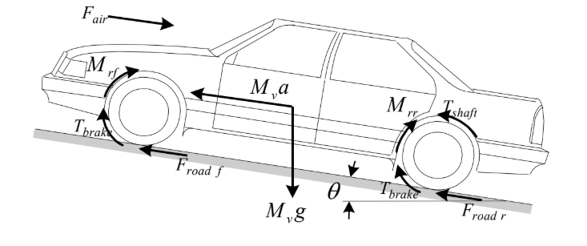

As we experimented with more and more control structures, one question kept coming back:  
sensor outputs alone were not enough to fully control the vehicle’s motion.

Yet every autonomous driving algorithm fundamentally assumes:

> “Given the steering and throttle I apply now,  
> what kind of motion will this create in the future?”

In other words, on top of the **current measurements** from sensors,  
we needed a **predictive understanding of how the vehicle can actually move** in physical terms.  
This is where our dynamics modeling began.

---
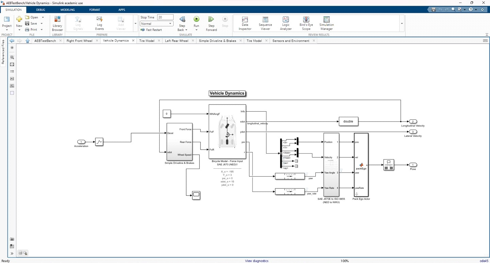
### 6.1 First Model – Understanding “How a Car Moves” with the Bicycle Model

In the early phase, we used MATLAB’s built-in **Bicycle Vehicle Model**.  
This model is based on the behavior of a typical gasoline vehicle and provides a good reference structure for understanding:

- tire–road interaction, and  
- basic longitudinal and lateral vehicle dynamics.

Our reasons for using this model were straightforward:

- it is already a **validated physical model**,  
- it allowed us to quickly understand vehicle dynamics block structures, and  
- it was well suited for learning **“by what principles does a vehicle actually move?”**

Because our test track was a **flat surface**,  
we ignored the z-axis (vertical motion) from the original 3DOF structure  
and used a simplified **2DOF (x–y plane)** configuration.

However, this model is fundamentally built for a **full-size gasoline vehicle**.  
So while it was ideal for learning general “vehicle physics,”  
it did not accurately reflect the actual behavior of **QCar, the platform we had to control in practice**.

That realization became the starting point for building a **QCar-specific dynamics model (`QCar_Dynamics`)**.

---

### 6.2 Why We Rebuilt QCar Dynamics – When the Platform Changes, the Physics Change Too

Quanser’s **QCar** is structurally very different from a conventional car:

- BLDC motor + ESC-based drive
- no mechanical brake system
- a 1/10-scale platform with low mass and low speed
- rolling resistance and motor response are much more prominent

Because of these structural differences,  
the standard Bicycle Model alone could not properly explain QCar’s:

- speed changes,  
- deceleration patterns, or  
- slip behavior.

We therefore revisited the underlying physics and selected only those relationships that were:

> “strictly necessary to determine how QCar actually moves.”

Using these, we built a separate **`QCar_Dynamics`** block.

---

### 6.3 Criteria for Selecting QCar Physics – To Build “Predictable Behavior”

We examined many physical equations to construct QCar Dynamics,  
but we were not trying to model “every physical phenomenon.”  
What we really needed were only the relationships that are:

> essential to understanding the next motion of the vehicle.

Our key criteria were:

#### ① ESC Duty → Voltage → Current → Motor Torque → Wheel Rotation → Vehicle Speed

The most critical characteristic of QCar is that  
**changes in vehicle speed are almost directly tied to changes in ESC duty**.

So this entire transfer chain had to be part of the model.  
Without it, we would have no way to interpret *why* speed changes occur.

#### ② Deceleration Comes from “Resistive Forces”, Not Brakes

QCar has no dedicated brake system.  
Deceleration is produced by a combination of:

- motor back-torque,  
- rolling resistance, and  
- aerodynamic drag.

We had to include these terms so that modules like SLAM, evasive maneuvers, and controllers could judge whether a given speed value is

> **“physically feasible in this situation.”**

#### ③ On a Low-Mass Platform, Small Slip Still Matters

On a 1/10-scale, low-mass platform,  
even small amounts of slip can produce meaningful differences  
between the true vehicle speed and the speed reported by sensors.

So instead of completely ignoring slip,  
we chose to include a **simplified slip model** inside our dynamics block.

These are only part of the full model, but they share one common property:

> they are precisely the elements needed to explain  
> “how QCar actually moves in the real world.”

With this selection strategy, we were able to:

- remove unnecessary complexity, while  
- building a structure where the vehicle’s reaction to the next input is **predictable**.

---

### 6.4 What the Dynamics Model Gave Us – A Basis for Understanding “The Next Motion”

Dynamics modeling was not just about:

> “making the simulation prettier or more detailed.”

For the first time, this model allowed us to explain in physical terms:

- how a given steering and throttle command  
  will change speed and position in the next moment, and
- how changes in ESC duty  
  translate into actual changes in vehicle speed and by what ratio.

In other words, the dynamics model became:

> a **starting point for predictive reasoning**,  
> letting us project “how the vehicle can move next”  
> on top of the sensor’s current readings.

This physical understanding later became the **common foundation** for:

- SLAM-based localization,  
- advanced controllers such as MPC, and  
- AEB and evasive maneuver algorithms.

It marked the transition of our system from one that simply **observes** sensor values  
to one that can **actively predict its own future motion**—  
and that transition began with this **dynamics modeling** step.

---

## [7. ROS2 Integration – Building a Unified System](Product/ROS/)

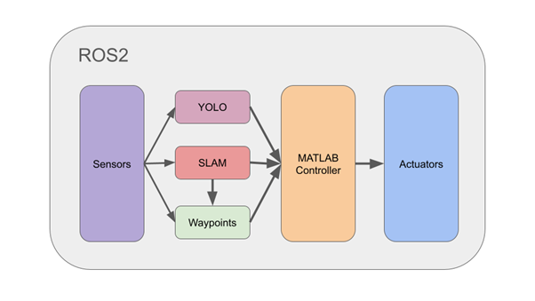

Once individual modules were functioning, our next task was to **integrate them into a single system**. The main difficulty was that each module operated on a completely different time scale:

- Control and sensor modules required millisecond-level real-time performance and were implemented in **C/C++**.
- Perception and inference modules operated on **Python**, designed under the assumption of hundreds of milliseconds of delay.

Synchronizing communication between these two worlds under a common timing framework was far from trivial.

Our initial idea was to unify all computation on **CUDA**, since the final deployment platform was an **NVIDIA Jetson** board. This seemed natural, but CUDA is a low-level GPU parallel computing framework, not a real-time robotics integration layer. Ensuring deterministic timing and implementing full sensor–actuator integration is structurally difficult and rarely practiced in robotics. We concluded that a CUDA-centric architecture was not realistic.

Next, we considered unifying everything under a **single programming language**:

- All in C/C++ → robust, but inhibits easy use of modern AI frameworks.  
- All in Python → simpler development, but sacrifices strict real-time behavior.

Moreover, simply unifying the language does not fundamentally solve synchronization and communication problems. So this approach also fell short.

The third attempt was to integrate everything under **MATLAB**:

- Sensors via MATLAB Toolboxes,  
- AI models via Deep Learning Toolbox,  

with the goal of operating all components inside a single environment.

However, two critical limitations appeared:

1. Models like SCNN and YOLO, which include **custom message-passing layers**, often failed during ONNX conversion due to structural conflicts or opset mismatches. They could not be loaded reliably into MATLAB, and there was no reliable way to test whether they were functioning correctly.
2. MATLAB Toolboxes focus on industrial-grade, widely used sensors. Supporting **RPLiDAR** and **RealSense** directly was either not possible or severely limited. We tried TCP-based communication as a workaround, but this made the system overly complex and introduced persistent data-format mismatches.

Through these experiences, we realized that MATLAB-based integration would be difficult to maintain for a full-scale autonomous driving stack.

At this point, we revisited the question:

> “What do real robotics projects use to integrate heterogeneous systems?”

The answer was **ROS (Robot Operating System)**.

ROS is a meta-operating system that:

- connects multiple languages,
- manages multiple sensors and nodes, and
- provides standardized communication patterns.

It inherently addresses many of the synchronization and communication issues we had faced. It also supports both **C++** and **Python** nodes, allowing each module to leverage its natural strengths.

With standardized components for sensor drivers, message types, and TF coordinate transforms, ROS allowed us to focus on higher-level logic instead of low-level plumbing.

In particular, **ROS2 Humble** uses a DDS-based QoS mechanism, which improved how we met real-time requirements among sensor, control, and inference modules.

Of course, ROS is not without drawbacks. As the system scales, DDS buffers can saturate, callback queues can introduce delays, and the broadcast-style architecture can burden network bandwidth. We mitigated these issues by carefully designing QoS profiles, differentiating topics with strict timing constraints from those requiring higher reliability.

As a result, the entire system finally formed a **cohesive, organically integrated architecture**.

---

## 8. Expanding the Goal – Toward Full Autonomous Driving

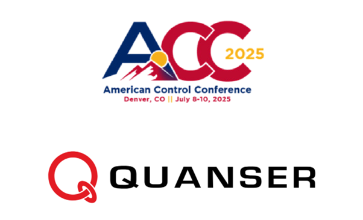

Our initial goal of building a fully autonomous system did not end with implementing individual functions. During AEB development, we encountered a crucial realization:

> Even a single function like braking only works correctly when **perception–decision–control** are tightly coupled.

To detect hazards, sensor interpretation must be stable. To determine braking timing, the vehicle state must be correctly estimated. Finally, in the control stage, a precise controller based on a realistic vehicle model is required.

This experience fundamentally changed our perspective. We realized that the essence of autonomous driving is not the completion of individual features but the **design of the entire stack**.

Naturally, a question arose:

> “Where does our stack stand right now?”

We wanted an **objective benchmark**, not just our own satisfaction. Domestic competitions were considered, but most focused on specific functions and did not evaluate the entire system holistically.

We sought an environment where perception, planning, and control could be viewed as a single system and evaluated against **industrial standards**. We concluded that such a structure was difficult to find domestically and turned our attention abroad.

We discovered the **Quanser Autonomous Car Competition (ACC)**, which provided exactly this type of environment.

The mission theme of ACC is the **autonomous taxi**. This is more than just moving a car; taxis must:

- determine precise stopping positions,
- replan paths in response to changing road conditions, and
- consider pedestrians, intersections, traffic lights, and surrounding vehicles simultaneously.

Even in scaled form, this corresponds to a demanding urban full-stack autonomous driving problem.

To solve such a problem, it is not enough to implement a few algorithms. One must integrate **sensor fusion**, **path planning**, **decision making**, and **controller design**.

ACC was exactly the **“full stack validation stage”** we were searching for.

The fact that the competition is run alongside the **American Control Conference (ACC)** also significantly influenced our decision. This is not just a student contest; it takes place in the same environment where researchers and experts from around the world present their latest work. We could:

- observe international research trends firsthand,  
- see which technologies are actively used in industry and academia, and  
- gain insight into which direction we should grow toward.

Our aim was not simply to obtain a good rank. We wanted to:

- elevate our **technical mindset**,  
- transition from function-level development to **system-level design**,  
- reinterpret team roles from a systems perspective, and  
- experience development and testing processes similar to those used in industry.

Ultimately, ACC showed us clearly **where we stood** and **how far we needed to go**. Experiencing international standards directly allowed us to concretely envision the direction and level of the autonomous driving system we needed to build.

---

## [9. Perception – Beginning to See the World (SCNN & YOLOv8s)](Product/Perception/)

Autonomous driving starts with **seeing the world**. Even if a vehicle can move, it cannot make decisions or respond to its environment without perception. Building a perception module that acts as the vehicle’s “eyes” was therefore essential.

Among various perception tasks, **lane detection** plays a central role: it defines the drivable region and provides a reference for steering control and trajectory generation. For this reason, lane detection is one of the most fundamental perception functions in autonomous driving.

Initially, we attempted lane detection using OpenCV-based image processing techniques such as **Gaussian Blur**, **Canny Edge**, and **Hough Transform**. However, the system became unstable in:

- sharp curves,
- partially occluded or faded lane markings, and
- noisy conditions.

When we tried to approximate lanes as functions, incomplete or noisy input often produced distorted curves that deviated from the actual lane shape.

These experiences made it clear that pure image processing alone would not suffice for robust lane detection, and that a new approach was needed.

Deep learning models structurally addressed many of these limitations. Because they can **learn lane shapes and patterns from data**, they are more robust to varying brightness, broken lines, and complex curvature. We expected that deep learning would provide **stable lane inference**, especially in curved segments.

We initially experimented with a custom CNN-based lane detector. However, after discussions with our advisor, we decided it would be more efficient to analyze existing well-established models and adapt them to our 1/10-scale environment.

We compared major lane detection models such as **PolyLaneNet**, **UFLD (Ultra Fast Lane Detection)**, and **SCNN (Spatial CNN)** by studying their research papers and experimental results. In terms of addressing our issues—lane discontinuity and curvature—**SCNN** emerged as the most suitable choice.

Our core problem could be summarized as a lack of **continuity**. SCNN addresses exactly this through a spatial message passing structure: it propagates features in the **up, down, left, and right** directions within the CNN, sharing spatial context and enforcing continuity along lanes.

However, simply importing a pretrained SCNN model did not solve our problem:

- The dataset used for pretraining and the 1/10-scale track environment differed greatly in layout, lane width, field of view, and texture.
- As a result, we faced strong **domain gaps**, and initial tests showed poor lane detection performance.

Despite these difficulties, we decided to leverage the pretrained model because:

- Our team size and project timeline did not allow us to build a large labeled dataset from scratch, and  
- Training from scratch would have been prohibitively time-consuming.

Our strategy was to exploit the **general features** of the pretrained model and adjust only what was necessary for our environment.

To do this, we:

1. Visualized feature maps produced by different SCNN layers using track images from our environment.  
2. Analyzed what features were being extracted and at which layers.  
3. Decided which layers could be kept (mainly lower-level features) and which needed adaptation (mostly higher-level layers).

Because our track did not require full four-lane highway detection—only differentiation between opposing single lanes— we simplified the output structure. We adjusted batch size, training schedule, and resolution to match our dataset size and available compute resources, optimizing the training pipeline accordingly.

Through these adjustments, SCNN eventually achieved stable tracking of continuous lanes even in curves and partially missing regions. Compared to our unstable initial models, it was as if scattered points had been smoothly connected into a solid, continuous line.
 
 

On the object detection side, we needed robust detection of traffic lights and signs. We evaluated multiple object detection architectures and selected **YOLOv8s**, considering the trade-off between accuracy and runtime performance on our embedded platform.

However, the pretrained YOLO model did not directly recognize our 1/10-scale track signs and signals due to differences in:

- physical size,
- design and color patterns, and
- environmental appearance.

To close this domain gap, we:

- collected a custom dataset focused on track-specific objects,  
- fine-tuned YOLOv8s on these samples, and  
- applied data augmentation to cover different angles and lighting conditions.

Additionally, each YOLO version requires specific dependencies, and aligning these with our **ROS2 + Jetson + Unreal** stack caused repeated compatibility issues. We had to choose a version that was:

- accurate enough, yet  
- light enough for real-time inference without interfering with control loops.

We then defined output structures compatible with **Stateflow** so that detection results (e.g., traffic light state) could be directly consumed by the control logic.

In the end, YOLOv8s became a practical module that **directly enabled decisions**, not just a standalone perception block.

---

## [10. Simulator Constraints & Early Control – Xytron Preliminary Stage](Simulations/Xytron%20Simulation//)

The preliminary round (Xytron) was held entirely in a simulator, but with **severely limited sensors**:

- 180° front LiDAR, and  
- a single RGB camera.

SLAM and waypoint-based planning were not available. We had to design a system that essentially **“drives based only on what it sees”**.

At that time, we implemented a lightweight driving algorithm combining:

- **SCNN-based lane detection**, and  
- a **PID controller**.

We used the front camera image to detect lane centers, defined the pixel offset between image center and lane center as steering error, and fed that error into a PID controller. This formed a simple vision-based feedback loop for steering.

At low speeds, the vehicle drove reasonably stably. However, as speed increased, oscillations and overshoot became severe. Gain tuning alone could not guarantee consistent high-speed performance.

This experience clearly demonstrated the limitations of simple **pixel-offset-based lane centering**.

These lessons directly shaped our next steps in the Quanser phase. With access to SLAM-based pose estimation and waypoint-based planning, our control design evolved through **Stanley**, **Pure Pursuit**, and finally **MPC**, transitioning from simple offset compensation to fully trajectory-aware control.

---

## 11. After Perception – “We See the Lane. Now How Do We Drive?”

Once we could reliably detect lanes, a more fundamental question emerged:

> “It’s good that we can see the lane, but how do we actually move using that information?”

SCNN provides lane information as **images**, but controllers require **numeric coordinates**. Perception alone is “seeing.” To move the vehicle, we must convert this information into mathematically defined targets—concrete points that the vehicle can follow.

We reasoned as follows:

- An autonomous vehicle moves by following a sequence of **continuous target points**.  
- We need a way to express these target points.  
- What if we represent the driving path as a sequence of **waypoints**?

This led us to the widely used concept of **waypoints** in autonomous driving: generating points along the lane center and connecting them into a drivable path.

### 11.1 Depth-Based Waypoint Generation – and Its Structural Limits

To generate waypoints, we must convert pixel coordinates into real-world coordinates (x, y). A natural idea was to use a **depth camera** and map SCNN’s pixel outputs to metric coordinates.

However, this is where we encountered a fundamental issue.

The QLabs simulator provider had already announced that **the depth camera was not functioning correctly**. We confirmed that the depth frames:

- contained very few valid values,
- intermittently produced invalid values like 0 and ∞, and
- exhibited highly inconsistent patterns from frame to frame.

In other words, the depth sensor was **unusable** for real-time coordinate conversion.

This was more than a sensor choice issue; it meant that our entire approach did not structurally fit the QLabs environment.

### 11.2 A More Important Lesson – Waypoints Are an “Language,” Not Just Points

Depth was not the only problem. We realized something deeper: even if depth had worked perfectly, the waypoints we were generating would have been unsuitable for control.

Sensor-based waypoints are inherently:

- noisy and unstable from frame to frame,  
- sensitive to small sensor perturbations, and  
- discontinuous, with frequent gaps between points.

From the controller’s perspective, this is not a **trackable path** but a **collection of jittering points**.

From this experience, we learned that **waypoints are not just points but a structural “language” for expressing stable, drivable paths**. Unless this language is used correctly, even the best perception or control algorithms cannot produce stable vehicle motion.

### 11.3 Our Conclusion from This Failure

Seeing the lane is only the beginning of perception and does not automatically produce drivable behavior.

To move an autonomous vehicle, we must:

- convert pixel-based perception to **real-world coordinates**,  
- ensure these coordinates are **continuous**, and  
- represent them as a **noise-resilient path structure** suitable for control.

Since the QLabs depth sensor was structurally unusable and sensor-based waypoint generation could not guarantee stability, we concluded that this approach was fundamentally flawed.

This failure became a turning point that led us to more robust, structurally grounded path planning methods:

- SLAM-based pose estimation,
- RRT-based path planning, and
- PH-based avoidance maneuver generation.

The question,

> “We see the lane, but how do we drive?”

was not merely a technical issue. It taught us that perception outputs must be **translated into the “language of paths”**—a comprehensive reasoning process in its own right.

---
## 12. 궤적 추종 제어의 시작 – Stanley Controller
Xytron 대회에서 차량을 처음으로 움직여 보았을 때, 우리는 PID 제어기의 한계를 즉시 체감했다.  
직선에서는 어느 정도 정상 주행이 가능했지만,

- 코너 진입 시 진동  
- 오버슈트·언더슈트  
- 불안정한 궤적 유지

이 문제가 반복되었다.

그때 우리는 명확히 알 수 있었다.  
**“단순한 피드백 제어만으로는 자율주행을 만들 수 없다.”**

그래서 PID의 구조적 한계를 넘어설 제어기가 필요했고, 가장 먼저 떠올린 것이 바로 **Stanley 제어기**였다.

---

### 12.1 Stanley를 위한 첫 설계: SCNN + Depth 기반 3D Waypoint
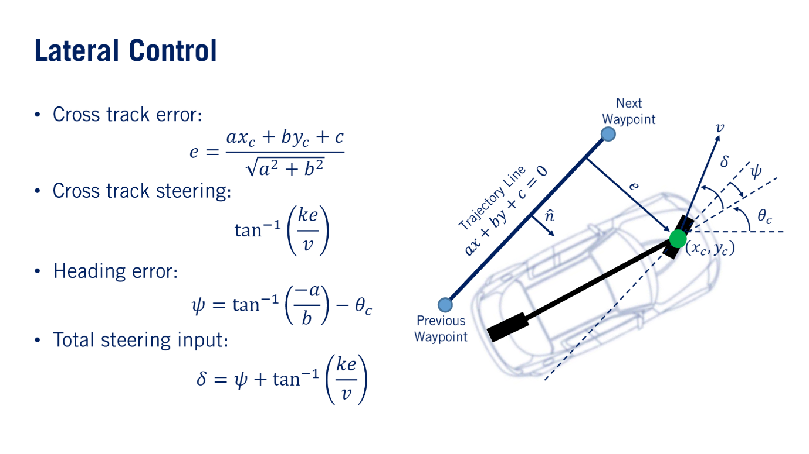

Stanley를 선택한 이유는 명확했다.

- 2005 DARPA Grand Challenge 우승 차량의 실제 제어기  
- 센서 기반 waypoint 추종에 최적화  
- 고속 상황에서 검증된 안정성  
- 우리가 구축하려는 실시간 자율주행 구조와 높은 적합성  

Stanley 제어기는 다음 값들을 이용해 조향을 계산한다.

- 횡오차 (cross-track error)  
- 헤딩 오차 (heading error)  
- 차선 곡률 (curvature)

이 값들은 단순한 오차 피드백 구조인 PID보다 훨씬 명확한 기하학적 조향 근거를 제공한다.

그러나 문제가 있었다.  
**카메라 이미지 + SCNN 마스크는 2D 평면 정보**이기 때문에, 이들만으로 위 변수들을 절대로 직접 계산할 수 없었다.

특히 2D 픽셀 좌표에서 보이는 곡률은 단지  
**화면 상의 곡선**에 불과하며,  
실제 차량 기준 거리 단위(m)에서 정의되는 **물리적 곡률(1/m)**과는 전혀 다른 값이다.

그래서 Depth 카메라를 이용해 각 픽셀의 실제 거리를 추정하고, 이를 기반으로 **3D waypoint**를 생성하는 방식을 사용했다.

이 과정을 통해 단순한 영상상의 차선이  
**실제 도로의 3차원 경로로 재해석**되며,  
Stanley가 필요로 하는 모든 값(곡률·횡오차·헤딩오차)을 계산할 수 있게 되었다.

#### 3D waypoint 파이프라인
1. SCNN으로 차선 마스크 검출  
2. Depth 카메라로 각 픽셀의 실제 거리 추정  
3. 두 정보를 결합해 3D waypoint 생성  
4. 생성된 waypoint를 Stanley 제어기에 입력  

이 파이프라인이 성공했다면,  
Stanley는 이론적으로도 실전에서도 가장 강력한 조향 제어기가 될 수 있었다.

---

### 12.2 예상 밖의 장애물 – Depth 카메라 버그로 인한 전면 중단
그러나 실험 과정에서 치명적 문제가 발생했다.

QLabs Depth 카메라가 **올바른 depth 값을 제공하지 않는 버그**가 있었다.

출력된 값은:

- 0  
- ∞  
- 랜덤 노이즈  
- 프레임마다 들쭉날쭉한 비정상 값  

즉, **실제 거리 정보가 완전히 증발된 상태**였다.

Depth가 없으면:

- SCNN 픽셀 → 월드 좌표 변환 불가능  
- 월드 좌표 없으면 → 3D waypoint 생성 불가능  
- 3D waypoint 없으면 → Stanley 사용 불가능  

결론적으로,  
**Stanley 기반 제어 구조는 초기 단계에서 전면 중단될 수밖에 없었다.**

---

### 12.3 다음 단계 – Waypoint 생성을 위해 Localization에 집중하다
Stanley를 쓰려면 3D waypoint가 필요하다.  
3D waypoint를 만들려면 Depth가 필요하다.  
하지만 Depth는 구조적으로 불가능한 환경이었다.

그래서 전략을 전환했다.

- Depth 기반 waypoint → **불가능**
- Localization 기반 waypoint → **가능**

즉,

- SLAM으로 차량 위치를 안정적으로 추정하고  
- 트랙 전체의 전역 waypoint를 미리 정의한 뒤  
- 현재 위치에서 가장 가까운 waypoint를 추종하는 방식으로 전환  

이 결정은 이후 **Pure Pursuit 선택**,  
그리고 SLAM–Waypoint 기반 제어 구조 설계의 핵심 출발점이 되었다.

---

### 12.4 요약

- PID는 곡률 변화에 매우 취약해 실전에서 불안정  
- Stanley는 이상적이었고 실제 우승 사례도 존재  
- SCNN + Depth 기반 3D waypoint 계획을 세웠음  
- 그러나 QLabs Depth 버그로 3D waypoint 생성 불가능 → Stanley 중단  
- 이후 SLAM–Waypoint 기반 구조로 재편  

Stanley는 실패했지만,  
**이 실패는 결국 가장 현실적이고 견고한 제어 구조를 찾게 해 준 중요한 방향 전환점이었다.**

---

## 13. 제어의 진화 – Pure Pursuit, 그리고 MPC

Depth 카메라 버그로 인해 Stanley 제어기가 불가능해지자, 우리는 다음 대안으로 **MPC(Model Predictive Control)**을 검토했다.

MATLAB의 다양한 경로 추종 예제를 분석하는 과정에서  
종·횡 통합 제어 문제에서 MPC가 널리 사용되는 것을 확인했기 때문이다.

"예측 기반 최적 제어"라는 구조는 충분히 매력적이었다.

---

### 13.1 다른 길을 찾다: MPC(Model Predictive Control) 테스트

MPC는:

- 미래 상태 예측  
- 조향·가속·제약조건을 동시에 고려  
- 예측 지평선 내에서 최적 입력 선택  

이론적으로 우리가 원하던 “부드럽고 예측적인 제어”에 가장 가까웠다.

그러나 구현 과정에서 다음과 같은 벽이 나타났다.

#### 1) 가장 큰 문제: 정확한 차량 모델의 부재
MPC는 모델 오차에 극도로 민감하다.  
하지만 아래 파라미터들을 정확히 알 수 없었다.

- 타이어 cornering stiffness  
- 관성모멘트 \(I_{zz}\)  
- 실제 조향·가속 응답  

이 값들은 문서로 제공되지 않았고,  
실험적으로 추정할 시간과 설비도 없었다.

즉,  
**“모델이 있어야 쓸 수 있는 제어기인데, 신뢰할 모델을 만들 수 없는 환경”**이었다.

#### 2) 비용함수(cost function) 설계의 난관
MPC는 Q, R 가중치 설계가 핵심이다.  
하지만 모델이 정확하지 않으니:

- 어떤 Q/R 조합도 일관된 결과를 내지 못함  
- 튜닝 기준이 존재하지 않음  

결과적으로,

- MPC는 강력하지만  
- 학부 장비·시간·모델링 제약 속에서는 "대회용 안정성" 확보가 불가능한 제어기였다.

그래서 MPC는 최종적으로 제외했다.

---

### 13.2 최종 선택: Pure Pursuit + Global Waypoints + Localization

정리하면:

- Stanley → Depth 버그로 실행 불가  
- MPC → 정확한 모델 부족으로 안정성 확보 불가  

**현실적으로 남은 선택지는 단 하나였다: Pure Pursuit**

Pure Pursuit의 장점:

- 정밀한 3D 차선 정보 불필요  
- 고차 차량 동역학 모델 불필요  
- look-ahead point만으로 안정적인 조향 가능  
- 계산량 적어 실시간성 우수  

즉,  
우리의 센싱 환경, 모델링 제약, 시뮬레이터 환경, 대회 규칙을 모두 고려했을 때  
**Pure Pursuit는 가장 단순하면서 가장 안정적인 유일한 선택이었다.**

---

### 13.3 Pure Pursuit의 문제점과 해결 전략

Pure Pursuit를 실제 주행에 적용하면서 두 가지 문제가 반복되었다.

---

#### 1) 직선 구간에서의 흔들림(Oscillation)

원인:

- 작은 오차도 과도하게 조향 반영  
- 핸들이 좌우로 흔들림  

해결 전략:

- 트랙을 직선 / 곡선 구간으로 분리  
- waypoint 맵에 구간 타입 포함  
- 직선에서는  
  - Look-ahead 크게 설정  
  - Steering saturation 강하게 적용  

---

#### 2) 곡선 구간에서의 안쪽 침투(Inside Drift)

원인:

- 곡선에서 look-ahead가 너무 길면 직선처럼 추종  
- 차량이 코너 안쪽으로 말림  
- 속도 높을수록 언더스티어 증가  

해결 전략:

- 곡선에서는  
  - Look-ahead 짧게 설정  
  - Target velocity 낮게 설정  

이를 통해:

- 곡률 변화에 더 빠르게 대응  
- 조향 여유 확보  

서로 다른 구간별 튜닝을 적용한 Pure Pursuit는  
직선 진동 문제와 곡선 안쪽 침투 문제를 모두 해결하며  
안정적 waypoint 추종을 달성했다.

---

### 13.4 결론 – 여러 실패 끝에 얻은 가장 현실적인 해답

우리는 여러 제어기를 적용하고 실패하는 과정을 통해 다음 결론에 도달했다.

- Depth 버그 → Stanley 불가능  
- 모델 부족 → MPC 불가능  
- Global waypoint와 Localization 기반에서 안정적인 제어 → Pure Pursuit뿐  

Pure Pursuit를 선택한 이유는  
“가장 간단해서”가 아니라  
**우리 환경에서 유일하게 책임질 수 있는 제어기였기 때문**이다.

하지만 Pure Pursuit는 “주어진 경로를 따라가기만 하는 제어기”이므로  
우리는 이후 강화학습 기반 Path Planning과  
고정확도 Localization의 중요성을 더욱 절실하게 깨닫게 되었다.

---

## [14. Localization and Stabilization – SLAM + Kalman Filter](Product/Localization/)

> “If I don’t know where I am, I can’t know where to go.”

Vehicle control begins with **accurate self-localization**. Just as humans construct a mental map and infer their current position from buildings, road shapes, and traveled routes, autonomous vehicles must make similar judgments based on sensor data.

Initially, we used **IMU integration** and **odometry** to estimate the trajectory. Over time, however, accumulated drift made it impossible to maintain accurate position estimates.

We asked:

> “Can we build the map and localize ourselves at the same time?”

The answer was **SLAM (Simultaneous Localization and Mapping)**.

SLAM uses sensor measurements to recognize environmental features and simultaneously:

- builds a map, and  
- estimates the vehicle’s pose within that map.

Implementing a complete SLAM system from scratch was not feasible within our constraints. In consultation with our advisor, we decided to analyze existing open-source SLAM solutions and adapt them to our environment instead.

From TurtleBot examples and various autonomous driving case studies, we found that **AMCL** and **Cartographer** were widely used:

- **AMCL** excels at probabilistic localization but requires a pre-built map.  
- **Cartographer** can build the map and localize in real time using only LiDAR, making it better suited to our closed-track environment.

We chose **Cartographer** and achieved relatively accurate real-time pose estimates.

However, in real-world operation, LiDAR noise and sensor timing offsets caused small fluctuations in the estimated pose. These fluctuations destabilized the controller and led to excessive corrections.

We had previously seen MATLAB examples that applied **Kalman Filters** to stabilize noisy sensor data. This led to the idea:

> “Can we apply a similar approach to stabilize SLAM-based pose estimates?”

We started experiments combining SLAM outputs with Kalman Filtering. In practice, however, results were not as consistent as we hoped:

- Designing an accurate prediction model was challenging at the undergraduate level.
- Model inaccuracies sometimes made the situation worse instead of better.

We learned the hard way that **poorly modeled complex filters can degrade performance**.

For this project, we chose a simpler but more robust method. We observed that:

- major jitter occurred from the second decimal place of SLAM coordinates, and  
- its magnitude was around **0.1 m**, significantly smaller than the vehicle length (**0.3 m**).

Thus, we decided to **truncate** SLAM coordinates to one decimal place, effectively quantizing the pose with 0.1 m resolution.

This approach is not as elegant as a Kalman Filter and does reduce positional resolution. However, it significantly suppressed overreactions in control and produced **stable and consistent behavior** in real driving.

---

## [15. Path Planning – Combining RRT and DQN](Product/Decision/Path%20Planning/)

While building the autonomous driving system, we gradually developed **Perception** and **Localization**.  
In earlier stages, we used SCNN-based lane detection to extract the track centerline, combined it with depth information, and generated waypoints for driving. We initially attempted to use the Stanley controller, but due to limitations of the depth camera, we ultimately adopted the **Pure Pursuit controller** as our steering method.

However, by design, Pure Pursuit operates on **local waypoints** visible to the vehicle at each time step.  
This revealed a critical limitation:

> Local waypoints alone were not enough – we needed a **Global Path** that covered the entire track.

To generate such a Global Path, we first had to know the vehicle’s pose accurately in an **absolute coordinate frame**.  
For this, we introduced Cartographer-based SLAM and completed our **Localization module**.

Once SLAM allowed us to obtain a stable pose on the map frame, a new question appeared:

> “Now that we can see the lanes and know our position,  
> where should the vehicle go next, and in **what order**?”

We were no longer just following a lane centerline.  
We now had to operate like a real taxi, visiting multiple **pickup/dropoff points** within a limited time and doing so as efficiently as possible.

In other words, two high-level planning problems emerged:

- How to generate a **global path** (Global Path Planning), and  
- How to **optimize the visiting order** of multiple rides.

---

### 15.1 Problem Definition – “How do we move a taxi most efficiently within a time limit?”

The main mission of the Quanser ACC competition was to operate a **taxi on an urban-style track**.  
The organizers provided an official list of Rides (A, B, C … T) that had to be executed within 5 minutes.  
Each Ride (A–T) contained fixed **pickup/dropoff points**. For example:

- Ride A: 1 → 8  
  - Node 1 = \([0.269, -0.049, 90°]\)  
  - Node 8 = \([-0.749, 1.077, 180°]\)

During the 5-minute mission, the vehicle must repeatedly:

1. Visit the Ride’s Pickup → Dropoff in order  
2. Return to the Taxi Hub  
3. Start the next Ride

Thus, the problem was not simply “shortest path between two points,” but rather:

> Given multiple Ride locations,  
> in what **order** and via which **paths** should we visit them  
> to achieve **maximum profit within the time limit**?

This is a combined **combinatorial optimization + path planning** problem.

---

### 15.2 Why RRT? – RRT as a “Path Generator”

The track is a complex **continuous space** with features such as:

- curves with high curvature,  
- roundabouts,  
- intersections,  
- bidirectional single-lane segments, and  
- segments where lane boundaries twist and merge.

We judged that purely grid-based search methods (e.g., Dijkstra on a uniform grid) would struggle to fully capture:

- the clearance between vehicle width and lane boundaries, and  
- the continuous curvature and physically feasible trajectories.

While exploring candidate methods, we focused on  
**RRT (Rapidly-Exploring Random Tree)**.

RRT:

- samples directly in continuous space,  
- can quickly generate obstacle-avoiding paths, and  
- scales relatively well to higher-dimensional spaces.

We confirmed through papers and references that RRT is widely used in real autonomous driving research.

As a result, for global path design, we adopted the following direction:

> “Define the entire track as a free space,  
> and generate paths by sampling this region using RRT.”

In other words, instead of classic graph search,  
we decided to use **RRT as a sampling-based path generator**.

---

### 15.3 How We Applied RRT – Offline, Segmented, and Smoothed

#### 1) Why run RRT offline?

We did **not** use RRT as a real-time online planner that generates paths during driving.  
Despite its strengths, RRT’s stochastic nature introduces several issues:

- Each run can produce slightly different paths (randomness),  
- Generated paths are not guaranteed to be optimal, and  
- Some runs may yield very inefficient or even unreasonable paths.

So we changed the strategy:

> “Run RRT **offline** multiple times,  
> and only keep the **best paths**.”

The selected paths were then processed with:

- Elastic Band, and  
- Spline-based smoothing

to generate a **final global path** that the controller could follow stably.

With this, **there was no need to run RRT at the competition site.**  
During actual driving, the vehicle simply followed a **pre-validated Global Path**, eliminating the randomness problem at the system level.

#### 2) Why segment the track instead of treating it as a single space?

Initially, we tried:

> “Let’s treat the entire track as one big free space and run RRT once.”

However, we ran into the following issues:

- The tree tended to grow only in certain regions (e.g., long straight segments),  
- Intersections, roundabouts, and complex structures made the definition of “free space” ambiguous and tangled.

To address this, we changed to a segmented approach:

1. **Divide the track into segments**  
   - between intersections,  
   - roundabout regions,  
   - straight segments,  
   - curved segments, etc.  
2. Define each segment as an independent free space  
3. Run **RRT separately on each segment**

We then stitched together the **best paths for each segment**  
to form a single **Global Path** over the full track.

---

### 15.4 Converting to a Directed Graph – Reinterpreting Data Structures & Algorithms

The Global Path obtained from RRT is a set of **continuous coordinates**.  
But to solve the taxi problem, simply following that path is not enough.

We needed a structure capable of representing decisions like:

- Which direction to take at intersections  
- How to encode one-way constraints and prevent wrong-way travel  
- How to enforce that all pickup/dropoff nodes for each Ride are visited

For these decision-making processes, a **directed graph** representation of the track, with:

- **nodes (Vertices)** and  
- **edges (Directed Edges)**,

was much more appropriate than raw continuous coordinates.

Based on the Global Path, we:

1. Defined branch points, merges, and intersections as **nodes**,  
2. Linked them using **directed edges** that respect actual drivable directions,  
3. Structurally removed the possibility of wrong-way driving by design.

In doing so, concepts from our **Data Structures & Algorithms** coursework naturally came into play.

- Defining graphs,  
- Constructing nodes and edges,  
- Structuring them so that path search is possible  

all became an example of applying **graph modeling concepts learned in class to a real track.**

---

### 15.5 Why DQN? – Optimizing the Ride Visit Order

Once the directed graph is prepared,  
the shortest path between any two nodes can be computed using standard algorithms such as **Dijkstra, BFS, or DFS**.

However, our core problem was not just “shortest path.”

> Given multiple pickup/dropoff locations,  
> **in what order** should we visit them  
> to maximize profit within 5 minutes?

This is not a single-path problem but a **visit order optimization** problem.  
The classical algorithms we learned are not designed to solve this directly:

- **BFS / DFS**  
  → would require exploring nearly all permutations; not scalable.  
- **Dijkstra**  
  → only gives the shortest path between a single pair of nodes.

In other words, “finding paths” was solved,  
but “**deciding visit order**” remained unresolved.

At this point, it became clear that our previous knowledge alone was not sufficient.  
We therefore introduced **Reinforcement Learning (RL)** – a framework where a policy is learned through interaction and rewards.

We referred to:

- Sutton & Barto, *Reinforcement Learning: An Introduction*  
- Oilseok & Lee, *파이썬으로 만드는 인공지능 (Building AI with Python)*

After understanding the structure of Q-learning,  
we concluded that this problem could be modeled as a **DQN (Deep Q-Network)**.

We chose DQN for the following reasons:

- Decisions on the directed graph are **discrete actions** (“from the current node, choose one of the outgoing edges”),  
  which matches well with **Q-learning–based methods** like DQN.
- The visit order problem induced by many Ride combinations is extremely hard to encode as mere hand-crafted rules.  
  Instead, we design a **reward function**, and let **DQN learn an optimal visit policy** from experience.

We defined the problem as:

- **State**: set of remaining destinations, current node  
- **Action**: which node to visit next  
- **Reward**: savings in travel distance, penalties for any illegal moves (e.g., wrong-way), bonuses for completing Rides

This allowed us to learn not just shortest paths, but:

> A **visit-order policy** that aims to maximize profit within the time horizon.

---

### 15.6 Why Offline DQN Instead of Real-Time DQN? – Turning It Into an Operational Strategy

Initially, we tried running DQN **in real time** to compute the sequence of nodes for each Ride on the fly.  
But experiments showed:

- Total number of nodes: about 60  
- Time for DQN to compute an optimal sequence for a single Ride: **around 10–15 seconds**

Since multiple Rides have to be completed within a 5-minute window,  
real-time computation was clearly **inefficient**.

We therefore changed the strategy:

- For all Rides A–T,  
  **pre-compute the optimal node sequence with DQN offline**, and
- During the competition:  
  - input the Ride ID,  
  - → load the precomputed node sequence,  
  - → start driving immediately.

This converted DQN from an online planner into an **offline policy generator** and  
significantly improved operational efficiency.

---

### 15.7 Final Architecture – Roles of RRT, Directed Graph, and DQN

Combining the above components, the final structure is:

1. **RRT** generates Global Paths offline.  
2. The Global Path is converted into **segment-wise directed graphs**.  
3. **DQN** runs on this graph to determine the sequence of nodes / waypoints to visit.  
4. For the resulting node sequence, the corresponding **waypoint JSON files are loaded in order**.  
5. Each waypoint sequence is tracked using the **Pure Pursuit controller**  
   (details are described in the control section).

---

### 15.8 Significance of This Section in the Overall Project

In the path planning module, we:

- Applied **graph modeling and search concepts** from our Data Structures & Algorithms coursework to a real-world track,  
- Used **RRT** to generate **global paths in a complex continuous environment**, and  
- Tackled the difficult **visit-order optimization** problem using DQN,  
  guided by reinforcement learning textbooks and research.

In this sense, the path planning module is:

> A concrete example where undergraduate-level fundamentals  
> and more advanced concepts were  
> **integrated and adapted to a real competition environment**,  

and it represents **one of the most technically complete and mature components** of the entire project.

---

## [16. Avoidance Maneuver – TDM + TG–PH Hybrid Framework](Product/Control/Avoidance%20Control/)

<table>
  <tr>
    <td align="center" valign="top">
       
      <b>Large Obstacle</b>
    </td>
    <td align="center" valign="top">
       
      <b>Small Obstacle</b>
    </td>
  </tr>
</table>

<table>
  <tr>
    <td align="center" valign="top">
       
      <b>Right direction</b>
    </td>
    <td align="center" valign="top">
       
      <b>Left direction</b>
    </td>
  </tr>
</table>

Even after implementing AEB, one question kept recurring.

In real driving, **full emergency braking** is not always the best or only action. When a pedestrian suddenly appears or a cone or stopped vehicle blocks the lane, drivers usually:

- avoid the obstacle, and then  
- return to their original lane.

Our system, however, did not have this second stage. We could brake hard, but not **“avoid and rejoin the flow.”** We had no answer to:

> “How do we pass the obstacle, not just stop in front of it?”

This marked the beginning of our work on **avoidance maneuvers**.

### 16.1 Problem 1 – The Vehicle Cannot Decide *When* and *Where* to Avoid

The first deficiency was conceptual:

- The vehicle could detect obstacles,  
- but could not decide whether the situation required avoidance or deceleration,  
- nor which direction (left/right) was safer.

To formalize this vague judgment, we analyzed the paper:

> “Decision Making and Hybrid-Based Trajectory Planning for Autonomous Vehicle in Various Highway Scenarios” (Yoon et al.)

This work introduced a **TDM (Tactical Decision Making)** structure that considers:

- ego speed,  
- relative speed \(v_{\text{rel}}\),  
- TTC (Time-To-Collision), and  
- front/rear gaps and adjacent-lane gaps (spatio-temporal gaps).

The core idea is to encode **action choices** (e.g., keep lane, brake, change lane) as **cost structures** over these variables.

Adopting TDM allowed our vehicle to answer:

- “Is deceleration sufficient, or is avoidance necessary?”  
- “If avoidance is needed, is the left or right side safer?”  
- “Given current speed, is the available gap sufficient to merge?”

In other words, TDM provides a systematic framework for answering:

> “Under what conditions should which action be taken?”

However, deciding that avoidance is necessary does not specify **how** to avoid.

### 16.2 Problem 2 – Even After Deciding to Avoid, the Vehicle Lacks a Concrete Path

After implementing TDM, the vehicle could logically conclude:

- “I should avoid now.”  
- “The left side is safer.”

But still lacked answers to:

- “How far sideways must I move to avoid a collision?”  
- “How do I quantify the efficiency of the avoidance path?”  
- “How do I smoothly return to the original waypoint flow afterward?”

A naive approach might be to “turn the steering wheel hard left and then correct later,” but we wanted a path described in terms of vectors and equations.

The TDM paper includes a **Trajectory Generator (TG)**, but it operates in the **Frenet coordinate system**, generating an entirely new polynomial trajectory.

Our system, however, was built entirely on **waypoint-based driving**. We wanted to:

- follow the track’s centerline most of the time, and  
- temporarily deviate around obstacles and then return to the original flow.

In other words, we needed a method to:

- preserve the global waypoint structure,  
- locally modify it around obstacles, and  
- describe the modified segment as a smooth, drivable curve.

We therefore decided to **separate the tasks** of:

1. deciding **how much to shift (offset)**, and  
2. describing **how to move along that offset (curve)**.

### 16.3 A Second Clue from PH Curves – Avoiding “Unnecessary Motion”

We turned to another paper:

> “A Study on Collision Avoidance Method Using Offset Curves of Pythagorean Hodograph Curves” (2023)

This work combines two key ideas:

1. Computing the **minimum lateral offset** needed to avoid an obstacle, and  
2. Using **Pythagorean Hodograph (PH)** curves to generate efficient avoidance and return paths.

First, the paper expresses the relative position of the obstacle and ego vehicle as a vector and calculates the distance required to pass safely, adding vehicle width, obstacle width, and safety margins to define a **minimum avoidance offset** \(\delta\).

This answers the question:

> “How far sideways must we move to avoid collision?”

Second, PH curves are used to generate a smooth transition that:

- starts from the original centerline path,  
- deviates by offset \(\delta\) around the obstacle, and  
- smoothly returns to the centerline.

We chose PH curves because they provide a mathematically well-behaved, **efficient avoidance path** that only deviates as much as necessary.

In the context of waypoint-based driving, we can:

- compute new waypoints offset by \(\delta\) near the obstacle, and  
- connect original–offset–original segments via PH curves.

This yields an avoidance path that:

- precisely reflects the required offset, and  
- remains free of unnecessary oscillations.

### 16.4 Reconstructing Two Papers into a Single Framework

We combined these concepts into a three-step hybrid framework:

1. **Decision (TDM)** – When and where to avoid  
   - Use \(v_{\text{rel}}\), TTC, and spatio-temporal gaps to decide whether to avoid.  
   - Determine which direction (left/right) offers a safer gap.

2. **Offset Calculation** – How much to avoid  
   - Express the relative pose between vehicle and obstacle as vectors.  
   - Decompose into longitudinal and lateral components and add vehicle/obstacle sizes plus safety margins to derive the minimum offset \(\delta\).

3. **Waypoint–PH Trajectory Generation** – How to move and come back  
   - Around the obstacle, shift global centerline waypoints by \(\delta\) to create a local avoidance path.  
   - Connect original centerline, avoidance segment, and return segment with PH curves to create a single continuous path.

By separating **decision**, **offset**, and **trajectory**, we were able to:

- decide when and where to avoid (TDM),
- quantify how far to move sideways, and
- generate a smooth path that minimally disrupts the original waypoint flow (PH).

### 16.5 What We Ultimately Built

The crucial point is that we did not simply “chain two papers together.” We:

- reinterpreted TDM as a **decision structure**,  
- reinterpreted PH as a **geometric tool for waypoint-based avoidance**, and  
- integrated both into our existing waypoint-centric system.

Thus, what we created is not “Paper A + Paper B,” but a unified **system-level interpretation** where:

- TDM provides a framework for **risk-aware decision making**, and  
- PH provides a framework for **geometrically sound avoidance trajectories**.

This required the ability to decompose problems, find relevant concepts, and recombine them in a way that fit our system’s architecture—an essential step toward research-level thinking.

In summary:

- **PH curves** became our essential geometric tool for **waypoint-based avoidance maneuvers**.
- **TDM** became our core structure for **mathematically judging risk and the need for avoidance**.

By reinterpreting and connecting these concepts, we strengthened our capability to lift paper-level ideas into **system-level implementations** as an undergraduate team.

---

## 17. Conclusion and Achievements

<table>
  <tr>
    <td align="center">
       
      <b><a href="Product/Decision/SCNN/">Lane Detection (SCNN)</a></b>
    </td>
    <td align="center">
       
      <b><a href="Product/Decision/YOLO/">Object Detection (YOLO)</a></b>
    </td>
  </tr>
  <tr>
    <td align="center">
       
      <b><a href="Product/Decision/path%20planning/">Path Planning (RRT + DQN)</a></b>
    </td>
    <td align="center">
       
      <b><a href="Product/Control/">Control (Pure Pursuit)</a></b>
    </td>
  </tr>
  <tr>
    <td align="center">
       
      <b><a href="Product/ROS/">ROS2 System Integration</a></b>
    </td>
    <td align="center">
       
      <b><a href="Product/Decision/SCNN/">Lane Tracking Visualization</a></b>
    </td>
  </tr>
</table>

Over two semesters (one year), we designed and implemented the entire pipeline from **theory → simulation → real vehicle**. Starting with Unreal-based simulation and ending with ROS2-based real QCar2 driving, we experienced the integration of all stages of autonomous driving into a single system.

Our key achievements include:

- **ACC Student Competition**: selected as one of the **top 12 teams** and advanced to Stage 2, finishing **7th overall**.  
- **Kookmin University Autonomous Driving Competition**: ranked in the **top 25 out of 126 teams** and qualified for the finals, but had to withdraw due to schedule conflicts with ACC.  
- Completion and open-sourcing of a **ROS2-based autonomous driving platform** on GitHub.

The final system was implemented as a ROS2-integrated stack comprising:

- a **camera–LiDAR–IMU fusion-based perception module**,  
- **SCNN and YOLO-based decision modules**, and  
- a **Pure Pursuit-based control module**.

These modules operated in real time and were successfully deployed on the QCar2 hardware.

However, the true essence of our work lies not in the visible end results but in the **process of turning theory into functioning systems**.

Concepts we had learned from textbooks—control theory, SLAM, deep learning—behaved in unexpected ways in real-world conditions. Multiple approaches existed for each function, and we constantly had to compare and test them to see which best addressed the overall system’s complexity and constraints.

Every time we solved a problem, we asked:

- “From which direction should we approach this problem?”  
- “Which method is most efficient under our constraints?”

The answers often came from the latest research papers and technical references, which we then adapted to our own system (e.g., SCNN, SLAM post-processing, TDM+PH).

As the system grew more complex, the number of variables exploded. A minor bug in design or algorithm could cause unexpected behavior, and sometimes the root cause lay in places we had not anticipated. We learned that systematically narrowing down possibilities and isolating error sources is itself a crucial engineering skill.

Most importantly, we experienced firsthand how **mathematical theories**—control theory, SLAM, deep learning—translate physical reality into **computable forms**. To make intuitive phenomena like “the lane curves” or “the lead vehicle is getting closer” accessible to computers, we had to express them in terms of coordinates, slopes, accelerations, and noise models.

This process of reconstructing reality into manageable units was where we experienced the greatest growth.

We also realized that real systems are full of noise and imperfections, and even small disturbances can affect overall stability. Studying and partially implementing Kalman Filters, MPC, and SLAM internals made us aware of both the limits of our current level and the need for deeper study.

This project became a starting point that clarified our future research direction. All team members gained practical experience with:

- **ROS2**,  
- **Simulink**, and  
- **TensorFlow**,

and learned how to design and integrate an entire autonomous driving pipeline.

Most importantly, we did not just assemble technologies. We designed and implemented **the learning process itself**:

- from PID to MPC,  
- from RRT to RL-enhanced RRT,  
- from generic CNNs to SCNN and LSTM.

Every step forward started from the question:

> “Why should we use this?”

> “We built a car that can see lanes, make decisions, and move.  
> But more importantly, through that process, we became engineers who can **see, decide, and act** on our own.”

---

## 18. Summary

The KDAS2025 project evolved from simple simulation-based control experiments into a **fully integrated AI-driven autonomous vehicle system**.

Step by step, we:

- overcame control instability with MPC,  
- improved localization with Cartographer and pose stabilization techniques,  
- enhanced perception via SCNN and YOLOv8s,  
- refined planning with RRT, DQN, and PH-based trajectory generation, and  
- integrated the entire stack over ROS2 on QCar2 hardware.

All code, data, and detailed documentation are organized under the `Product/` directory and related paths referenced above.

This repository captures not only the final system, but also the **entire process** through which we learned to design, implement, and validate a complete autonomous driving stack from first principles.
