# AEB Simulation Setup & Environment

We verified the AEB algorithm in a **Simulink + Unreal Engine 3** simulation.  
The project was developed in **MATLAB R2024b** using the default **variable-step** configuration and the **ode45** solver.

Simulink supports **mixed continuous** (vehicle dynamics) and **discrete** (sensors/controllers) execution within one model.  
Each block has a defined sample time; the solver integrates continuous states, while discrete blocks update coherently through ZOH / Rate Transition.  
Linking with Unreal Engine enables **visual and intuitive** validation beyond purely mathematical analysis.

---

## Setup Script

Key parameters are defined centrally in a **Setup Script** to ensure consistent scenario sweeps and prevent configuration errors.

- `maxSteer`, `minSteer`, `min_ac`, `max_ac`, `max_dc`  
  → Actuation constraints (steering limits, acceleration/deceleration bounds) derived from MATLAB examples and typical passenger-car limits.

- `PB1_decel`, `PB2_decel`, `FB_decel`  
  → Stage-wise deceleration for AEB (Partial Brake 1/2, Full Brake) depending on relative distance and ego speed.

> Vehicle-dynamics parameters should ideally come from measurement.  
> In this study, we used MATLAB examples and course references due to measurement constraints.

We employ both **Tyre (Magic Tyre)** and **Bicycle** models. The key parameters are:

| Variable | Definition |
|---|---|
| *m* | Vehicle mass |
| *I<sub>z</sub>* | Yaw inertia |
| *l<sub>f</sub>, l<sub>r</sub>* | CG to front/rear axle distances |
| *C<sub>f</sub>, C<sub>r</sub>* | Cornering stiffness (front/rear) |
| μ<sub>B</sub>, μ<sub>C</sub>, μ<sub>D</sub>, μ<sub>E</sub> | Magic Tyre coefficients |
| *h* | CG height above axle plane |
| *J<sub>wheel</sub>* | Wheel inertia |
| *r<sub>wheel</sub>* | Tire radius |
| *v<sub>0</sub>* | Initial speed |

---

## Dynamics Calculations

### Brake Model

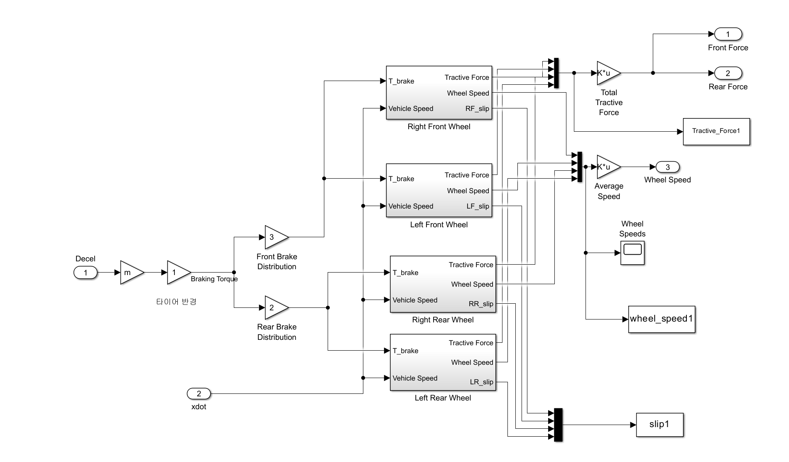

The brake model assumes **four identical wheels** and a **front:rear torque split of 3:2**, representing typical load transfer during braking.

### Wheel Dynamics

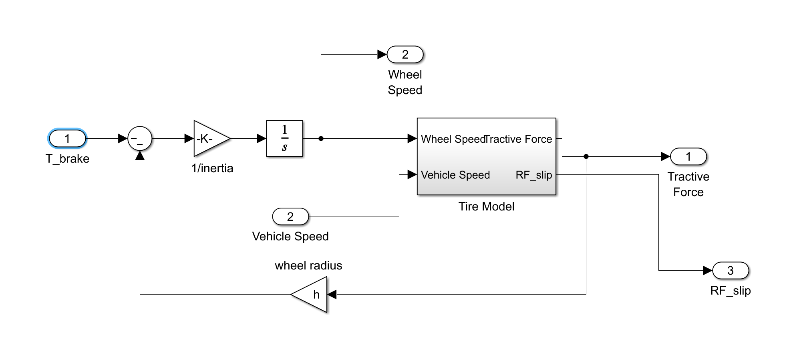

The wheel dynamics relate shaft torque, brake torque, and longitudinal road force.  
The tire model provides the effective radius and the longitudinal road force used in wheel balance equations.

---

### Tyre (Magic Tyre) Model

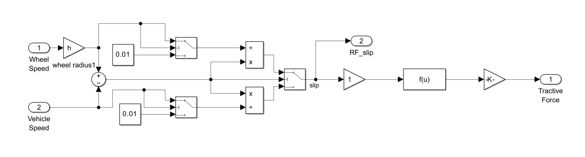

We use the Bakker–Pacejka **Magic Tyre Model**, expressed as:

```
F_road(s) = D * sin( C * atan( B*s - E * (B*s - atan(B*s)) ) )
```

This is implemented in a Function block. Input is slip (*s*).  
Camber adjustment is neglected, slip bias (*S<sub>h</sub>*) is set to 0; coefficients (*B*, *C*, *D*, *E*) are parameters.

The **slip ratio** (*s*) is defined as:

```
s = (h_eff * ω - v) / max(h_eff * ω, v)
```

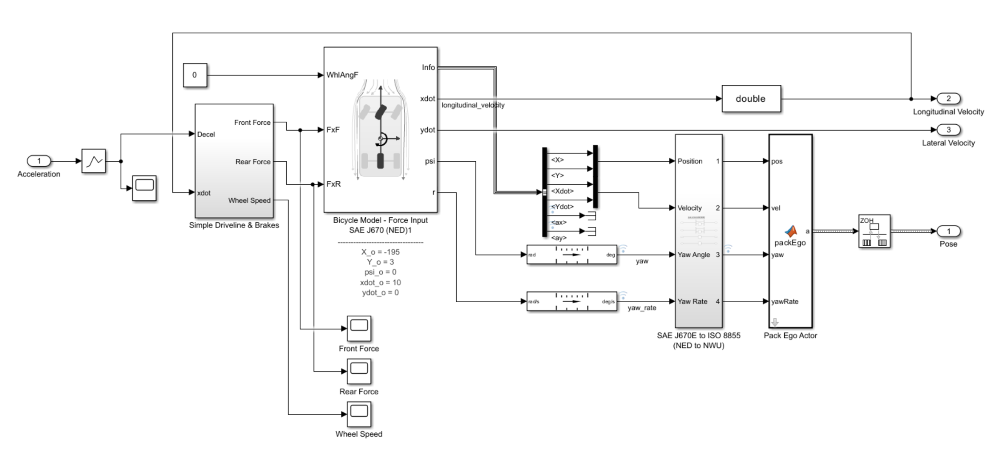

Division by zero is prevented using a Switch block that replaces the denominator with 0.01 when needed.

---

### Bicycle Model Integration

Front/rear longitudinal forces from the brake and tyre models feed a **Bicycle Model** to compute vehicle pose.  
Since only stopping scenarios are evaluated, the steering wheel angle is fixed at **0 rad**.  
We use the **Automated Driving Toolbox Bicycle Model** block for consistency with the Unreal Engine simulation stack and to minimize integration errors.

For environment consistency, all angles are converted from radians → degrees,  
and coordinates are transformed between **NED → NWU**.

#### UE Actor Bus Packing

Ego-vehicle data is passed to Unreal as a structured **Actor bus**:

```
Struct(
  ActorID,
  Position [x, y],
  Velocity [x, y],
  Roll, Pitch, Yaw,
  AngularVelocity [roll, pitch, yaw]
)
```

#### Key Symbols

| Symbol | Description | Context |
|---|---|---|
| *J<sub>ω</sub>* | Wheel rotational inertia | Wheel dynamics |
| *ẇ* | Angular acceleration | Wheel dynamics |
| *T<sub>shaft</sub>* | Shaft torque | Wheel dynamics |
| *T<sub>brake</sub>* | Brake torque | Wheel dynamics |
| *h<sub>eff</sub>* | Effective wheel radius | Wheel dynamics, Slip ratio |
| *F<sub>road</sub>* | Longitudinal tire force | Wheel dynamics, Tyre model |
| *B,C,D,E* | Magic Tyre coefficients | Tyre model |
| *S<sub>h</sub>* | Slip bias | Tyre model |
| *s* | Slip ratio | Slip computation |
| *v* | Longitudinal velocity | Slip ratio |
| *ω* | Wheel angular velocity | Slip ratio |

---

## Unreal Engine Simulation

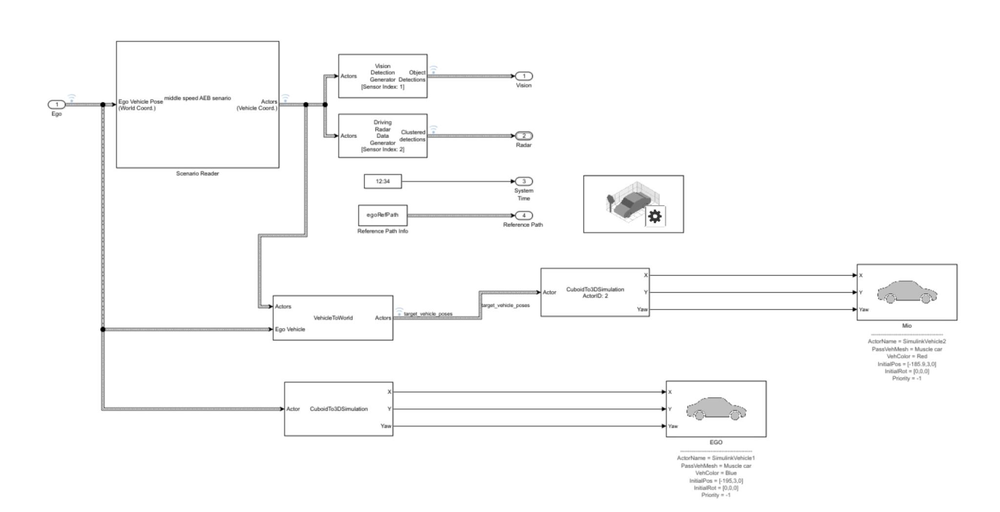

The **Automated Driving Toolbox** was used to couple Simulink with Unreal Engine for **3-D visualization** and **intuitive diagnostics**.

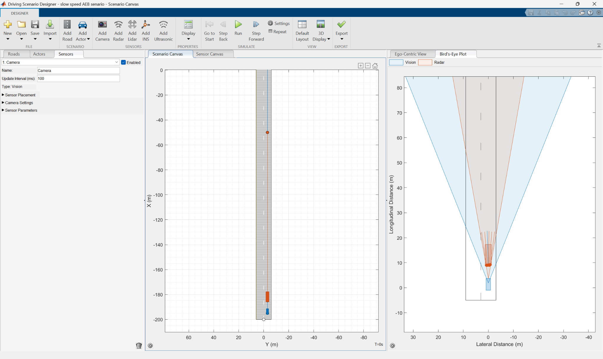

### Driving Scenario Design

Two vehicles (Ego and Lead) were configured to drive along straight paths.  
Low-, mid-, and high-speed scenarios were prepared to evaluate **TTC-based braking**.

Since no physical sensors exist in simulation, synthetic sensor data was generated using:

- *Cuboid to 3-D Simulation* for object conversion  
- *Simulation 3-D Vehicle with Ground Following* for vehicle definition  
- *Detection Concatenation* + *Multi-Object Tracker* for fusion and tracking

> Built-in MATLAB blocks were used since perception modeling was not the goal of this study.

---

## Lead Car Detection

Lead vehicle detection compares tracker outputs with ego pose:

- *x > 0*: object is ahead of the ego  
- *|y| ≤ 1.8 m*: within ±1.8 m lateral band (half lane width)

If both are true, the object is treated as a **lead vehicle**.  
Relative distance and velocity are used to compute **TTC** for braking control.

---

## AEB Controller

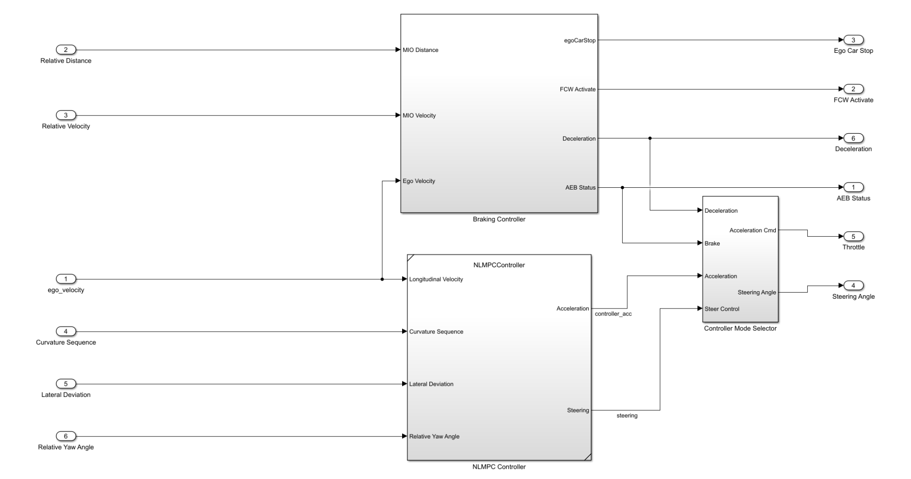

The controller includes:
- **Brake Controller**
- **Normal Driving Controller** (EKF + NMPC; not essential for straight-line runs)
- **Mode Selector**

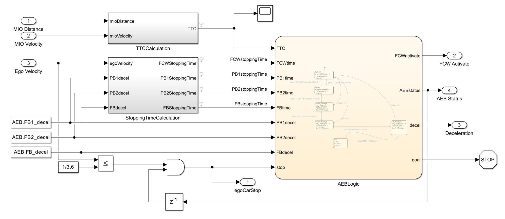

Three sections run sequentially:

1. TTC computation  
2. Stopping-time computation  
3. AEB operation logic (Stateflow)

---

### TTC Computation

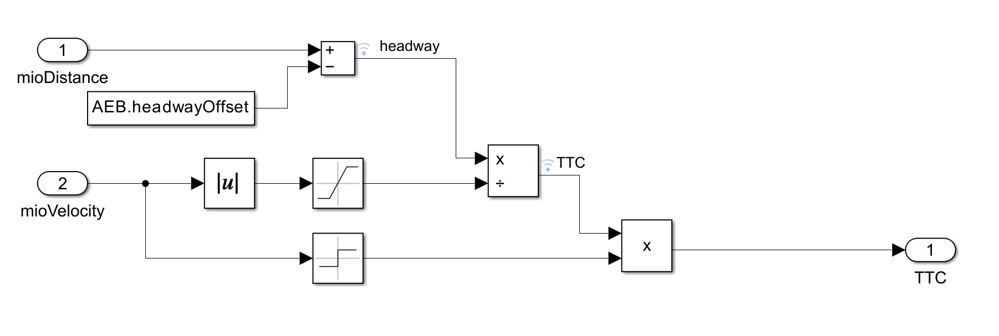

TTC is computed as:

```
TTC = sign(v_rel) * (d_rel - h0) / |v_rel|
```

where:  
*d<sub>rel</sub>* → relative distance  
*v<sub>rel</sub>* → relative velocity  
*h<sub>0</sub>* → safety headway offset

A **Saturation** block prevents division by zero.  
The **sign()** function ensures that negative TTC values represent approach and positive ones represent separation.

---

### Stopping-Time Computation

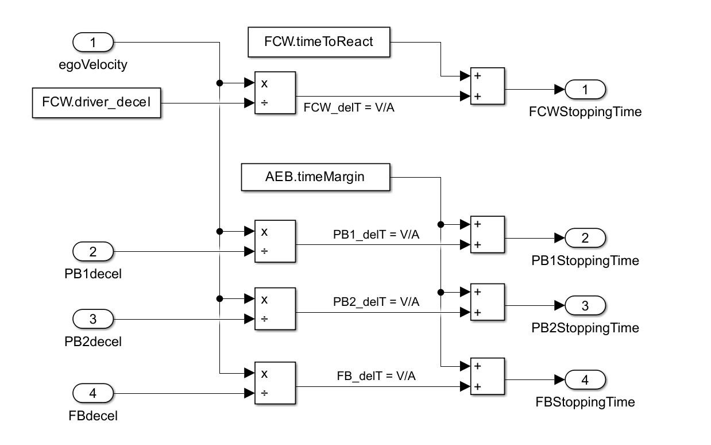

Stopping time under deceleration *a* is:

```
t_stop = v / a
```

A small time margin is added for safety.

---

### AEB Operation Logic (Stateflow)

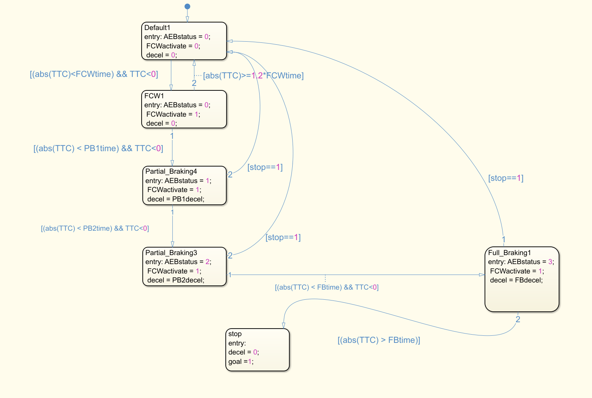

States:
- Normal Driving  
- Alert  
- Partial Braking  
- Full Braking  

Transition rule: when *TTC < t_stop*, the state advances based on risk level and outputs the corresponding deceleration command.

---

### Mode Selection

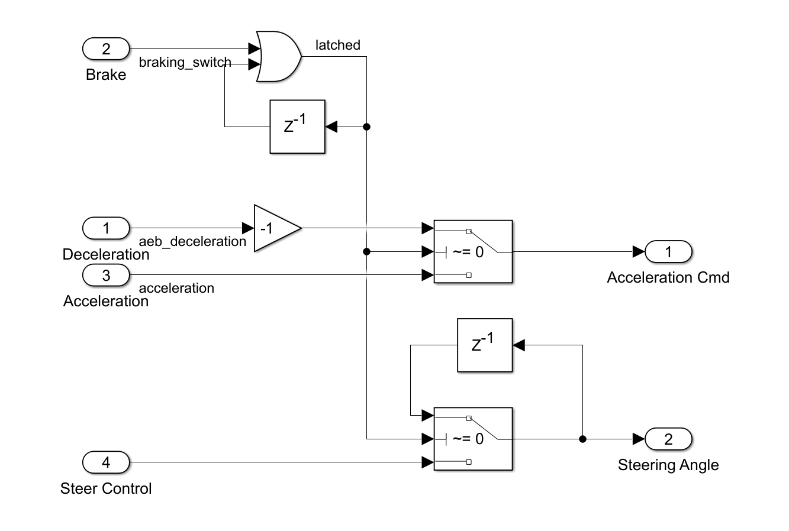

The **Controller Mode Selector** receives the AEB state signal and outputs the final brake command.  
A latching mechanism prevents transient glitches.  
While braking, steering commands are held constant to minimize lateral load transfer and ensure maximum braking efficiency.

---

## Results and Discussion

Simulation results:

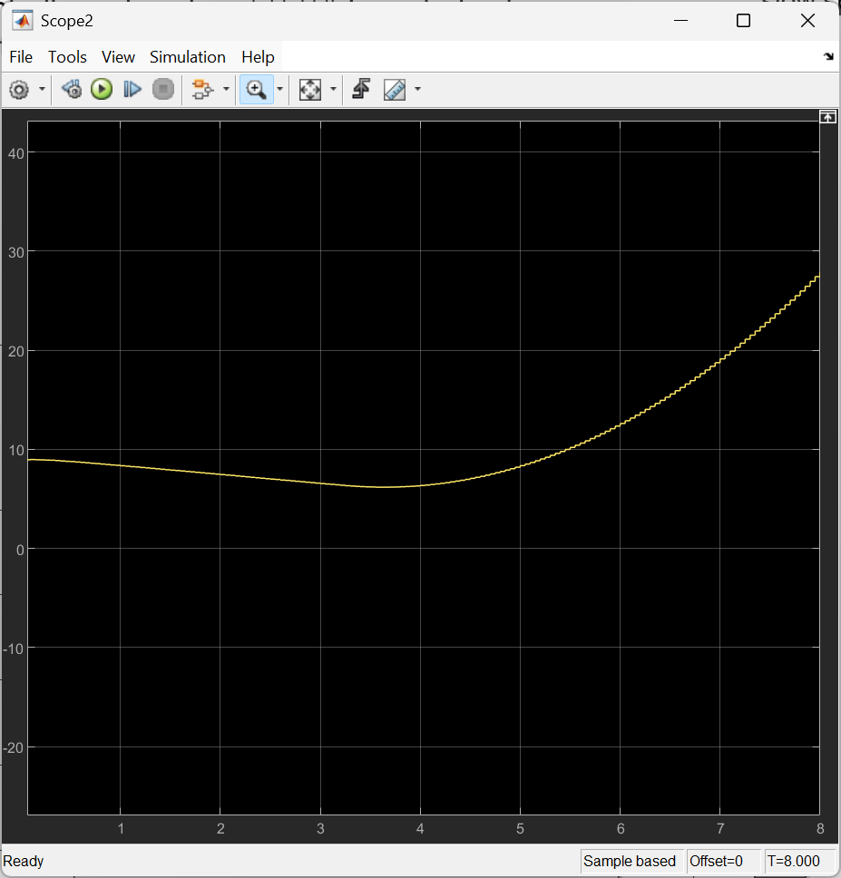  
Relative distance

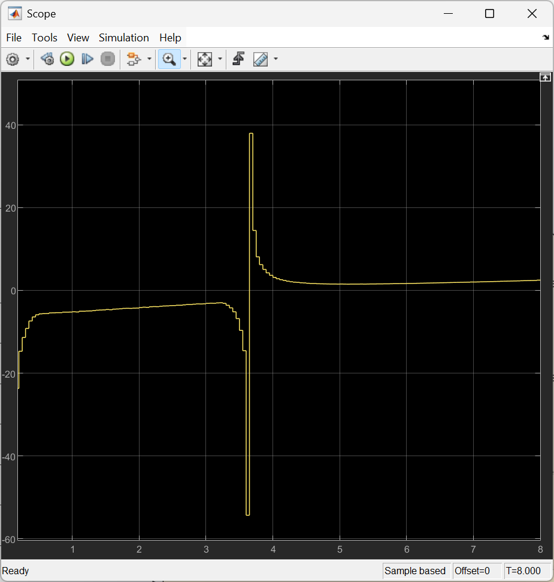
TTC

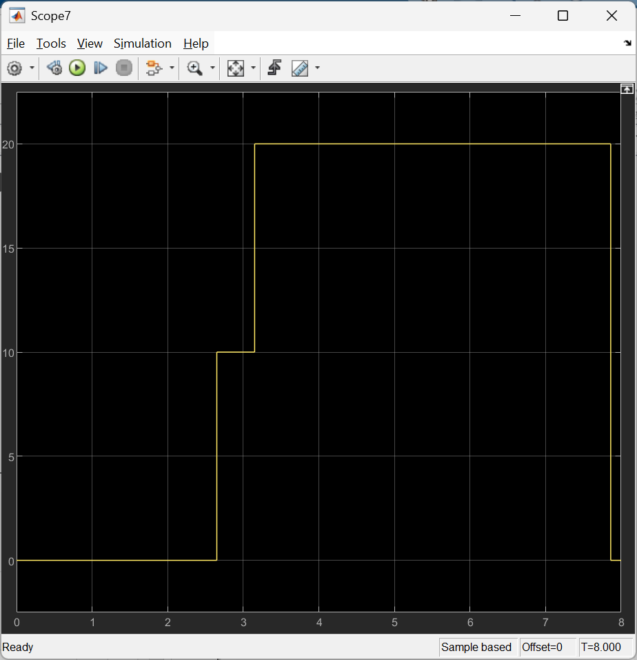
Deceleration

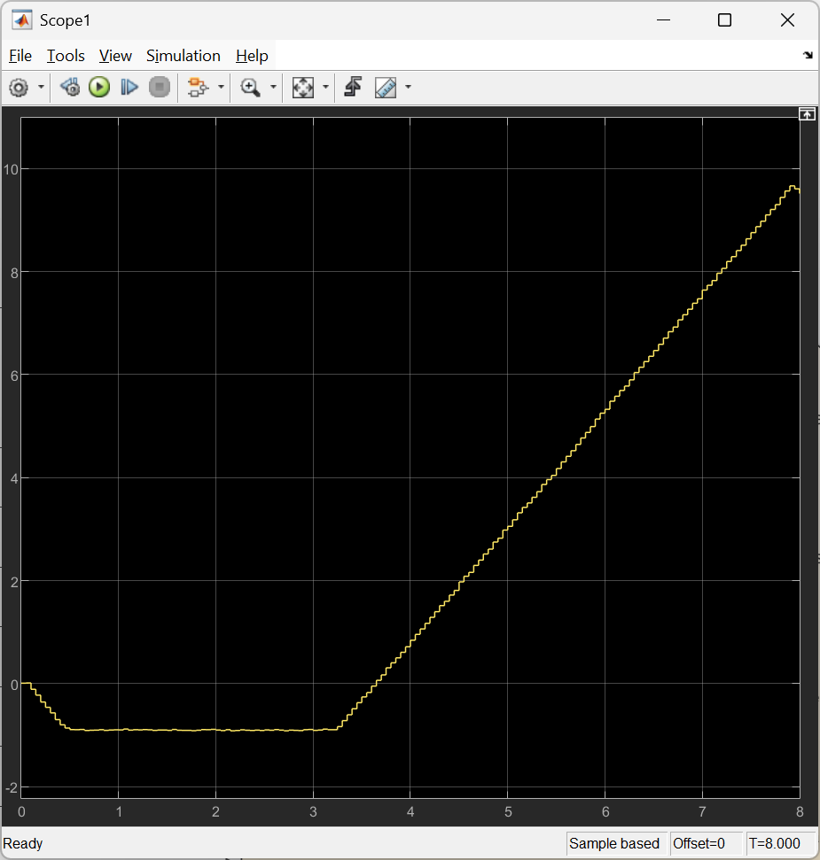  
Relative velocity

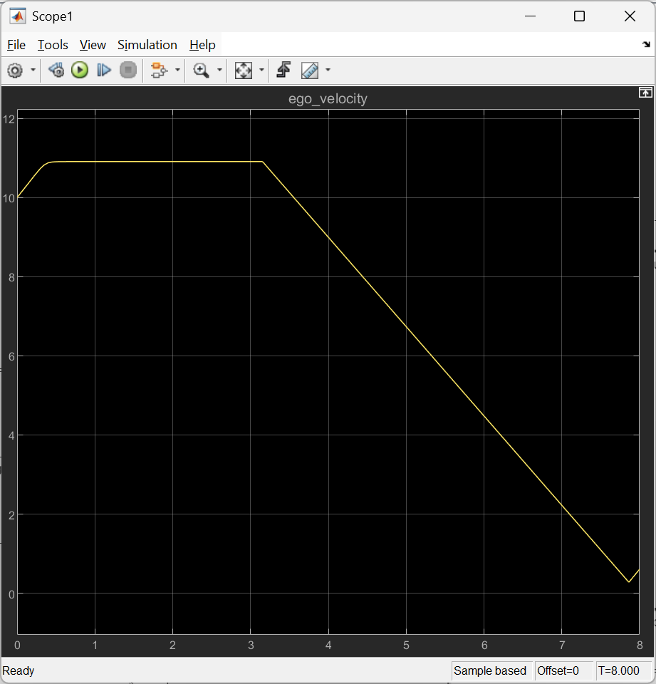
Ego velocity

**Analysis:**  
In this scenario, the lead vehicle moves slower than the ego vehicle. Relative distance reaches a minimum near 3 s, then increases as braking engages.  
TTC decreases sharply around 3.5 s and becomes negative as |v_rel| approaches zero.  
Deceleration increases stepwise, validating the stage logic.  
Relative velocity approaches zero after braking, and ego velocity decreases steadily, avoiding collision.

---

## Takeaways and Future Work

Unreal integration allows **visual validation** of motion, distance, and interactions beyond numerical plots.

Currently braking uses **three discrete stages** (PB1, PB2, FB).  
A continuous risk-based deceleration curve using *v̇_rel* could yield smoother control.

TTC performs well but assumes constant relative velocity, so it is less robust in curved paths or multi-object environments.

**Alternative Metrics**

| Method | Concept | Pros | Cons |
|---|---|---|---|
| Enhanced TTC | TTC + acceleration | More stable under high accel | Sensitive to accel noise |
| Decel Rate to Avoid Collision | Minimum decel to avoid impact | Physically intuitive | May misjudge static objects |
| Stopping Distance Index | Distance-based risk metric | Reflects braking ability | Needs lead decel estimate |
| Risk Function | Weighted distance/speed/accel | Continuous risk mapping | Requires tuning |
| Collision Possibility | Probabilistic risk | Handles uncertainty | Heavy computation |
| AI Prediction | Data-driven risk estimation | Handles nonlinearities | Requires dataset & training |

Simulation is idealized; **real-world transfer** requires calibration for lighting, surface, noise, and latency.  
Nonetheless, it remains an essential, safe **intermediate validation stage** before on-vehicle deployment.

---
