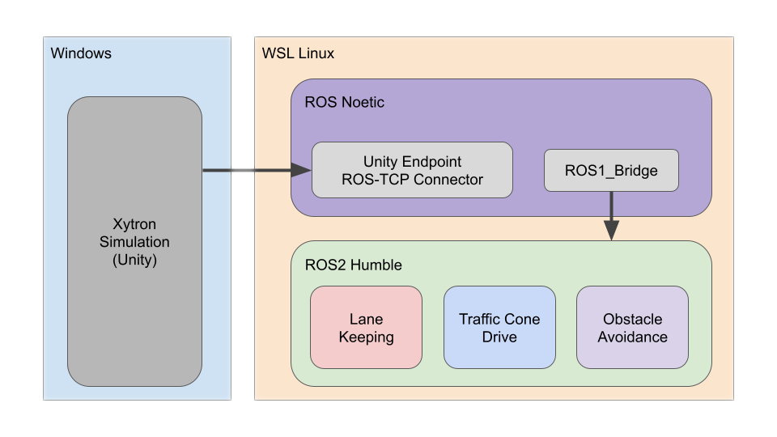
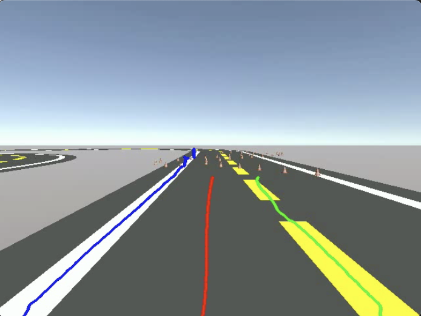
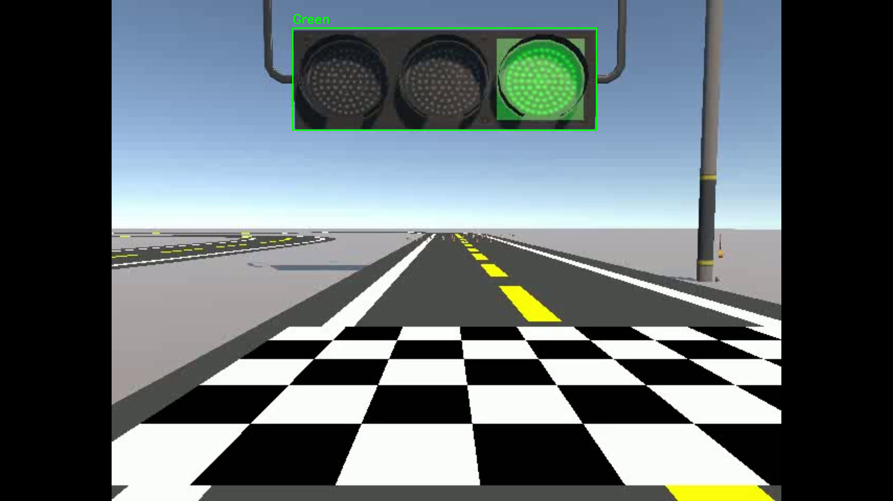
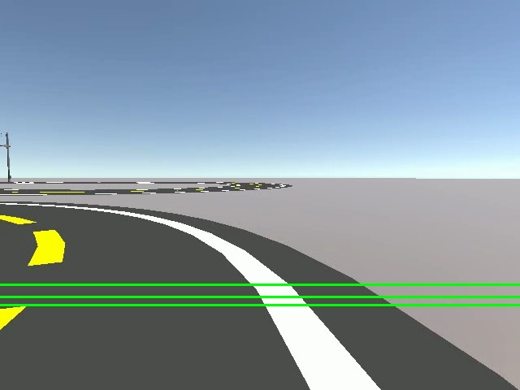
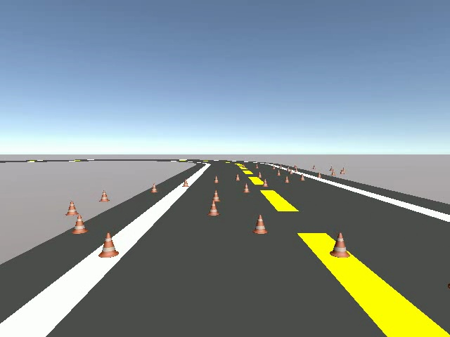
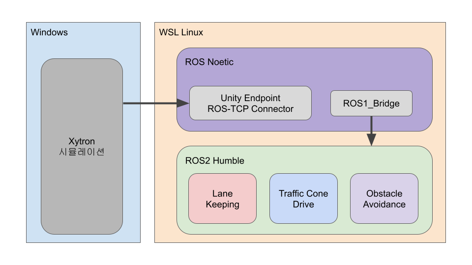

# Xytron Autonomous Driving Competition

The Xytron competition was conducted using Xytron’s proprietary autonomous vehicle platform.  
The preliminary round took place in a Unity-based simulator integrated with **ROS1**, using the same sensor configuration as the real Xytron vehicle.  
Each vehicle was equipped with a **front-facing LiDAR** and a **front RGB camera**.

The track did not include physical barriers; it was a **flat 2-lane environment** with both curved and straight segments but no visual features for localization.  
The objective was to complete the entire lap while **minimizing collisions** and **accurately maintaining the lane center**.  
Each run began upon detecting a green traffic light, and the vehicle was required to maintain lane-following behavior throughout.  
Within the track, an S-shaped cone section and an overtaking section were included, and the system was required to traverse all regions without collision.

---

## Development Environment

Since our project was based on **ROS2**, we aimed to maintain a unified workflow in that environment.  
However, the **Xytron simulator** operated on **Unity–ROS1 Noetic** via a **TCP-based Unity Endpoint**, preventing direct integration with ROS2.  
We contacted Xytron to request the simulation configuration files but were informed that they were not available for release.

As the final competition round would use **ROS2-based hardware**, we concluded that developing both ROS1 and ROS2 versions in parallel would be inefficient.  
Thus, we built a **ROS1–ROS2 bridge** to enable direct operation and development in ROS2.  
The system ran on **ROS1 Noetic** and **ROS2 Humble**, which were fully compatible with the latest bridge version cloned and built directly from the official `ros1_bridge` repository.

---

## Lane Keeping Algorithm

Lane keeping was the core functionality, and thus, it was the first module to be developed.  
Because the track had no feature points and the LiDAR was fixed front-facing, **LiDAR-based SLAM** was infeasible.  
As a result, **position estimation** of the vehicle was impossible, and without a depth camera, **waypoint-based methods** were also unsuitable.

Therefore, we designed a control strategy that computes the **lateral x-coordinate error** between the **lane center** and the **vehicle center**, and corrects this error using a **PID controller**.  
The vehicle center was defined as the center pixel of the camera image, while the lane center was obtained from **SCNN (SCNN_LaneDetection)**.  
The PID output represented the **steering angle**, driving the error to converge to zero.

The PID gains were determined empirically.  
The graph above compares the offset (lane–vehicle center error) and the steering angle output of the PID controller during tuning.  
The most stable response was obtained with:

| Parameter | Symbol | Value |
|------------|:------:|------:|
| Proportional Gain | Kp | 0.02 |
| Integral Gain | Ki | 0 |
| Derivative Gain | Kd | 0.12 |

Furthermore, the shapes of the lane error and PID steering output curves showed similar dynamics, confirming satisfactory controller performance.

Three **ROI lines** (Y-pixels = 375, 365, 350) were used.  
Because detecting lanes at farther distances enables earlier steering response, the uppermost ROI (Y=375) was prioritized.  
If lane detection failed at Y=375, the algorithm sequentially switched to Y=365 and Y=350 for robustness.  
This reduced steering loss on sharp curves where higher ROIs may fail.

---

## Traffic Cone Navigation

In the cone section, the vehicle was controlled to stay centered between left and right cones.  
Using **LiDAR**, both cone positions were detected, and the **lateral distance difference** was used as the PID error term to generate the steering command.  
However, since the cones were neither continuous nor perfectly aligned, accuracy degraded.  
Therefore, the system was improved by prioritizing the **right-side cone**, falling back to the **left** only when the right cone was not detected.

The PID controller used the same gain values as in Lane Keeping (`Kp=0.02, Ki=0, Kd=0.12`).  
Instead of additional tuning, we stabilized control by reducing vehicle speed.  
The LiDAR scanning range was limited to **±45–90°**, and the **median of the distance data** was used to suppress noise.

---

## Vehicle Avoidance Algorithm

Vehicle avoidance was triggered automatically when **YOLO** detected a front vehicle.  
Since no depth camera was available, distance estimation was not directly possible, and LiDAR–camera fusion was infeasible due to time constraints.  
Thus, avoidance was executed solely based on YOLO detection.

To improve stability, frame thresholding was applied to eliminate transient misdetections,  
and the **bounding box size** was used as a proxy for distance estimation.  
When this estimated distance fell below a threshold, the avoidance maneuver was triggered.

Because the vehicle lacked absolute position awareness,  
path generation was replaced with a **predefined steering profile** approach.  
Rather than a single abrupt steering command, a **progressive steering angle profile**—increasing then decreasing—was applied, emulating natural driver behavior.

After multiple simulations, the optimal configuration was:

- Apply up to **+10°** steering for **1.0 s**,  
- Then reverse steering up to **−15°** for **0.4 s**.

Only two lanes existed, so the **direction of avoidance (left/right)** could be manually selected via a switch input.  
After a left avoidance, an automatic **right-lane recovery** was executed to ensure stable cyclic operation.

---

## Traffic Light Detection

YOLO was also used to classify **traffic light colors**.  
Since the simulation environment lacked visual disturbances such as lighting reflections or weather effects,  
dataset creation and training were easier than in real-world scenarios, enabling **faster convergence** and **higher accuracy**.

Initially, training only on green lights led to **overgeneralization**, causing all signals to be classified as green.  
After adding red and yellow samples, the classification accuracy exceeded **97%**.  
Upon detecting a green light, the node published a `True` signal on the `/start_signal` topic to trigger vehicle launch.

---

## Results and Discussion

The PID controller used in the Xytron project provided **fast response** but **limited stability**.  
Although the derivative term partially compensated for the error rate,  
it only responded to the **current error** rather than the **future trajectory**, limiting its predictive capability.

This limitation became prominent at high speeds:  
insufficient correction time caused severe steering oscillations and frequent overshooting.  
In extreme cases, the vehicle failed to stabilize and exited the track.  

To achieve stable driving, trajectory-following control methods such as **Pure Pursuit** or **Stanley Controller**  
were identified as more suitable than pure PID-based correction.  
Based on this conclusion, the **Quanser competition system** was later upgraded to use a **Pure Pursuit controller**.

The avoidance algorithm also exhibited dependency on **precise trigger timing**.  
If the vehicle failed to initiate steering at the predefined moment,  
the intended path could not be followed, increasing collision risk.  
Because triggering was based on indirect indicators (e.g., bounding box size),  
false activations could occur when obstacle size or position changed.  

This issue could be resolved by employing **Sensor Fusion** with **Depth Camera or LiDAR**,  
enabling accurate distance-based triggering.  
Moreover, replacing fixed steering commands with **trajectory generation and tracking control**  
would improve generalization across diverse scenarios.

In future **Quanser competitions**,  
we plan to utilize the depth camera for **accurate distance estimation and trajectory-based avoidance**.

Finally, although LiDAR data was not fully exploited due to simulator constraints,  
future work will include clustering LiDAR scan data to estimate obstacle positions more precisely,  
enhancing both perception and control accuracy.

Despite the limited simulation environment,  
our team successfully developed algorithms satisfying all requirements and completed the run stably.  
As a result, we ranked **Top 25 out of 126 teams**, qualifying for the finals.  
However, due to scheduling conflicts with the **Quanser International Competition**,  
we could not attend the finals.

Nevertheless, this project served as a crucial foundation for implementing a **ROS2-based autonomous driving system** in real hardware.

---
